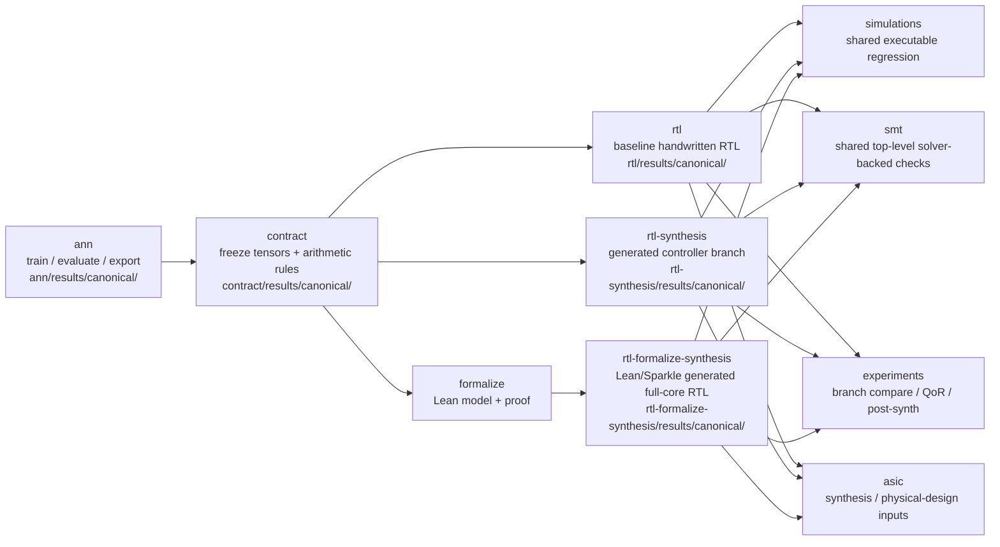

# Tiny Neural Inference ASIC

## What This Is

This repository is a small end-to-end research project for a tiny neural-network inference chip.

It takes one toy MLP and pushes it through the full stack:

1. train an actual ANN
2. freeze one quantized result as the implementation contract
3. implement and compare multiple RTL branches
4. formalize the intended behavior in Lean
5. validate the RTL with shared simulation and SMT
6. drive open-source synthesis and downstream experiments from the same frozen result

The model is intentionally small enough to inspect by hand:

- input width: `4`
- hidden width: `8`
- output width: `1`
- hidden activation: `ReLU`
- output: binary classification

## Goal

The goal is not benchmark performance. The goal is to make the whole path understandable and checkable:

- an ANN that is actually trained
- a frozen quantized contract that downstream code agrees on
- a small sequential-MAC RTL design
- a Lean formalization of the intended behavior
- simulation, SMT, and ASIC artifacts tied back to the same frozen result

## Quick Start

If you only want the baseline canonical flow:

```bash
make train
make evaluate ARGS="--artifact quantized"
make verify
```

That path uses canonical artifacts by default:

- `ann/results/canonical/`
- `contract/results/canonical/`
- `rtl/results/canonical/`

## End-to-End Flow



## Domains And Branches

### Domains

- `ann`: training, evaluation, quantization, export, and run artifacts
- `contract`: frozen implementation handoff, arithmetic assumptions, and downstream sync
- `rtl`: baseline handwritten SystemVerilog implementation
- `formalize`: Lean model and proof baseline
- `formalize-smt`: optional SMT-assisted Lean proof workflow
- `simulations`: shared executable validation
- `smt`: solver-backed validation outside Lean
- `experiments`: cross-branch comparison, characterization, and reporting
- `asic`: synthesis and physical-design flow inputs

### RTL Branches

The repository intentionally keeps three RTL implementation styles:

| Branch | Style | Canonical surface | Purpose |
| --- | --- | --- | --- |
| `rtl` | layered baseline RTL | `rtl/results/canonical/{sv,blueprint}/` | canonical implementation baseline |
| `rtl-synthesis` | generated controller + reused datapath | `rtl-synthesis/results/canonical/{sv,blueprint}/` | controller-synthesis experiment |
| `rtl-formalize-synthesis` | monolithic generated full-core + stable wrapper | `rtl-formalize-synthesis/results/canonical/{sv,blueprint}/` | Lean/Sparkle full-core generation experiment |

The common comparison contract is the branch-local `mlp_core` surface, not a forced 3-way per-layer symmetry.

## Test Scope And Branch Comparison

The RTL verification stack uses one shared core and branch-specific additions.

### Common Required Scope

Every supported RTL branch is expected to pass:

1. `contract-preflight`
2. branch-local canonical surface existence
3. shared `mlp_core` dual-simulator regression
4. shared top-level SMT family at the `mlp_core` boundary

### Branch-Specific Required Scope

- `rtl`
  - internal observability bench
  - `controller_interface` SMT family
- `rtl-synthesis`
  - fresh synthesis flow
  - adapter validation
  - controller-only equivalence
  - mixed-path closed-loop equivalence
- `rtl-formalize-synthesis`
  - Lean emit
  - wrapper regeneration / freshness
  - wrapper structural validation
  - raw-core review artifact

### Branch Comparison

`experiments` is the reporting and characterization layer above the common verification core. The important families are:

- `branch-compare`: compares maintained branch evidence and shared top-level results
- `qor`: records branch-local Yosys characterization
- `post-synth`: records downstream synthesis evidence
- `artifact-consistency`: checks the Sparkle emitted-subset / wrapper contract

These families are useful and often operationally important, but they are not the same thing as the common required verification core.

## Direct Execution And Canonical Defaults

The public surface is still `make`, but every major path also has a direct Python runner. By default, these runners consume canonical artifacts.

### Baseline Canonical Flow

```bash
make train
make evaluate ARGS="--artifact quantized"
make freeze-check
make sim
make smt
make verify
```

### Working From An Explicit ANN Run

```bash
python3 ann/runners/main.py train --out-dir ann/results/runs/run_001 --skip-export
python3 ann/runners/main.py evaluate --run-dir ann/results/runs/run_001 --artifact quantized
python3 ann/runners/main.py export --run-dir ann/results/runs/run_001
```

`evaluate`, `freeze`, shared simulation, and SMT all use canonical inputs when no explicit run or path is provided.

### Branch-Specific Runners

```bash
# rtl-synthesis
python3 rtl-synthesis/runners/spot_flow.py
python3 simulations/runners/run.py --branch rtl-synthesis --profile shared --simulator all

# rtl-formalize-synthesis
python3 rtl-formalize-synthesis/runners/emit.py --emit
python3 simulations/runners/run.py --branch rtl-formalize-synthesis --profile shared --simulator all

# experiments
python3 experiments/runners/run.py --family branch-compare
python3 experiments/runners/run.py --family qor
```

## Canonical And Runtime Outputs

Checked-in canonical artifacts live under each domain or branch:

- `ann/results/canonical/`
- `contract/results/canonical/`
- `rtl/results/canonical/`
- `rtl-synthesis/results/canonical/`
- `rtl-formalize-synthesis/results/canonical/`

Non-committed runtime execution artifacts are separated into:

- `build/`: generated files, tool intermediates, simulator binaries, logs
- `reports/`: summaries, reports, pass/fail records

Both use `runs/<run_id>/...` plus `canonical/...` snapshots so local executions remain traceable.

## Dependencies

Install the baseline local toolchain:

```bash
brew bundle
```

If you need schematic generation support:

```bash
npm install -g netlistsvg
```

The core local tools used by this repository are:

- `python3`
- `iverilog`
- `vvp`
- `verilator`
- `yosys`
- `yosys-smtbmc`
- `z3`
- `lake`
- `elan`

Optional branch-specific tools:

- `ltlsynt` for `rtl-synthesis`
- `syfco` for native TLSF lowering in `rtl-synthesis`
- `git` for the Sparkle prepare path

Vendor/tool bootstrap helpers remain under `scripts/`, for example:

- `scripts/prepare_vendor_tools.sh`

## Repository Map

- `ann/`: ANN code and result artifacts
- `contract/`: frozen contract and downstream sync
- `rtl/`: baseline canonical RTL
- `rtl-synthesis/`: controller-synthesis branch
- `rtl-formalize-synthesis/`: Lean/Sparkle RTL-generation branch
- `formalize/`: Lean proof baseline
- `formalize-smt/`: optional proof automation complement
- `simulations/`: shared benches and simulation runners
- `smt/`: solver-backed validation
- `experiments/`: branch comparison and characterization
- `asic/`: synthesis / physical-design flow source
- `specs/`: requirements and design documents
- `runners/`: shared Python runner infrastructure
- `scripts/`: shell scripts and vendor-preparation utilities

## Where To Read Next

- [specs/README.md](specs/README.md)
- [ann/README.md](ann/README.md)
- [contract/readme.md](contract/readme.md)
- [experiments/README.md](experiments/README.md)

## Notes

- The repository treats the selected trained result as the source of truth for downstream implementation.
- Do not edit generated contract weights by hand; re-freeze them from an ANN run.
- The generated RTL branches are experiment tracks. The canonical implementation baseline is still `rtl/`.
