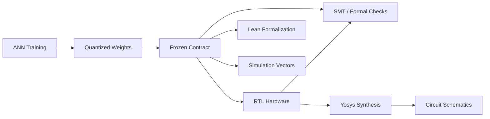
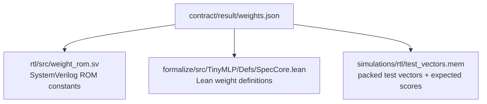
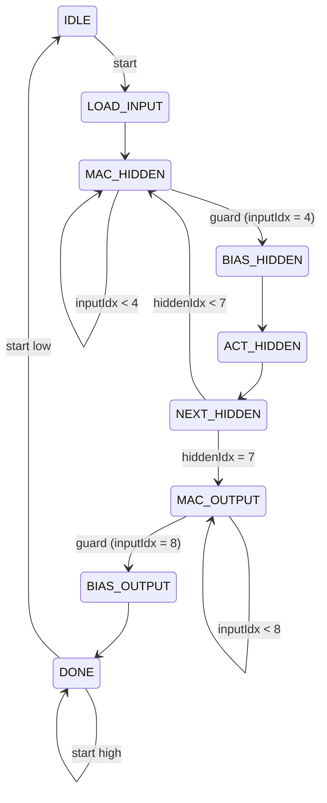
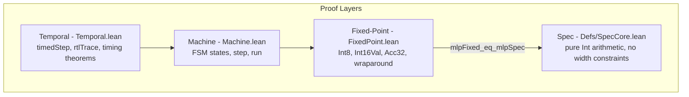
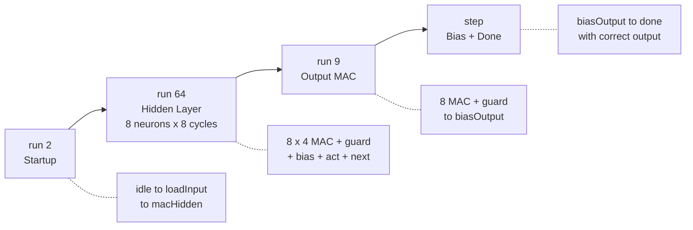
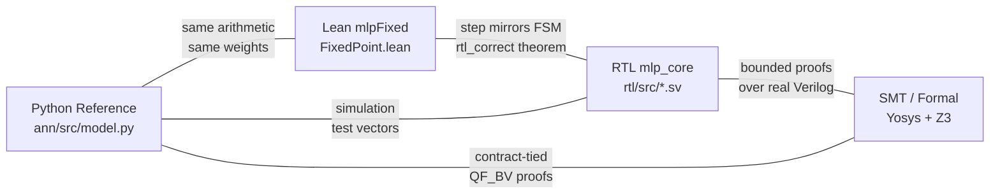

# From ANN to Proven Hardware

This document describes the actual process used in this repository to turn a trained neural network into a formally verified hardware circuit.

The path is:



Each step narrows the abstraction. By the end, the same set of frozen integers appears in three places: a SystemVerilog ROM, a Lean match expression, and a simulation test vector file. The formal proofs and simulation runs independently confirm that the hardware computes the same function as the math.

## 1. The ANN Result

The ANN is a `4 -> 8 -> 1` MLP:

```text
h[i] = ReLU(sum_j(W1[i,j] * x[j]) + b1[i])     for i in 0..7
y    = sum_i(W2[i] * h[i]) + b2
out  = (y > 0)
```

Training produces floating-point parameters. Quantization converts them to signed integers:

| Component | Type |
|-----------|------|
| Input `x[j]` | `int8` |
| Weight `W1[i,j]`, `W2[i]` | `int8` |
| Bias `b1[i]`, `b2` | `int32` |
| Hidden activation `h[i]` | `int16` |
| Accumulator | `int32` |
| Output | `1 bit` |

The quantization rules are exact: round half away from zero, then signed saturation to the target width. After quantization, all downstream work uses integer arithmetic only.

The Python reference model (`ann/src/model.py`) implements inference with explicit width-wrapping at every stage:

```python
for i in range(8):
    acc = 0
    for j in range(4):
        product = wrap_signed(x[j] * w1[i][j], 16)
        acc = wrap_signed(acc + product, 32)
    acc = wrap_signed(acc + b1[i], 32)
    hidden[i] = wrap_signed(relu(acc), 16)

acc = 0
for i in range(8):
    product = wrap_signed(hidden[i] * w2[i], 24)
    acc = wrap_signed(acc + product, 32)
score = wrap_signed(acc + b2, 32)
out = int(score > 0)
```

This reference model is the single source of truth for what "correct" means. Everything else must agree with it.

## 2. The Contract

The contract (`contract/result/weights.json`) freezes one quantized result as the implementation target. It records:

- the exact integer weights and biases
- the arithmetic rules (widths, overflow policy, sign-extension requirements)
- verified safe bounds for every intermediate value over all `int8` inputs

The contract is not just data. It is a decision: these specific numbers, under these specific arithmetic rules, are what the hardware must compute. Once frozen, you do not re-derive values. You regenerate downstream artifacts from the same payload.

The freeze pipeline (`contract/src/downstream_sync.py`) writes three files from the frozen weights:



This guarantees that the RTL ROM, the Lean spec, and the simulation expectations all use the same numbers. There is no manual copying.

## 3. From Contract to RTL

### The Design Problem

The contract says _what_ to compute. The RTL says _how_ to compute it in hardware, cycle by cycle.

The fundamental constraint is that hardware is a reactive state system. Unlike the Python reference (which runs a loop and returns), the RTL controller must:

- accept a `start` signal
- walk through states on clock edges
- read one weight per cycle from a ROM
- accumulate partial sums in a shared register
- signal `done` when the result is ready
- hold the result stable until the next transaction

### The Architecture

The RTL uses a sequential MAC-reuse architecture: one multiplier, one accumulator, sequential weight reads.

The controller FSM has 9 states:



Each hidden neuron takes 8 cycles:
- 4 MAC cycles (one per input)
- 1 guard cycle (index has reached terminal value, no MAC, advance FSM)
- 1 BIAS_HIDDEN cycle
- 1 ACT_HIDDEN cycle (ReLU + store)
- 1 NEXT_HIDDEN cycle (advance to next neuron or switch phase)

The output stage takes 11 cycles:
- 8 MAC cycles (one per hidden activation)
- 1 guard cycle
- 1 BIAS_OUTPUT cycle (add b2, register out_bit)
- 1 DONE cycle (result externally visible)

Total: 1 (LOAD_INPUT) + 64 (hidden) + 11 (output) = 76 cycles.

### The Handshake Contract

The timing semantics are part of the RTL contract, not implementation details:

- `start` is sampled in IDLE for transaction acceptance and in DONE for hold/release behavior
- `in0..in3` are captured on the `LOAD_INPUT` cycle, so they must remain stable through that sampling edge
- `busy` is a level: high in every state except IDLE and DONE
- `done` is a level: high in DONE, not a pulse
- `out_bit` is valid exactly when `done = 1`
- while `done ∧ start`: machine stays in DONE
- `done ∧ ¬start`: machine returns to IDLE

These are the properties that temporal proofs must capture.

### Guard Cycles

The MAC states include one guard cycle after the last useful multiply. After the fourth hidden MAC, `input_idx` becomes 4. The next cycle stays in MAC_HIDDEN but `do_mac_hidden` is gated off (`input_idx < INPUT_NEURONS` is false). The FSM advances to BIAS_HIDDEN.

This matters because:
- off-by-one errors typically appear at these boundaries
- a missing or extra MAC operation changes the accumulated result
- an out-of-range read could access garbage weight or activation data

The guard cycle is where most controller bugs hide. That is why both the formalization and the testbench treat boundary transitions as first-class verification targets.

### How Weights Enter the RTL

The freeze pipeline generates `weight_rom.sv` with case-statement ROM:

```systemverilog
always_comb begin
  unique case ({hidden_idx, input_idx})
    8'h00: w1_data = 8'sd0;
    8'h01: w1_data = 8'sd0;
    // ...
  endcase
end
```

The same integers from `contract/result/weights.json` appear here as SystemVerilog signed literals.

## 4. From Contract to Lean Formalization

### The Layered Strategy

The formalization splits the problem into four layers:



This separation exists because the hardest parts of the proof are different in each layer:
- The spec layer is about arithmetic identities
- The fixed-point layer is about width-safe wraparound
- The machine layer is about FSM sequencing
- The temporal layer is about handshake timing

### How Weights Enter Lean

The freeze pipeline generates a match-expression block in `Defs/SpecCore.lean`:

```lean
def w1At : Nat → Nat → Int
  | 0, 0 => 0
  | 0, 1 => 0
  | 2, 0 => 2
  | 2, 1 => 1
  -- ...
  | _, _ => 0

def b1At : Nat → Int
  | 0 => 0
  | 2 => 1
  -- ...

def b2 : Int := -1
```

These are the same numbers as the ROM. The auto-generation guarantees it.

### The Mathematical Spec

The mathematical spec defines inference over unrestricted `Int`:

```lean
def hiddenSpecAt (input : MathInput) (idx : Nat) : Int :=
  relu (w1At idx 0 * input.x0 + w1At idx 1 * input.x1 +
        w1At idx 2 * input.x2 + w1At idx 3 * input.x3 + b1At idx)

def outputScoreSpec (input : MathInput) : Int :=
  w2At 0 * h0 + w2At 1 * h1 + ... + w2At 7 * h7 + b2

def mlpSpec (input : MathInput) : Bool :=
  outputScoreSpec input > 0
```

This is the "what should happen" definition. No widths, no wrapping.

### The Fixed-Point Model

The fixed-point model mirrors the math but with bounded types:

```lean
structure Input8 where
  x0 : Int8; x1 : Int8; x2 : Int8; x3 : Int8

structure Hidden16 where
  h0 : Int16Val; h1 : Int16Val; ... ; h7 : Int16Val

structure Acc32 where
  raw : Int32Val
```

Every arithmetic operation wraps through `wrap16` or `wrap32`:

```lean
def acc32 (acc term : Acc32) : Acc32 :=
  Acc32.ofInt (acc.toInt + term.toInt)    -- wraps to int32

def relu16 (x : Acc32) : Int16Val :=
  Int16Val.ofInt (relu x.toInt)           -- wraps to int16
```

The key bridge theorem proves that for the specific frozen weights, wrapping doesn't change the result:

```lean
theorem mlpFixed_eq_mlpSpec (input : Input8) :
    mlpFixed input = mlpSpec (toMathInput input)
```

This works because the contract's verified bounds show that no intermediate value overflows its width for any `int8` input.

### The Machine Model

The machine state layout mirrors the RTL FSM and datapath registers, but the operational `step`/`run` view intentionally starts from a preloaded input-register state:

```lean
inductive Phase
  | idle | loadInput | macHidden | biasHidden | actHidden
  | nextHidden | macOutput | biasOutput | done

structure State where
  regs : Input8
  hidden : Hidden16
  accumulator : Acc32
  hiddenIdx : Nat
  inputIdx : Nat
  phase : Phase
  output : Bool
```

The `step` function mirrors what each RTL state does on a clock edge:

```lean
def step (s : State) : State :=
  match s.phase with
  | .macHidden =>
      if s.inputIdx < inputCount then
        { s with accumulator := acc32 s.accumulator (hiddenMacTermAt ...),
                 inputIdx := s.inputIdx + 1 }
      else
        { s with phase := .biasHidden }
  -- ...
```

The guard cycle appears naturally: when `inputIdx = 4`, the condition `inputIdx < inputCount` is false, so the step just changes the phase. No MAC happens. This matches the RTL exactly once the input register has already been loaded.

### The Correctness Proof

The proof assembles in stages:



The total: `run 76 (initialState input)` has `phase = .done` and `output = mlpFixed input`.

```lean
theorem rtl_correct (input : Input8) :
    (run totalCycles (initialState input)).output = mlpFixed input
```

This is proved by symbolic simulation: unfolding `run` in chunks and equating intermediate states to their mathematical definitions.

### The Temporal Layer

The operational `step`/`run` model assumes a preloaded transaction input. It does not model external `start` sampling, `LOAD_INPUT` data capture, or DONE hold behavior. The temporal layer adds those interface semantics.

```lean
def timedStep (sample : CtrlSample) (s : State) : State :=
  match s.phase with
  | .idle =>
      if sample.start then
        { s with phase := .loadInput }
      else
        { s with hiddenIdx := 0, inputIdx := 0 }
  | .loadInput =>
      { s with regs := sample.inputs, hidden := Hidden16.zero,
               accumulator := Acc32.zero, hiddenIdx := 0,
               inputIdx := 0, output := false, phase := .macHidden }
  | .done => if sample.start then s else { s with phase := .idle }
  | _     => step s
```

This models the RTL exactly:
- In IDLE with start low, stay idle and clean `hiddenIdx`/`inputIdx` back to zero
- In IDLE with start high, accept the transaction and move to `LOAD_INPUT`
- In LOAD_INPUT, capture the external input bus into `regs`
- In DONE with start high, hold
- In DONE with start low, return to IDLE
- In any active state, run the operational step

The temporal theorems prove timing properties over `rtlTrace`, which applies `timedStep` at each cycle:

| Theorem | What it says |
|---------|-------------|
| `acceptedStart_eventually_done` | Accepted start reaches done in exactly 76 cycles |
| `acceptedStart_capturedInput_correct` | The final output matches the input sampled on the `LOAD_INPUT` cycle |
| `busy_during_active_window` | Busy is asserted throughout cycles 1..75 |
| `done_implies_outputValid` | Done implies the output is valid |
| `output_stable_while_done` | Output doesn't change while machine stays in done |
| `done_hold_while_start_high` | Machine stays in done while start is held high |
| `done_to_idle_when_start_low` | Machine returns to idle when start drops |
| `idle_wait_cleans_controller_indices` | Idle waiting preserves datapath contents while cleaning `hiddenIdx` and `inputIdx` to zero |
| `phase_ordering_ok` | Every transition follows the allowed phase graph |

The boundary theorems prove that guard cycles are safe:

| Theorem | What it says |
|---------|-------------|
| `hiddenGuard_no_mac_work` | Guard cycle in MAC_HIDDEN changes only the phase |
| `hiddenGuard_no_out_of_range_reads` | No memory access during the guard cycle |
| `hiddenBoundary_no_duplicate_or_skip_work` | Last MAC + guard = correct accumulator, correct next phase |
| `outputGuard_no_mac_work` | Same for output layer |
| `outputBoundary_no_duplicate_or_skip_work` | Same for output layer |
| `biasOutput_registers_result` | BIAS_OUTPUT computes the final output; DONE is first valid cycle |

### Index Safety

The `IndexInvariant` defines legal index ranges per phase:

```lean
def IndexInvariant (s : State) : Prop :=
  match s.phase with
  | .macHidden  => s.hiddenIdx < 8 ∧ s.inputIdx ≤ 4
  | .biasHidden => s.hiddenIdx < 8 ∧ s.inputIdx = 4
  | .macOutput  => s.hiddenIdx = 0 ∧ s.inputIdx ≤ 8
  -- ...
```

This is proved preserved by `step`, `run`, and `timedStep`. It guarantees that ROM reads and hidden-register accesses never use out-of-range indices.

## 5. Simulation

### How Test Vectors Are Generated

The freeze pipeline generates `simulations/rtl/test_vectors.mem` from the frozen weights. Each vector is a packed hex record:

```text
[32-bit expected score] [1-bit expected out] [8-bit in0] [8-bit in1] [8-bit in2] [8-bit in3]
```

The generator synthesizes vectors that cover:
- positive score (out = 1)
- zero score (out = 0)
- negative score (out = 0)

If any class cannot be synthesized, generation fails. This is a contract-level requirement: the frozen weights must be able to produce all three score classes.

### What the Testbench Checks

The SystemVerilog testbench (`simulations/rtl/testbench.sv`) drives the DUT and checks:

**Correctness**: `out_bit` matches the expected classification for each vector.

**Timing**: latency from accepted `start` to `done` is exactly 76 cycles. Any deviation fails.

**Handshake**:
- After accepted start, state is LOAD_INPUT and busy is high
- During LOAD_INPUT, the DUT captures the current `in0..in3` bus value into `input_regs`
- During active computation, busy stays high
- In DONE, busy is low
- With start held high in DONE, machine stays in DONE with stable output
- After dropping start in DONE, machine returns to IDLE in one cycle

**Boundary transitions** (checked on the first vector):
- Hidden guard cycle: MAC_HIDDEN with `do_mac_hidden=0` and `input_idx=4`
- Final hidden neuron handoff: NEXT_HIDDEN with `hidden_idx=7` transitioning to MAC_OUTPUT
- Output guard cycle: MAC_OUTPUT with `do_mac_output=0` and `input_idx=8`
- BIAS_OUTPUT to DONE visibility transition

**Score coverage**: the suite must include at least one positive, one zero, and one negative score case.

The testbench samples on `negedge clk` to observe post-update register values, avoiding races with the `posedge` update.

### Dual-Simulator Regression

`make sim` runs the same testbench through both Icarus Verilog and Verilator. The regression passes only if both simulators pass. This catches simulator-specific interpretation differences in the SystemVerilog.

## 6. Visualizing the RTL

The RTL source files describe the circuit in text. To see the actual hardware structure — gates, registers, muxes, and their connections — we synthesize the design with Yosys and render it as a schematic via netlistsvg.

### Top-Level: mlp_core


The top-level wiring. The controller drives the datapath, the weight ROM feeds the MAC unit, and the ReLU output connects back to the hidden register file. This is the hardware equivalent of the Python reference model's loop structure — flattened into parallel, clocked components.

### Controller


The FSM. The state register (flip-flops) holds the current phase. The combinational cloud around it computes next-state and control signals (`do_mac_hidden`, `do_mac_output`, etc.). The guard cycle logic is visible as gating conditions on the MAC enable signals.

### MAC Unit


The multiplier and accumulator. The parameterized widths (A=16, B=8, ACC=32) determine the physical size of the multiply and add logic.

### ReLU Unit


The activation function. A comparator checks whether the input is negative, a mux selects zero or the input, and truncation narrows the result from 32 bits to 16 bits.

### Weight ROM


The frozen contract weights synthesized into combinational logic. Each case-statement entry becomes a lookup path from the address inputs to the data output.

### How This Connects to Verification

The schematics show what Yosys _thinks_ the design means after synthesis. Comparing the schematic against the spec catches structural misunderstandings:

- Is the accumulator actually 32 bits?
- Does the ReLU truncate to 16 bits?
- Are the weight ROM outputs signed?
- Is the controller generating the right number of control signals?

These are the same questions the Lean formalization answers mathematically. The schematic answers them visually.

## 7. The Four-Way Agreement

The core claim of this repository is four-way agreement:



Each pair is connected differently:

- **Python <-> Lean**: same arithmetic rules, same weights, same wraparound behavior. The Lean `mlpFixed` is a direct Lean transliteration of the Python reference. The bridge theorem `mlpFixed_eq_mlpSpec` then connects fixed-point to math.

- **Lean <-> RTL**: the Lean `step` function mirrors RTL state transitions. The machine proof (`rtl_correct`) shows that `run 76` produces the same output as `mlpFixed`. The temporal proofs show that the cycle-level timing matches the RTL handshake contract.

- **Python <-> RTL**: simulation. The testbench feeds the same inputs and expected outputs (generated from the Python model) to the RTL DUT and checks agreement.

- **RTL <-> SMT**: bounded model checking. Yosys elaborates the real SystemVerilog into an SMT model, and yosys-smtbmc proves control, boundary, range-safety, transaction-capture, and exact-latency properties over all inputs within a bounded trace window. Unlike Lean, this reasons about the actual Verilog, not a hand-written model of it.

- **Python <-> SMT**: contract arithmetic proofs. The frozen contract's weights and arithmetic rules are encoded as QF_BV queries, and Z3 proves that no intermediate value overflows its declared width and that two different bitvector encodings of the network produce identical results.

No single method covers everything alone:
- Simulation can't check all 2^32 inputs
- Lean proofs don't run on actual Verilog
- The Python model doesn't prove timing properties
- SMT bounded proofs can't see beyond their trace depth

Together, they provide confidence from four independent directions that the frozen contract is correctly implemented in hardware. For the full solver-backed verification story, see [`docs/solver-backed-verification.md`](solver-backed-verification.md).

### formalize-smt as a Lean Overlay

`formalize-smt` is not a fifth verification direction. It is a separate optional Lean-side overlay that changes how some helper lemmas are proved inside Lean.

The repository already includes a narrow implementation of that idea in `formalize-smt/`: it reproves the arithmetic `ArithmeticProofProvider` obligations with `lean-smt` and exposes an alternate provider for the shared fixed-point layer. That package is separate from the external `smt/` domain and separate from the canonical `formalize/` baseline.

So the architectural rule is:

- if SMT is used only to help construct Lean theorems that are still kernel-checked, it stays inside the Lean leg of the four-way story
- if the project ever accepted solver answers as an oracle, that would weaken the Lean leg rather than create a new independent one

The current `formalize-smt` package should still be treated as experimental. Its upstream `lean-smt` dependency currently emits a `sorry` warning during build, so its trust story is weaker than the vanilla `formalize/` baseline even though it remains useful as a proof-automation experiment.

## 8. What Makes This Hard

The arithmetic in this project is small. The hard parts are:

**Reactive timing**: The RTL is not a function. It is a state machine that produces results over time. Proving that `out_bit` is valid at cycle 76 (and not 75 or 77) requires reasoning about every intermediate state.

**Boundary transitions**: The controller has boundaries where counters wrap, phases change, and shared registers get reused. Each boundary is an opportunity for off-by-one errors, stale values, or out-of-range reads.

**Width-accurate arithmetic**: Proving that fixed-point wraparound doesn't change the result requires bounding every intermediate value. The `hiddenSpecAt8_*_bounds` theorems in `Defs/SpecCore.lean` do this per-neuron for the current weights.

**Handshake semantics**: `done` being a level (not a pulse), `busy` being low in both IDLE and DONE, the DONE-hold-while-start-high behavior -- these are the properties that determine whether downstream logic can safely sample the output. Getting them wrong is a hardware bug even if the arithmetic is perfect.

The Lean formalization addresses all four. The simulation validates the first two against actual Verilog. The solver-backed formal checks prove the control and boundary properties directly against the real RTL, and confirm the arithmetic width safety over the frozen contract. The combination is what makes the end-to-end claim credible.
