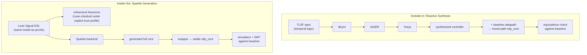
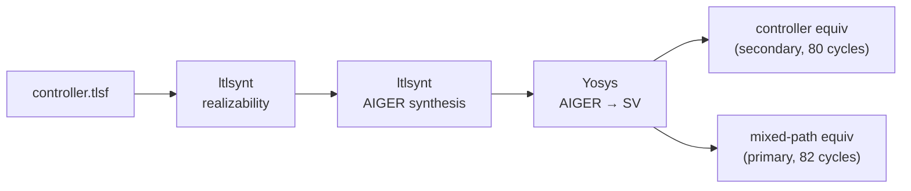
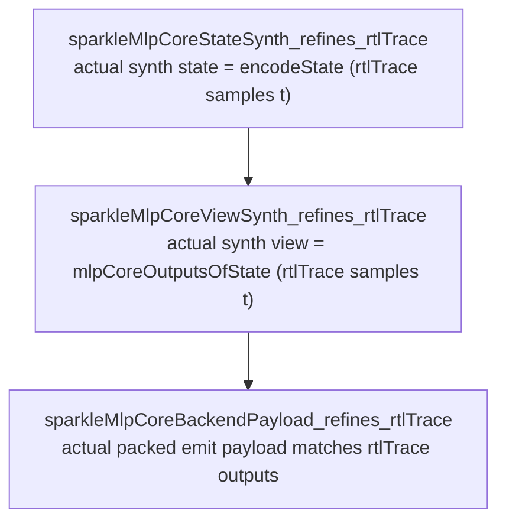
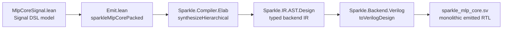

# Generated RTL: From Specification to Hardware

## The Problem

The Lean formalization proves that a model of the FSM computes the correct output with correct timing. But the model is not the Verilog. The `step` function in Lean and the `always_ff` block in SystemVerilog are separate artifacts in separate languages. A transcription bug — a swapped index, a missing guard — would not be caught by the Lean proofs.

Hand-writing the Verilog and hoping it matches the model is the baseline approach, and it works. But the correspondence is maintained by design discipline, not by a theorem. The two generation approaches in this repository are different strategies for narrowing that gap.

## Two Strategies, Two Directions

**Reactive synthesis** works _outside-in_. You write a temporal specification (TLSF) that describes the controller's behavior in LTL, and a synthesis tool (ltlsynt) constructs an implementation that satisfies it. This is a direct descendant of Amir Pnueli's program: Pnueli introduced temporal logic for reasoning about reactive systems (1977), and his later work with Rosner (1989) posed the synthesis problem — given a temporal specification, automatically construct a system that satisfies it against all environment behaviors. The shift from _verification_ ("given this system, prove it correct") to _synthesis_ ("given this spec, construct a correct system") is the conceptual foundation of this branch. The generated controller is plugged into the existing datapath and validated against the hand-written baseline. The trust flows from the specification inward: if the spec is complete and the tool is sound, the controller is correct by construction.

**Sparkle code generation** works _inside-out_. You re-implement the design in a hardware DSL hosted inside Lean, prove that it refines the same `rtlTrace` that the temporal and correctness proofs reason about, then emit Verilog from the DSL. The trust flows from the proof outward: the refinement theorems are checked by Lean under an explicit trust profile, and the remaining gaps below the theorem boundary are the DSL-to-Verilog lowering path and wrapper reconstruction. The formal viewpoint here is different from Pnueli's game-theoretic framework: it is based on a Lean-hosted signal model together with refinement theorems back to the repository's existing machine semantics.

Neither approach alone eliminates the gap. Reactive synthesis can only handle the controller (not arithmetic), and its connection to the Lean proofs is indirect. Sparkle covers the full core with direct proof connection, but trusts the code generator. Together, they provide independent evidence from different directions against the same baseline.



---

# Part I: Reactive Synthesis (`rtl-synthesis`)

## 1. Why Synthesize a Controller

The hand-written controller in `rtl/results/canonical/sv/controller.sv` is a 9-state FSM with counter comparisons, guard-cycle logic, and a hold/release handshake protocol. It works, and the Lean formalization proves its model correct. But the correspondence between the Lean `step`/`timedStep` model and the SystemVerilog source is maintained by design discipline, not by a theorem.

Reactive synthesis offers a different trust model: instead of writing a controller and proving it correct, you _specify_ the desired behavior in a temporal logic and let a synthesis tool _construct_ a controller that satisfies it. The result is correct by construction — if the specification is complete and the tool is sound.

The question is whether a synthesized controller can be reinserted into the existing datapath without changing the observable `mlp_core` behavior. That is the primary claim of this branch.

### Controller-Only Scope

GR(1) synthesis works well for discrete control: phase transitions, guard-cycle decisions, handshake protocols. It does not work well for arithmetic datapaths: signed multiplication, accumulation, ReLU activation, ROM lookups. The controller is the right boundary because:

- The controller decides _when_ to MAC, _when_ to add bias, _when_ to signal done
- The datapath decides _how_ to multiply, _how_ to accumulate, _what_ values to use
- These concerns are cleanly separated in the RTL architecture

The synthesized controller replaces only the decision logic. The MAC unit, ReLU unit, weight ROM, and hidden register file remain unchanged from the baseline.

## 2. The Abstraction Problem

The fundamental challenge is that GR(1) synthesis tools operate on boolean signals, while the RTL controller operates on multi-bit counters.

### What the RTL Controller Sees

The hand-written controller receives two 4-bit buses:

```
hidden_idx[3:0]   — which hidden neuron (0-7)
input_idx[3:0]    — which input/weight within the current phase (0-4 or 0-8)
```

It makes decisions by comparing these buses against constants:

```systemverilog
if (input_idx < INPUT_NEURONS)    // hidden guard: input_idx < 4
if (hidden_idx == HIDDEN_NEURONS - 1)  // last hidden: hidden_idx == 7
if (input_idx < HIDDEN_NEURONS)   // output guard: input_idx < 8
```

### Predicate Abstraction

The solution is to extract the decision-relevant predicates from the counter buses. Five boolean predicates capture all the information the controller uses:

| Predicate | RTL expression | Meaning |
|-----------|---------------|---------|
| `hidden_mac_active` | `input_idx < 4` | Hidden MAC should fire |
| `hidden_mac_guard` | `input_idx == 4` | Hidden MAC guard cycle |
| `output_mac_active` | `input_idx < 8` | Output MAC should fire |
| `output_mac_guard` | `input_idx == 8` | Output MAC guard cycle |
| `last_hidden` | `hidden_idx == 7` | Last hidden neuron |

These are mutually exclusive within each pair. The TLSF specification encodes this as an environment assumption.

Operationally, the predicate abstraction collapses the full counter state into a smaller control-relevant view of boolean predicates. The controller's decisions depend only on that abstract view, not on every concrete counter valuation. This is the same control/data separation that the Lean formalization's `controlOf` projection exploits (see [`temporal-verification-of-reactive-hardware.md`](temporal-verification-of-reactive-hardware.md) §8): control questions can be answered without reasoning about the full datapath state.

### Counter Ownership

The counters `hidden_idx` and `input_idx` are **datapath-owned**, not controller-owned. The synthesized controller only observes them through the predicate abstraction. This means the synthesized controller cannot be verified in isolation against the exact counter schedule — it can only be verified in closed loop with the datapath. This is why the mixed-path equivalence (§7) is the primary claim.

### One-Hot Phase Encoding

The synthesis tool outputs 9 boolean phase signals, one per FSM state. This is natural for GR(1) constraints but different from the baseline controller's 4-bit state encoding. The adapter layer (§5) reconstructs the 4-bit state from the one-hot phases.

### Reset Mismatch

The RTL uses asynchronous active-low reset (`rst_n`). Synthesis tools use synchronous trace semantics. The adapter layer bridges this with a reset-pending latch that captures async reset edges and presents them as synchronous `core_reset`.

## 3. The TLSF Specification

The specification is `rtl-synthesis/controller/controller.tlsf`, written in TLSF (Temporal Logic Synthesis Format).

### Structure

- **PRESET**: initial output values (start in IDLE)
- **REQUIRE**: environment assumptions (what the datapath promises)
- **ASSERT**: system guarantees (what the controller must do)
- **GUARANTEE**: additional liveness guarantees (empty here — all constraints are safety)

### Environment Assumptions (REQUIRE)

The assumptions fall into four categories:

**1. Reset clears position bits.** When `reset` is asserted, all counter position bits are zero.

**2. Active/guard mutual exclusivity.** In MAC_HIDDEN, either `hidden_mac_active` is true with a valid position (0-3), or `hidden_mac_guard` is true at exactly position 4. Never both. Same for MAC_OUTPUT with positions 0-7 and guard at 8.

**3. Counter increment constraints.** Explicit bit-by-bit encoding of counter progression within MAC phases:

```
position 0 (000) → next position 1 (001)
position 1 (001) → next position 2 (010)
position 2 (010) → next position 3 (011)
position 3 (011) → next position 4 (100)  ← guard
position 4 (100) → next position 4 (100)  ← holds at guard
```

This is the `exact_schedule_v1` assumption profile. It encodes the deterministic counter schedule and enables the 76-cycle latency claim. Without it, the tool could not guarantee exact cycle counts.

**4. Counter preservation across non-incrementing phases.** During BIAS_HIDDEN, ACT_HIDDEN, etc., the neuron ordinal bits are preserved.

### System Guarantees (ASSERT)

**One-hot exclusivity.** Exactly one phase active at all times (36 pairwise negation constraints).

**Phase transition machine.** 14 transition rules mirroring the baseline FSM:

```
G(!reset && phase_idle && !start       -> X phase_idle)
G(!reset && phase_idle && start        -> X phase_load_input)
G(!reset && phase_load_input           -> X phase_mac_hidden)
G(!reset && phase_mac_hidden && !guard -> X phase_mac_hidden)
G(!reset && phase_mac_hidden && guard  -> X phase_bias_hidden)
...
G(!reset && phase_done && !start       -> X phase_idle)
```

**Reset to IDLE.** `reset` forces IDLE immediately and in the next cycle.

## 4. The Synthesis Pipeline

Five stages, orchestrated by `rtl-synthesis/controller/run_flow.py`:



**Stage 1: Realizability.** `ltlsynt --realizability` confirms a satisfying controller exists.

**Stage 2: AIGER generation.** `ltlsynt --aiger --verify` synthesizes the controller as a Boolean circuit. The `--verify` flag model-checks the output against the specification.

**Stage 3: Yosys translation.** Converts AIGER to SystemVerilog (`controller_spot_core.sv`). The result is a flat state machine that sees only boolean predicates.

**Stage 4: Controller equivalence (secondary).** Bounded 80-cycle proof that the synthesized controller's sampled interface matches the baseline.

**Stage 5: Mixed-path equivalence (primary).** Bounded 82-cycle proof that the full `mlp_core` assembly produces the same outputs as the baseline. This is the gating criterion.

## 5. The Adapter Layer

`controller_spot_compat.sv` (175 lines) bridges synthesis semantics and RTL reality.

**Predicate extraction** — combinational logic that extracts boolean predicates from counter buses:

```systemverilog
assign hidden_mac_active = (input_idx < INPUT_NEURONS_4B);
assign hidden_mac_guard  = (input_idx == INPUT_NEURONS_4B);
assign last_hidden       = (hidden_idx == LAST_HIDDEN_IDX);
```

**Reset bridging** — captures async `rst_n` edges and presents synchronous `core_reset`:

```systemverilog
always_ff @(posedge clk or negedge rst_n) begin
  if (!rst_n) core_reset_pending <= 1'b1;
  else        core_reset_pending <= 1'b0;
end
assign core_reset = !rst_n || (core_reset_pending && !reset_consumed);
```

**Phase override** — forces IDLE during reset regardless of the synthesized core's output.

**State reconstruction** — one-hot to 4-bit encoding, plus control output derivation:

```systemverilog
do_mac_hidden  = phase_mac_hidden && hidden_mac_active;
do_mac_output  = phase_mac_output && output_mac_active;
done           = phase_done;
busy           = !(phase_idle || phase_done);
```

## 6. The Mixed-Path Assembly

```
rtl-synthesis/results/canonical/sv/
├── controller.sv              ← build-generated alias
├── controller_spot_compat.sv  ← committed adapter
├── controller_spot_core.sv    ← build-generated synthesized core
├── mlp_core.sv → rtl/…        ← symlink to baseline
├── mac_unit.sv → rtl/…        ← symlink
├── relu_unit.sv → rtl/…       ← symlink
└── weight_rom.sv → rtl/…      ← symlink
```

Datapath modules are symlinked to the baseline. The only difference is the controller path. The `controller.sv` alias wraps `controller_spot_compat` with the baseline port interface, so `mlp_core.sv` instantiates `controller` without knowing which implementation is behind it.

## 7. The Dual Validation Strategy

### Controller-Only Equivalence (Secondary, 80 Cycles)

Both controllers driven with identical inputs, explicit counter schedule modeled in the harness, all outputs asserted equivalent. **Secondary** because it depends on the harness faithfully modeling the counter schedule.

### Mixed-Path Equivalence (Primary, 82 Cycles)

Two complete `mlp_core` assemblies — baseline vs. synthesized — driven with identical external inputs. Minimal assumptions (reset, single start pulse). No counter schedule assumed; counters driven by the actual datapath.

```systemverilog
if (step >= 7'd2) begin
  assert (generated_done == baseline_done);
  assert (generated_busy == baseline_busy);
  assert (generated_out_bit == baseline_out_bit);
end
```

This is the **gating criterion**. On top of this, the branch also runs shared simulation (dual-simulator) and shared SMT families (boundary, range safety, transaction capture, bounded latency).

---

# Part II: Sparkle Code Generation (`rtl-formalize-synthesis`)

## 8. Why Generate from Lean

The reactive synthesis approach generates a controller from a _temporal specification_ and validates it against the baseline. The Sparkle approach takes a different path: generate RTL directly from the same Lean model that the proofs reason about.

The Lean formalization defines `step`, `timedStep`, and `rtlTrace` — pure functions that model the FSM's behavior. These same definitions are the basis for the correctness and temporal proofs. If the RTL could be generated from these definitions, the gap between model and implementation would narrow structurally.

Sparkle is a Signal DSL hosted in Lean 4 with a Verilog backend. It provides hardware-level primitives (`Signal.loop`, `Signal.register`, `hw_cond`, bounded `BitVec` types) that can be elaborated into synthesizable SystemVerilog. The `rtl-formalize-synthesis/` domain uses Sparkle to emit a full-core `mlp_core` — controller and datapath together — from a Lean-hosted hardware model.

### Full-Core Scope

Unlike reactive synthesis, which generates only the controller, Sparkle generates the entire `mlp_core`: FSM control, MAC operations, ReLU activation, weight/bias ROM, hidden register file, and accumulator management. This is possible because Sparkle's Signal DSL can express bounded-width arithmetic, signed operations, and ROM lookups — the same operations that GR(1) synthesis cannot handle.

## 9. The Signal DSL Model

The hardware state is declared using `declare_signal_state`, which defines a register file with explicit bit widths:

```lean
declare_signal_state MlpCoreState
  | phase : BitVec 4 := 0#4
  | hidden_idx : BitVec 4 := 0#4
  | input_idx  : BitVec 4 := 0#4
  | input_reg0 : BitVec 8 := 0#8
  | input_reg1 : BitVec 8 := 0#8
  | input_reg2 : BitVec 8 := 0#8
  | input_reg3 : BitVec 8 := 0#8
  | hidden_reg0 : BitVec 16 := 0#16
  -- ... (8 hidden registers)
  | acc_reg : BitVec 32 := 0#32
  | out_reg : Bool := false
```

This mirrors the pure `State` from `Machine.lean`, but with bounded types instead of unbounded `Int` and `Nat`. Every field has an explicit bit width that determines the physical register size in the generated Verilog.

### Signal Semantics

A `Signal dom α` represents a time-indexed stream of values of type `α`. The key operations:

- `Signal.atTime t` — extract the value at cycle `t`
- `Signal.register init next` — a clocked register with initial value and next-state function
- `Signal.loop` — recursive signal definition (feedback loops)
- `hw_cond` — multiplexer-style conditional (synthesizable)

The full-core model is built by composing these primitives into a `Signal dom MlpCoreState` that represents the complete hardware state at every cycle.

A `Signal dom α` can be read operationally as a time-indexed signal. The full-core model carries the complete hardware state at each cycle: phase, indices, registers, and accumulator. The synth-path refinement theorem `sparkleMlpCoreStateSynth_refines_rtlTrace` (§11) establishes state-by-state agreement between the actual `Signal.loop` implementation and `encodeState (rtlTrace ...)`. The helper theorem `sparkleMlpCoreState_refines_rtlTrace` remains available for the pure trace-wrapped view used in some explanatory proofs.

### Controller and Datapath Composition

The Signal DSL model is split across files that mirror the pure formalization's structure:

- `ControllerSignal.lean` — FSM phase transitions, guard-cycle decisions
- `DatapathSignal.lean` — MAC operations, ReLU, sign extension, weight/bias ROM
- `ContractData.lean` — elaborated weight and bias tables from the frozen contract
- `MlpCoreSignal.lean` — full-core composition, state encoding/decoding

The controller logic uses `hw_cond` chains that correspond to the `match s.phase with` cases in the pure `step` function. The datapath logic uses BitVec arithmetic that corresponds to `acc32`, `relu16`, and `hiddenMacTermAt` in the pure model.

## 10. The Encode/Decode Bridge

The pure formalization uses unbounded types (`Phase`, `Nat`, `Int`, `Input8`, `Hidden16`, `Acc32`). The Signal DSL uses bounded `BitVec` types. The encode/decode bridge connects the two:

```lean
def encodePhase : Phase → BitVec 4
  | .idle => 0#4
  | .loadInput => 1#4
  | .macHidden => 2#4
  -- ...

def encodeState (s : State) : MlpCoreState :=
  (encodePhase s.phase,
    (BitVec.ofNat 4 s.hiddenIdx,
      (BitVec.ofNat 4 s.inputIdx,
        (encodeInputReg s.regs 0,
          -- ... all 17 fields
```

`encodeState` is a deterministic, lossless mapping (within the bounded range) from the pure `State` to the hardware `MlpCoreState`. The refinement theorems prove that this encoding is preserved by stepping: if the pure model steps from `s` to `step s`, the Signal DSL model steps from `encodeState s` to `encodeState (step s)`.

The encoding must respect the Grothendieck structure of the state space. The pure `IndexInvariant` defines legal index ranges per phase — a functor `F : Phase → Set` whose total space ∫F is the set of legal control configurations. `encodeState` must map each fiber correctly: when the phase transitions from `macHidden` (where `inputIdx ≤ 4`) to `biasHidden` (where `inputIdx = 4`), the BitVec encoding must land in the correct fiber of the hardware state space. A guard-cycle boundary where the encoded index drifts out of the target fiber would break the refinement proof at that specific transition — and the proof term would identify the exact fiber mismatch.

## 11. The Refinement Theorems

The proof chain in `Refinement.lean` connects the pure Lean semantics to the Signal DSL:



**State refinement.** At every cycle `t`, the actual synth-path Signal DSL state equals the encoded pure state:

```lean
theorem sparkleMlpCoreStateSynth_refines_rtlTrace (samples : Nat → CtrlSample) (t : Nat) :
    (sparkleMlpCoreStateSynth ...).atTime t = encodeState (rtlTrace samples t)
```

This is proved by induction on `t` under the branch's declared trust profile. The base case shows that the initial synth-path state equals `encodeState idleState`. The inductive step shows that one cycle of the synth-path model produces the same result as encoding one step of the pure model.

**View refinement.** Sampling the observable outputs from the actual synth-path Signal DSL model produces the same values as extracting outputs from the pure state:

```lean
theorem sparkleMlpCoreViewSynth_refines_rtlTrace (samples : Nat → CtrlSample) (t : Nat) :
    (sparkleMlpCoreViewSynth ...).sample t = mlpCoreOutputsOfState (rtlTrace samples t)
```

The proof uses `sparkleMlpCoreStateSynth_refines_rtlTrace` to rewrite the synth-path Signal DSL state, then shows that output extraction commutes with encoding. Helper theorems over `sparkleMlpCoreState` and `sparkleMlpCoreView` remain in the file as pure trace-wrapper views, but they are not the main public synth-path boundary.

**Backend payload refinement.** The packed 299-bit output bundle matches the pure trace outputs. The actual emit declaration theorem is `sparkleMlpCorePacked_refines_rtlTrace`; the manifest-facing endpoint is the alias `sparkleMlpCoreBackendPayload_refines_rtlTrace`. Together they connect the synth-path Signal DSL outputs to the actual bit layout that the Sparkle backend emits.

## 12. The Emission Pipeline



The emission entrypoint is `MlpCoreSparkle.Emit`, which produces `sparkleMlpCorePacked` — a single Lean definition that Sparkle's compiler elaborates into a typed IR and then renders as SystemVerilog.

The output is a monolithic module `MlpCore_sparkleMlpCorePacked` with a 299-bit packed output bus. All 17 state fields plus control signals and observability aids are concatenated into a single `out[298:0]` port.

### Why a Packed Bus

Sparkle's current backend emits a single output bundle. Rather than fighting this constraint, the pipeline embraces it: the packed bus is the raw artifact, and a stable wrapper reconstructs the familiar `mlp_core` interface. The packing order is fixed by the Lean packing definitions and backend payload theorem, and the checked-in wrapper is kept in sync by artifact-consistency checks even though the wrapper itself remains a validation surface.

## 13. The Wrapper

The wrapper `rtl-formalize-synthesis/results/canonical/sv/mlp_core.sv` (146 lines) reconstructs the canonical `mlp_core` port interface from the packed Sparkle output:

```systemverilog
assign rst = ~rst_n;    // active-high reset for Sparkle

MlpCore_sparkleMlpCorePacked u_sparkle_mlp_core (
  ._gen_start(start), ._gen_in0(in0), ...,
  .clk(clk), .rst(rst), .out(packed_out)
);

// Unpack the 299-bit bundle:
assign state      = packed_out[298:295];
assign done       = packed_out[286];
assign busy       = packed_out[285];
assign out_bit    = packed_out[284];
assign hidden_idx = packed_out[283:280];
assign input_idx  = packed_out[279:276];
assign acc_reg    = packed_out[275:244];
// ... (all 17 state fields + control signals)
```

The wrapper also exposes `FORMAL` ports for SMT verification — the same observability signals that the hand-written baseline provides.

### What the Wrapper Does

- **Reset inversion**: converts active-low `rst_n` to Sparkle's active-high `rst`
- **Port renaming**: maps Sparkle's synthetic names (`_gen_start`, `_gen_in0`) to canonical names
- **Bundle unpacking**: extracts fields from the 299-bit packed output using bit ranges derived from the Lean packing definitions and checked by wrapper-regeneration consistency
- **FORMAL exports**: exposes state, indices, control signals, and register contents for SMT harnesses

### What the Wrapper Does NOT Do

The wrapper does not compute anything. It is pure wiring — no registers, no combinational logic beyond the reset inversion. If the packed bundle is correct, the unpacked signals are correct. The wrapper is a validation surface, not a trust boundary.

## 14. The Verification Manifest

`rtl-formalize-synthesis/results/canonical/verification_manifest.json` records the complete trust chain:

- **Declared emitted subset**: which Lean sources, which Sparkle features, which entrypoint
- **Exact emit path**: fingerprints for the backend AST, elaborated design, and rendered Verilog
- **Proof endpoint**: the theorem (`sparkleMlpCoreBackendPayload_refines_rtlTrace`) that connects proofs to the emitted artifact
- **Proof lane**: which `ArithmeticProofProvider` was used (vanilla baseline)
- **Sparkle feature slice**: exactly which Sparkle constructs the emission exercises (`Signal.loop`, `hw_cond`, `Signal.register`, `bundleAll!`, BitVec operations)
- **Residual validation surfaces**: wrapper reconstruction, shared simulation, downstream synthesis

This manifest is the traceability record. It answers "what was proved, by whom, about what artifact, using which proof strategy."

## 15. Trust Boundaries

### What Is Proved (Machine-Checked)

The refinement theorems are checked by Lean against the branch's declared trust profile. The checked-in synth-path chain currently relies on two explicit axioms recorded in the verification manifest: vendored Sparkle's `Signal.loop_unfold` and the local bridge `nextState_pure_eq_timedStep`. Within that explicit trust profile, the proof chain is: pure temporal correctness → synth-state refinement → synth-view refinement → backend payload refinement.

### What Is Trusted (Verified Elsewhere)

The Sparkle lowering/backend — the path from Signal DSL to SystemVerilog — is treated as verified for the declared emitted subset. This means the pipeline trusts that Sparkle correctly lowers the specific constructs used by this design (`Signal.loop`, `hw_cond`, `Signal.register`, bounded BitVec operations). The claim does not extend to unexercised Sparkle features.

The verification manifest records exactly which features are exercised, so the trust claim is scoped and auditable.

### What Is Validated (Simulation, SMT)

- **Wrapper reconstruction**: the bit-slicing from packed output to individual signals
- **Shared simulation**: dual-simulator regression with the same test vectors as the baseline
- **Shared SMT families**: boundary behavior, range safety, transaction capture, bounded latency — proved against the wrapper-backed Sparkle RTL
- **Branch comparison**: QoR and downstream synthesis against the hand-written baseline

---

# Part III: Generated vs. Hand-Written

## 16. Three Implementations of the Same Machine

The repository maintains three RTL implementations of the same `mlp_core`. They look different internally but are compared at one deliberate common boundary: the `mlp_core` top-level port interface.

The hand-written baseline (`rtl/`) is a layered design. The controller, MAC unit, ReLU unit, and weight ROM are separate modules with explicit internal boundaries. You can read `controller.sv` to understand control flow, open `mac_unit.sv` to check the accumulator width, inspect `weight_rom.sv` to verify the frozen constants. Each module is a direct review and debug unit.

The reactive synthesis branch (`rtl-synthesis/`) keeps the same layered datapath but replaces the controller with a generated core behind an adapter. Below the `mlp_core` boundary, the MAC unit, ReLU, and weight ROM are identical symlinks to the baseline. The controller path is different: a synthesized Boolean state machine wrapped by `controller_spot_compat.sv`. The internal review unit is now the adapter, not the controller itself.

The Sparkle branch (`rtl-formalize-synthesis/`) changes the implementation shape most aggressively. The raw generated artifact is a monolithic module with no internal layer boundaries. The `mlp_core` interface is recovered through a wrapper that unpacks a 299-bit packed bus. There is no separate controller or MAC unit to inspect — the entire design is a single flattened circuit.

This asymmetry is intentional. The three branches optimize for different things:

- `rtl` optimizes for layered clarity
- `rtl-synthesis` optimizes for a narrow generated-controller claim with minimal datapath disruption
- `rtl-formalize-synthesis` optimizes for a full-core generated claim aligned with the proof/emission boundary

The comparison is meaningful not because the branches look similar internally, but because they preserve the same top-level machine contract through different implementation strategies.

### What Structural Differences Mean for Failures

When something breaks, the location of the mismatch tells you different things depending on the branch:

- A mismatch in `rtl-synthesis` usually points to **controller synthesis, adapter logic, or controller reintegration**. The datapath is unchanged, so a datapath-level failure would be a baseline bug, not a synthesis bug.

- A mismatch in `rtl-formalize-synthesis` is more likely to be about **generation scope, wrapper packing/reset adaptation, or proof-to-emission boundary drift**. There is no preserved per-layer boundary to isolate the failure to a specific submodule.

- A mismatch in the hand-written `rtl` that the other two branches do not reproduce points to a **transcription bug** — the Lean model and the SystemVerilog disagree.

## 17. Trust Flows in Opposite Directions

The deepest difference between the two generation approaches is not scope or tooling. It is the direction trust flows.

In reactive synthesis, the TLSF specification is the source of truth. It exists independently of the Lean formalization — it was written to capture the controller's temporal behavior, not to mirror a Lean model. The generated controller satisfies the spec by construction. The question is: does the spec faithfully describe what the baseline does? The closed-loop equivalence check answers this empirically, for one bounded transaction.

In Sparkle generation, the Lean pure model is the source of truth. The Signal DSL re-implements the same `rtlTrace` that the proofs reason about, and the refinement theorems prove the correspondence at every cycle for all inputs. The question is: does the Sparkle backend faithfully translate the DSL into Verilog? This is trusted for the declared feature subset, not proved.

The hand-written baseline sits between these two trust models. It is neither synthesized from a spec nor generated from a model. Its trust comes from the combination of Lean proofs (over the model), simulation (over the actual Verilog), and SMT checks (over the elaborated design). No single method covers it completely, but the combination is the strongest in the repository because all three verification layers apply directly.

## 18. Different Failure Modes

**When the hand-written baseline breaks**, the failure is a mismatch between the Lean model and the SystemVerilog. The Lean proofs still pass (they reason about the model), but simulation or SMT catches the divergence. Debugging requires reading both the Lean `step` function and the SystemVerilog `always_ff` block, finding the case that disagrees, and fixing the Verilog. The failure is local and the fix is surgical.

**When reactive synthesis breaks**, the failure is usually at the specification or assumption level. Unrealizability means the assumptions are too weak or the guarantees are too strong — but understanding _why_ requires expertise in GR(1) game semantics. An assumption mismatch (the datapath violates the `exact_schedule_v1` progression) shows up as output divergence in the closed-loop check, but the root cause is invisible in the harness. An adapter bug produces a correct core driving an incorrect wrapper, and only the closed-loop check catches it reliably.

**When Sparkle generation breaks**, the failure splits across the proof boundary. An encoding bug in `encodeState` fails the refinement proof at the inductive step — Lean points to the exact mismatch. A backend bug passes the refinement proof (it reasons about DSL semantics) but fails in simulation. A wrapper bug means the bit-slicing diverged from the theorem-verified packing order.

The pattern: hand-written failures are surgical. Reactive synthesis failures are hard to diagnose (boolean predicates, hidden assumptions). Sparkle failures are easy to diagnose above the proof boundary, opaque below it.

## 19. What Each Approach Cannot See

**The hand-written baseline is blind to its own transcription errors.** The Lean proofs apply to the model, not the Verilog. A missing edge case in the SystemVerilog that the Lean model handles correctly would not be caught by the Lean proofs. Simulation catches it only if a test vector triggers it. SMT catches it only within the bounded trace depth.

**Reactive synthesis is blind to the datapath.** It generates only the controller. Whether the MAC unit accumulates correctly, whether the ReLU clips at the right boundary — none of this is in scope. The closed-loop equivalence check catches a broken datapath only if it diverges from the baseline, but it cannot prove the baseline is correct.

**Sparkle generation is blind below the DSL.** Between the Signal DSL and the physical gates are several unproved layers: Sparkle elaboration, backend rendering, Yosys synthesis, place-and-route. The scoped trust claim narrows this, but it is still trust, not proof.

**All three are blind to multi-transaction behavior.** The equivalence check covers 82 cycles. The refinement theorems prove per-cycle correspondence but do not address transaction sequences. The Lean temporal proofs cover single-transaction idle cleanup and hold/release. Multi-transaction reasoning remains open.

**All three are blind to post-synthesis timing.** Neither generation approach addresses setup/hold violations, clock skew, or routing delays.

## 20. Why Structural Differences Are Acceptable

The three branches look different internally, but the repository does not require textual sameness or per-layer isomorphism. It requires a chain of evidence that the branches implement the same top-level machine contract.

The arithmetic foundation makes this possible. The bridge theorem `mlpFixed_eq_mlpSpec` proves that for the frozen weights, wrapping never activates on the actual computation range (see [`from-ann-to-proven-hardware.md` §5](from-ann-to-proven-hardware.md) for the two-model analysis and [`solver-backed-verification.md` §5](solver-backed-verification.md) for the QF_BV confirmation). This means structural differences in how intermediate values are represented (16-bit contract products vs. 24-bit RTL products after sign extension) do not change the result, as long as both representations stay within the verified safe range.

The same principle extends to the generated branches. The Sparkle branch does not preserve the baseline's `controller`, `mac_unit`, `relu_unit`, `weight_rom` layer split. It exports a monolithic core. But the monolithic core computes the same function at the `mlp_core` boundary — proved by refinement theorems above the DSL, validated by simulation and SMT below it. The encode/decode bridge in §10 must preserve both arithmetic range expectations and the expected control-state layout.

The formalization makes these structural differences reviewable. Without it, a large monolithic generated module would be a black box. With it, the Signal DSL model is readable Lean code, the refinement theorems are checked by Lean under the declared trust profile, and the verification manifest records exactly which features and fingerprints are in play.

## 21. Seeing the Difference

The synthesized circuit schematics show the structural asymmetry directly:

- baseline: 
- controller-synthesis: 
- Lean/Sparkle: 

`rtl` shows the manually layered full-core structure. `rtl-synthesis` shows the same shell with a controller replacement path. `rtl-formalize-synthesis` shows the stable wrapper boundary, not the raw generated internal structure.

## 22. Why Three Approaches, Not One

Each approach covers ground the others cannot.

The **hand-written baseline** provides the reference implementation and the most thoroughly verified artifact. All three verification methods (Lean proofs, simulation, SMT) apply to it directly. But its correctness depends on design discipline between the Lean model and the SystemVerilog source.

**Reactive synthesis** provides independence. The TLSF spec was written to describe the controller's behavior, not to mirror the Lean model. ltlsynt is a separate tool with separate internals. If both the synthesized controller and the baseline satisfy the same closed-loop behavior, that is independent evidence from an independent tool chain. This independence is valuable precisely because it does not share failure modes with the Lean proof chain.

**Sparkle generation** provides proof depth. The refinement theorems cover the full core at the Signal DSL level and are checked by Lean under the explicit trust profile recorded in the verification manifest. The proof connection to `rtlTrace` is direct, not mediated by an equivalence check. If the pure proofs establish that `rtlTrace` computes the correct output at cycle 76, the refinement theorems extend that guarantee to the Signal DSL model without bounded-depth limitations.

Neither generated approach can replace the other:
- Sparkle cannot provide independence (it shares the Lean model and proof infrastructure)
- Reactive synthesis cannot provide proof depth for the datapath (GR(1) cannot express arithmetic)
- Neither can replace the hand-written baseline as the primary auditable reference

The two approaches also draw on distinct formalisms. The reactive synthesis path uses temporal logic (Pnueli) to specify the controller, game theory (GR(1)) to construct it, and bounded model checking to validate the result. The Sparkle path uses a Lean-hosted signal semantics together with the same phase-indexed invariants and fixed-width arithmetic model used elsewhere in the repository. The hand-written baseline is the artifact where both lines of work meet: Lean proofs cover the model, SMT checks cover the emitted or hand-written RTL, and simulation checks the shared `mlp_core` boundary.

The repository does not force these traditions into a single formal framework. It lets each operate where it is strongest — temporal logic for control specification, dependent types for invariant maintenance, quotient arithmetic for width safety — and connects them at the shared `mlp_core` boundary. The combination gives the repository three-way cross-checking: a failure in any one path that the other two do not reproduce is a strong signal of a localized bug rather than a systemic error.

For optional mathematical commentary on these constructions, see [`docs/hardware-mathematics.md`](hardware-mathematics.md).
