# Grothendieck Construction and the Mathematical Foundations of Hardware Design

This document organizes the mathematical structures used across the formal verification documents in this repository, with the **Grothendieck construction** and **Grothendieck category** as the central axis. It shows how core concepts from digital accelerator design — combinational logic, sequential logic, finite state machines, Moore/Mealy machines, synchronous and asynchronous circuits, and HDL — are reconstructed in the language of category theory.

This is a standalone mathematical reference. The constructions described here appear concretely in four companion documents:

- [`from-ann-to-proven-hardware.md`](from-ann-to-proven-hardware.md) — the end-to-end verification pipeline and proof layers
- [`temporal-verification-of-reactive-hardware.md`](temporal-verification-of-reactive-hardware.md) — temporal theorems, the Grothendieck construction over FSM phases, and the Cartesian fibration (§7–§8 of that document)
- [`generated-rtl.md`](generated-rtl.md) — reactive synthesis, Sparkle code generation, and the encode/decode bridge across fibers (§10, §22)
- [`solver-backed-verification.md`](solver-backed-verification.md) — SMT bounded proofs, quotient geometry, and the compositional arithmetic miter (§3, §5)

---

## 1. Why the Grothendieck Construction

The formal verification in this repository addresses the same hardware through four distinct layers:

| Layer | Subject | Mathematical character |
|-------|---------|----------------------|
| Mathematical spec (`SpecCore.lean`) | Unbounded integer arithmetic | First-order arithmetic over ℤ |
| Fixed-point model (`FixedPoint.lean`) | Finite-width wrapping arithmetic | Quotient ring ℤ/2ⁿℤ |
| Machine model (`Machine.lean`) | FSM state transitions | Finite automata |
| Temporal model (`Temporal.lean`) | Reactive traces | Presheaves (functors over time) |

These layers are **not independent**. The legal state space at each layer depends on state from other layers. For example, the valid index range in the MAC_HIDDEN phase (inputIdx ≤ 4) differs from the valid range in the BIAS_HIDDEN phase (inputIdx = 4). This **phase-dependent invariant** is precisely the total category of a Grothendieck construction.

The Grothendieck construction is the universal tool for "assembling fibers that vary over a base into a single category." This document shows why it serves as a unifying language that cuts across combinational logic, sequential logic, FSMs, temporal logic, arithmetic theories, and type theory.

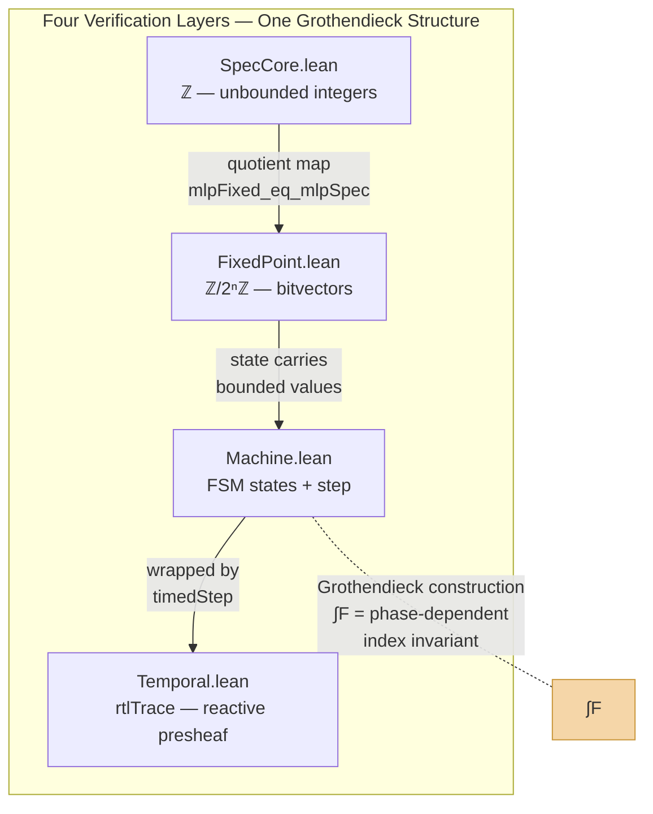

---

## 2. Category Theory Fundamentals

### 2.1 Definition of a Category

A category **C** consists of a collection of objects Ob(**C**) and, for any two objects A, B, a collection of morphisms Hom(A, B), satisfying:

```
h ∘ (g ∘ f) = (h ∘ g) ∘ f          (associativity)
id_B ∘ f = f = f ∘ id_A             (identity)
```

for all composable f : A → B, g : B → C, h : C → D.

### 2.2 Functors

A functor F : **C** → **D** sends objects to objects and morphisms to morphisms, preserving composition and identities:

```
F(g ∘ f) = F(g) ∘ F(f)
F(id_A) = id_{F(A)}
```

A contravariant functor F : **C**ᵒᵖ → **D** reverses the direction of morphisms: F(g ∘ f) = F(f) ∘ F(g).

### 2.3 Natural Transformations

A natural transformation η : F ⇒ G between functors F, G : **C** → **D** assigns to each object X ∈ **C** a morphism η_X : F(X) → G(X), such that for every morphism f : X → Y the following square commutes:

```
G(f) ∘ η_X = η_Y ∘ F(f)
```

### 2.4 Presheaves

A presheaf on a category **C** is a contravariant functor F : **C**ᵒᵖ → **Set**. The presheaf category **Set**^(**C**ᵒᵖ) is the category of all presheaves on **C** with natural transformations as morphisms.

The most direct hardware example: viewing time as the natural number category **ℕ**, a signal `Signal dom α` is a functor **ℕ** → **Set**. It assigns a value of type α to each clock cycle t. This is the semantics used by the Sparkle Signal DSL in this repository.

---

## 3. The Grothendieck Construction: Definition and Intuition

### 3.1 Basic Definition

Given a category **C** and a functor F : **C** → **Cat** (where **Cat** is the category of small categories), the **Grothendieck construction** ∫F (also written ∫_C F or **C** ⋉ F) is the category defined as follows:

**Objects:**

```
Ob(∫F) = { (c, x) | c ∈ Ob(C),  x ∈ Ob(F(c)) }
```

**Morphisms** from (c, x) to (c', x'):

```
Hom_{∫F}((c,x), (c',x')) = { (f, g) | f : c → c' in C,  g : F(f)(x) → x' in F(c') }
```

**Composition:**

```
(f', g') ∘ (f, g) = (f' ∘ f,  g' ∘ F(f')(g))
```

### 3.2 Contravariant Grothendieck Construction

For a contravariant functor F : **C**ᵒᵖ → **Cat**, the direction of g reverses:

```
Hom_{∫F}((c,x), (c',x')) = { (f, g) | f : c → c' in C,  g : x → F(f)(x') in F(c) }
```

For a presheaf F : **C**ᵒᵖ → **Set**, each F(c) is a discrete category (a set), so g becomes the equation x = F(f)(x').

### 3.3 The Projection Functor

There is a natural projection functor π : ∫F → **C** from the total category to the base:

```
π(c, x) = c
π(f, g) = f
```

This projection defines a **fibration**. The **fiber** over c ∈ **C** is π⁻¹(c) = F(c).

### 3.4 Intuition: Assembling an Indexed Family into One

The intuition behind the Grothendieck construction is simple: "a different structure F(c) sits over each base point c, and a base morphism f : c → c' induces a connection F(f) : F(c) → F(c') between fibers. The construction assembles all of this into a single category."

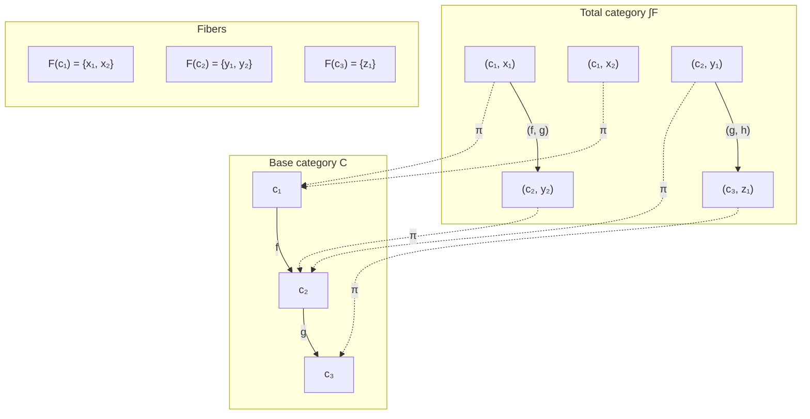

Think of it like a building: the base **C** is the floor plan, each room c has its own furniture F(c), and the Grothendieck construction is the whole building — all rooms with all their furniture, plus the hallways (morphisms) connecting them.

---

## 4. Combinational Logic: Categorical Interpretation

### 4.1 What Is Combinational Logic

A combinational logic circuit is one whose output is determined solely by the current inputs. It has no memory elements and no state. It is composed of logic gates (AND, OR, NOT, XOR, etc.).

### 4.2 Categorical Model: Cartesian Closed Categories

The natural categorical model for combinational logic is a **Cartesian closed category (CCC)**.

| Circuit concept | Categorical counterpart |
|----------------|------------------------|
| Wire bundle (n-bit bus) | Object A ∈ Ob(**C**) |
| Gate composition | Morphism f : A → B |
| Parallel wiring | Product A × B |
| Fan-out | Diagonal morphism Δ : A → A × A |
| Constant input | Global element 1 → A |
| Lookup table (LUT) | Exponential object Bᴬ |

In HDL, `assign y = a & b;` is a morphism f : Bit × Bit → Bit. More complex combinational logic (adders, multiplexers, ROMs) is expressed as compositions of morphisms.

### 4.3 Example from This Repository

The weight ROM in this repository is pure combinational logic:

```systemverilog
always_comb begin
  unique case ({hidden_idx, input_idx})
    8'h00: w1_data = 8'sd0;
    // ...
  endcase
end
```

This is a morphism `romRead : Idx × Idx → Int8`. Since there is no state, no Grothendieck construction is needed — it is a single morphism over a single fiber. However, the moment this ROM is read with **different semantics depending on the FSM phase**, fiber structure emerges (see §6).

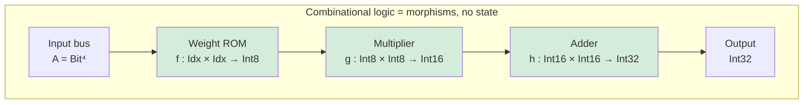

Each box is a morphism. No feedback, no memory — just composition. This is a CCC: everything is a pure function from inputs to outputs.

### 4.4 Combinational Logic and Topoi

The fact that truth values in combinational logic are {0, 1} corresponds to the subobject classifier Ω = {true, false} in the **Set** topos. This is the categorical expression of classical logic: the law of excluded middle P ∨ ¬P holds, and every proposition is either true or false.

---

## 5. Sequential Logic: Categorical Interpretation

### 5.1 What Is Sequential Logic

A sequential logic circuit is one whose output and **next state** are determined by the current input and the **current state**. It contains memory elements such as flip-flops, registers, and latches.

### 5.2 Synchronous Sequential Circuits

In synchronous circuits, state transitions occur only on clock edges. The transition functions are:

```
next_state = δ(current_state, input)
output     = λ(current_state, input)   -- Mealy
output     = λ(current_state)          -- Moore
```

### 5.3 Asynchronous Sequential Circuits

In asynchronous circuits, input changes affect state immediately. In this repository, the asynchronous reset (`rst_n`) is an example:

```systemverilog
always_ff @(posedge clk or negedge rst_n) begin
  if (!rst_n) state <= IDLE;  // asynchronous reset
  else state <= next_state;    // synchronous transition
end
```

The gap between Sparkle's synchronous Signal DSL semantics and the RTL's asynchronous reset is why the reset bridging logic in `controller_spot_compat.sv` is necessary. See [`generated-rtl.md` §5](generated-rtl.md) for the adapter layer design.

### 5.4 Categorical Model of Sequential Logic: Presheaves over Time

The natural model for synchronous sequential circuits is a presheaf over the natural number category **ℕ**. Viewing **ℕ** as a category whose objects are natural numbers and whose sole morphisms are successors s : n → n+1:

- State stream: **ℕ** → **State** — assigns a state to each cycle
- Input stream: **ℕ** → **Input** — assigns an input to each cycle
- Output stream: **ℕ** → **Output** — assigns an output to each cycle

The `rtlTrace` in this repository has exactly this structure:

```lean
def rtlTrace (samples : Nat → CtrlSample) : Nat → State
  | 0 => idleState
  | n + 1 => timedStep (samples n) (rtlTrace samples n)
```

This is a functor T : **ℕ** → **State**, assigning a machine state to each natural number (cycle).

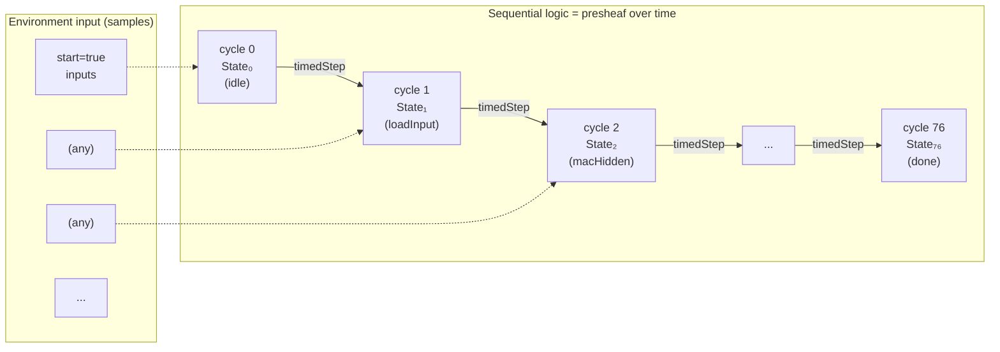

Unlike combinational logic, sequential logic has **state that persists across cycles**. The machine at cycle n+1 depends on the machine at cycle n. This is a presheaf: a functor from time to states.

### 5.5 The Emergence of the Grothendieck Construction: Phase-Dependent State Spaces

The point where sequential circuits go beyond simple presheaves is when **the state space itself depends on the phase**. In this repository's FSM:

- MAC_HIDDEN phase: inputIdx is one of 0, 1, 2, 3, 4
- BIAS_HIDDEN phase: inputIdx is exactly 4
- MAC_OUTPUT phase: inputIdx is one of 0, 1, ..., 8
- DONE phase: inputIdx is exactly 8

The "allowed index combinations" differ at each phase. This is a functor F : **Phase** → **Set**, and its total space ∫F is the set of all legal control configurations (treated in detail in §7).

---

## 6. Finite State Machines: Categorical Interpretation

### 6.1 Definition of a Finite State Machine

A finite state machine (FSM) is a 5-tuple (Q, Σ, δ, q₀, F):
- Q: finite set of states
- Σ: input alphabet
- δ: Q × Σ → Q transition function
- q₀ ∈ Q: initial state
- F ⊆ Q: accepting states (in hardware, specific output conditions)

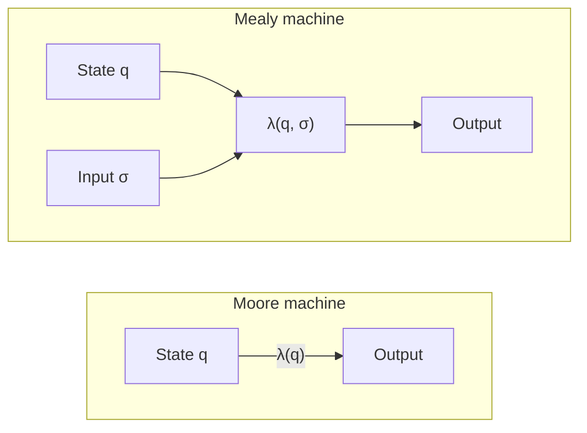

### 6.2 Moore Machines and Mealy Machines

**Moore machine**: output is a function of the current state only, λ : Q → Γ

**Mealy machine**: output is a function of the current state and input, λ : Q × Σ → Γ

The FSM in this repository is a hybrid:
- `done`, `busy` are Moore outputs — determined by phase alone
- `do_mac_hidden` is a Mealy output — determined by the combination of phase (MAC_HIDDEN) and input condition (inputIdx < 4)

```lean
-- Moore: determined by phase alone
def busyOf (s : State) : Bool := s.phase ≠ .idle ∧ s.phase ≠ .done

-- Mealy: phase + index condition
def doMacHidden (s : State) : Bool :=
  s.phase = .macHidden ∧ s.inputIdx < inputCount
```

### 6.3 Viewing the FSM as a Functor

The most natural way to view an FSM categorically is to construct a **transition category**.

Define a category **T** as follows:
- Objects: the phase set Phase = {idle, loadInput, macHidden, biasHidden, actHidden, nextHidden, macOutput, biasOutput, done}
- Morphisms: allowed transitions (the `AllowedPhaseTransition` from this repository)

```
idle → idle              (start = false)
idle → loadInput         (start = true)
loadInput → macHidden
macHidden → macHidden    (inputIdx < 4)
macHidden → biasHidden   (inputIdx = 4, guard cycle)
biasHidden → actHidden
actHidden → nextHidden
nextHidden → macHidden   (hiddenIdx < 7)
nextHidden → macOutput   (hiddenIdx = 7)
macOutput → macOutput    (inputIdx < 8)
macOutput → biasOutput   (inputIdx = 8, guard cycle)
biasOutput → done
done → done              (start = true)
done → idle              (start = false)
```

This transition graph is a **directed graph** and generates a free category. The `phase_ordering_ok` theorem in this repository proves that every actual transition is a morphism in this category.

### 6.4 The Grothendieck Construction over the FSM

The true categorical structure of an FSM emerges not from the transition graph alone, but when it includes the **datapath fibers** attached to each phase.

Define a functor F : **Phase** → **Set** as follows:

```
F(macHidden)  = { (h, i) ∈ ℕ² | h < 8 ∧ i ≤ 4 }
F(biasHidden) = { (h, i) ∈ ℕ² | h < 8 ∧ i = 4 }
F(actHidden)  = { (h, i) ∈ ℕ² | h < 8 ∧ i = 4 }
F(nextHidden) = { (h, i) ∈ ℕ² | h < 8 ∧ i = 0 }
F(macOutput)  = { (h, i) ∈ ℕ² | h = 0 ∧ i ≤ 8 }
F(biasOutput) = { (h, i) ∈ ℕ² | h = 0 ∧ i = 8 }
F(done)       = { (h, i) ∈ ℕ² | h = 0 ∧ i = 8 }
F(idle)       = { (h, i) ∈ ℕ² | h ≤ 8 ∧ i ≤ 8 }
F(loadInput)  = { (h, i) ∈ ℕ² | h ≤ 8 ∧ i ≤ 8 }
```

The total space is:

```
∫F = { (p, h, i) | p ∈ Phase, (h, i) ∈ F(p) }
```

This is the categorical identity of `IndexInvariant` in this repository. `IndexInvariant` is the characteristic function of ∫F. See [`temporal-verification-of-reactive-hardware.md` §7](temporal-verification-of-reactive-hardware.md) for the full preservation proof and the mermaid diagram of the fiber transition graph.

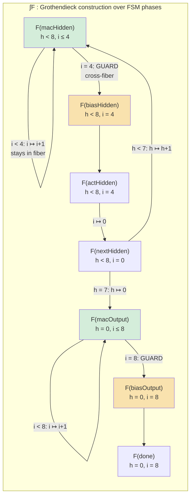

Each colored box is a **fiber** — the set of legal index values for that phase. Arrows within a fiber (self-loops) are intra-fiber moves. Arrows between fibers are **cross-fiber transitions**, and the guard cycles (highlighted in yellow) are where the fiber boundary is crossed.

### 6.5 Cross-Fiber Transitions and Guard Cycles

A guard cycle is a **cross-fiber transition**. In the transition from macHidden to biasHidden:

1. Within the macHidden fiber, i increments 0 → 1 → 2 → 3 (intra-fiber movement)
2. When i = 4, macHidden → biasHidden (cross-fiber transition, **guard cycle**)
3. In the biasHidden fiber, i = 4 is preserved

The guard cycle proofs in this repository verify that these fiber transitions are correct — that the image lands in the target fiber:

```lean
theorem hiddenGuard_no_mac_work (sample : CtrlSample) (s : State)
    (hphase : s.phase = .macHidden) (hidx : s.inputIdx = inputCount) :
    SameDataFields s (timedStep sample s)
```

Categorically, this says that the fiber restriction of the transition morphism is well-defined.

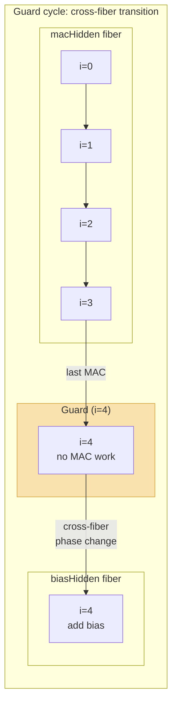

The guard cycle is the "door" between two fibers. The proof `hiddenGuard_no_mac_work` guarantees that when you walk through this door, no spurious computation happens — the accumulator is untouched, and you land safely in the next fiber.

---

## 7. Cartesian Fibrations and the Control Projection

### 7.1 Definition of a Cartesian Fibration

A functor π : **E** → **B** is a **Cartesian fibration** if, for every morphism f : b → b' in **B** and every object e' in **E** over b', there exists a Cartesian lift f̃ : e → e' with π(f̃) = f. A morphism f̃ is **Cartesian** if for every g : e'' → e' with π(g) = f ∘ h, there exists a unique h̄ : e'' → e with π(h̄) = h and f̃ ∘ h̄ = g.

### 7.2 The Cartesian Fibration in This Repository

The projection `controlOf : State → ControlState` defines a Cartesian fibration:

```
         step
State ─────────→ State
  │                 │
  │ π = controlOf   │ π = controlOf
  ↓                 ↓
ControlState ──→ ControlState
    controlStep
```

The commutativity condition is `π ∘ step = controlStep ∘ π` where π = controlOf. This is the `control_step_agrees` theorem:

```lean
theorem control_step_agrees (s : State) :
    controlOf (step s) = controlStep (controlOf s)
```

**Why Cartesian**: the control transition (controlStep) does not depend on datapath values (registers, accumulator, hidden activations). The FSM is **data-independent**. This means the fiber coordinate does not influence the base dynamics — precisely the condition for a Cartesian fibration.

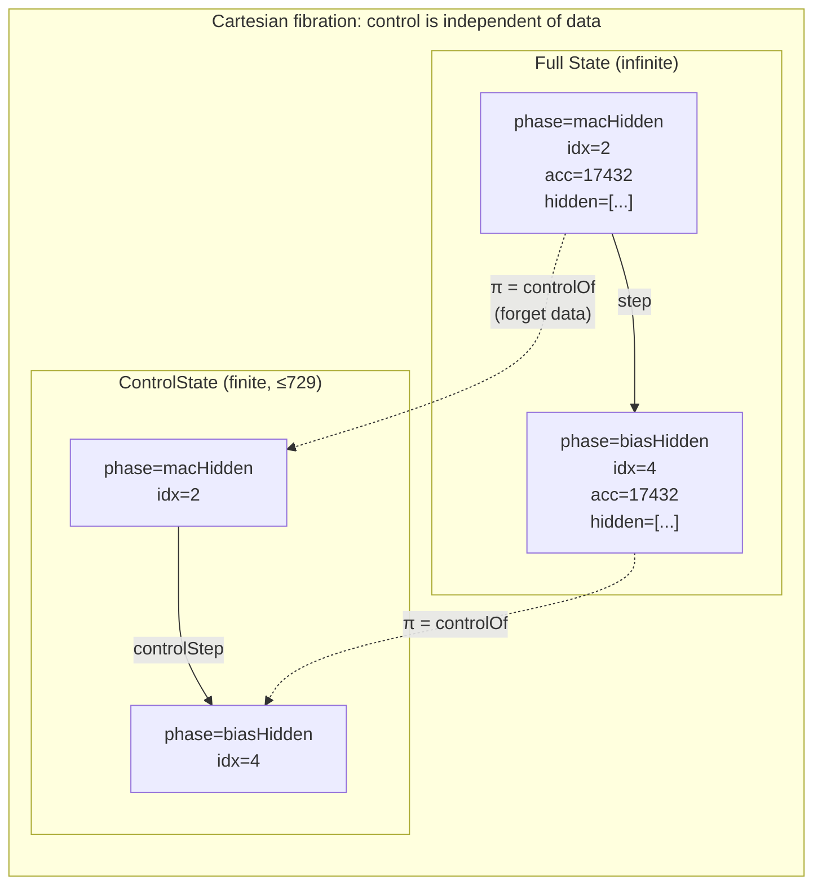

The key insight: the **bottom row** (control) evolves identically regardless of what the accumulator, registers, or hidden values are. So you can answer phase-related questions by looking only at the finite bottom row.

### 7.3 Practical Significance of the Control Projection

The key consequence of a Cartesian fibration: **properties that depend only on the base can be proved on the base alone.**

The base category **ControlState** is finite (9 phases × 9 hiddenIdx × 9 inputIdx = at most 729 reachable states). The full state space **State** is infinite (32-bit accumulator, eight 16-bit hidden registers, etc.). Thanks to the control projection, phase-related properties (active window, phase ordering, index safety) can be decided by `native_decide` on the finite space.

```lean
private theorem controlRun_active_window (k : Fin totalCycles) (hpos : 0 < k.1) :
    let ph := (controlRun k.1 initialControl).phase
    ph ≠ .idle ∧ ph ≠ .done := by
  native_decide +revert
```

This means forgetting the infinite fiber and computing on the finite base — precisely the reduction that a Cartesian fibration permits. See [`temporal-verification-of-reactive-hardware.md` §8](temporal-verification-of-reactive-hardware.md) for the full control projection technique and its use in the active window proof.

---

## 8. Grothendieck Topoi and Internal Logic

### 8.1 Definition of a Topos

An **elementary topos** is a category satisfying:

1. **Finite limits** exist (in particular, terminal object 1 and pullbacks)
2. **Cartesian closure**: for any objects A, B, an exponential object Bᴬ exists satisfying

```
Hom(C × A, B) ≅ Hom(C, Bᴬ)     (natural in C)
```

3. A **subobject classifier** Ω exists: an object Ω with a morphism true : 1 → Ω such that for every monomorphism m : S ↪ X, there is a unique χ_S : X → Ω making the following a pullback:

```
S ——→ 1
|       |
m       true
|       |
↓       ↓
X ——→ Ω
  χ_S
```

### 8.2 Grothendieck Topoi

A **Grothendieck topos** is a sheaf category Sh(**C**, J) over a small site (**C**, J), where J is a Grothendieck topology on **C**.

Key relationship: every Grothendieck topos is an elementary topos. The presheaf category **Set**^(**C**ᵒᵖ) is also a topos (without the sheaf condition).

### 8.3 Three Key Topos Examples

| Topos | Definition | Subobject classifier Ω | Logic |
|-------|-----------|------------------------|-------|
| **Set** | Category of sets and functions | {true, false} | Classical (LEM holds) |
| **Set**^(**C**ᵒᵖ) | Presheaves on **C** | Functor of sieves | Intuitionistic |
| Sh(**C**, J) | Sheaf topos | Functor of closed sieves | Intuitionistic |

### 8.4 Internal Logic

The **internal logic** of a topos is the logical system naturally induced by the topos structure:

- **Conjunction ∧**: product
- **Disjunction ∨**: coproduct
- **Implication →**: exponential
- **Universal ∀**: dependent product / right adjoint
- **Existential ∃**: dependent sum / left adjoint
- **True ⊤**: terminal object
- **False ⊥**: initial object

In a general topos, the law of excluded middle P ∨ ¬P **may fail**. This is intuitionistic logic. A topos where classical logic holds (a Boolean topos) is the special case where Ω is {0, 1}.

### 8.5 Significance for Hardware

| Logical system | Hardware counterpart | Where used |
|---------------|---------------------|------------|
| Classical logic | Combinational logic — every bit is 0 or 1 | SAT/SMT solvers, bitvector reasoning |
| Intuitionistic logic | Constructive proofs — proving existence extracts a value | Program extraction in Lean/Coq |
| Internal logic | Reasoning inside a topos — context-dependent truth | Temporal reasoning over presheaves |

In this repository, **temporal properties** can be interpreted in the internal logic of the presheaf topos. "Done at cycle 76" is a truth value at time index 76, which is an element of the presheaf Ω.

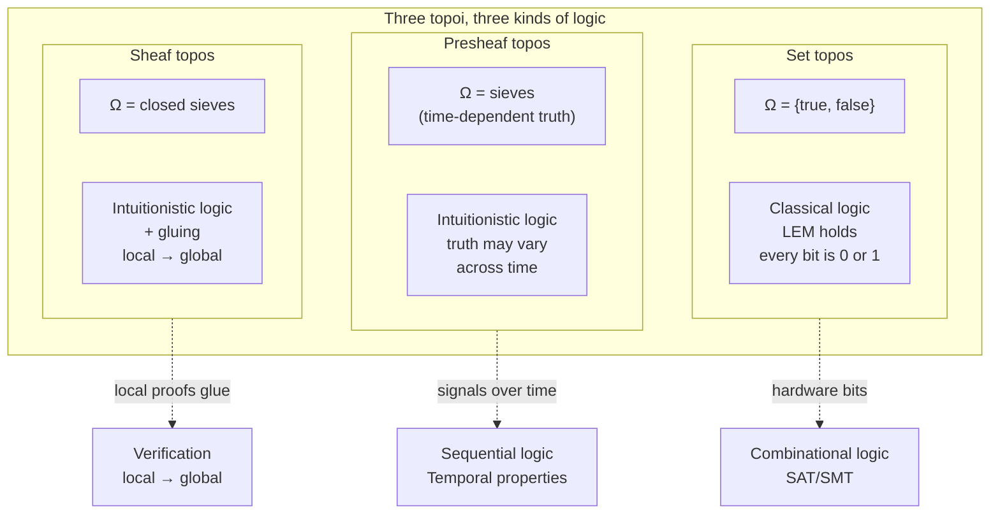

---

## 9. The Grothendieck Construction and Dependent Types

### 9.1 What Are Dependent Types

A dependent type is a type that depends on a value. When the codomain B in a function type `A → B` varies with the element of A, we write this as the dependent function type `Π(a : A), B(a)`.

- **Dependent product (Π-type)**: `Π(a : A), B(a)` — a function choosing an element of B(a) for every a
- **Dependent sum (Σ-type)**: `Σ(a : A), B(a)` — a pair of some a and an element of B(a)

### 9.2 The Grothendieck Construction = Categorical Realization of the Dependent Sum

The objects (c, x) of the Grothendieck construction ∫F are precisely elements of the dependent sum `Σ(c : C), F(c)`. If the functor F : **C** → **Set** assigns a set F(c) to each c, the total space is `{(c, x) | c ∈ C, x ∈ F(c)}`.

In the language of type theory:

```
∫F  ↔  Σ(c : C), F(c)     (at the level of objects)
π   ↔  fst                 (projection = first component)
```

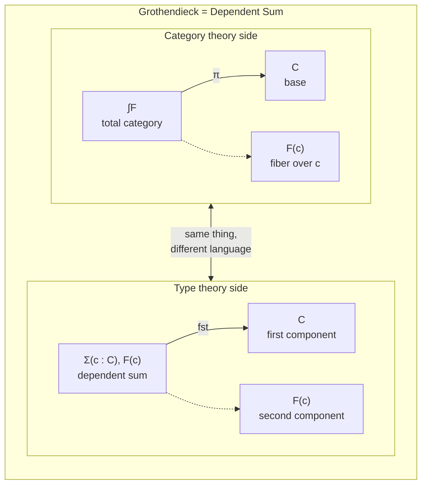

### 9.3 Realization in This Repository

Lean 4's `IndexInvariant` is the propositional version of a dependent type:

```lean
def IndexInvariant (s : State) : Prop :=
  match s.phase with
  | .macHidden  => s.hiddenIdx < 8 ∧ s.inputIdx ≤ 4
  | .biasHidden => s.hiddenIdx < 8 ∧ s.inputIdx = 4
  -- ...
```

This is `Π(p : Phase), Prop`, a dependent function assigning a proposition to each phase. The totality of states satisfying `IndexInvariant` is `Σ(p : Phase), F(p)` — the Grothendieck construction ∫F.

Sparkle's `encodeState` must respect this structure:

```lean
def encodeState (s : State) : MlpCoreState := ...
```

The encoding must place each phase fiber element into the correct BitVec range. When the phase transitions from macHidden to biasHidden, the encoded index must land within the target fiber's BitVec representable range. This is the core check at the inductive step of the refinement proof. See [`generated-rtl.md` §10–§11](generated-rtl.md) for the encode/decode bridge and the refinement theorems.

### 9.4 Categorical Interpretation of Contexts and Substitution

In type theory, a **context** Γ = (x₁ : A₁, x₂ : A₂(x₁), ...) is a nested Σ-type of dependent types. A **substitution** σ : Δ → Γ is a morphism between contexts.

Hardware correspondences:
- Context = current FSM phase + index state
- Substitution = index transformation accompanying a phase transition
- Dependent type = valid index range that varies with phase

---

## 10. Temporal Logic and Presheaves

### 10.1 Temporal Logic Fundamentals

Temporal logic deals with propositions that change over time.

| Symbol | Name | Meaning |
|--------|------|---------|
| **G** φ | Globally | φ at all future time points |
| **F** φ | Eventually / Future | φ at some future time point |
| **X** φ | neXt | φ at the immediately next time point |
| φ **U** ψ | Until | φ holds until ψ becomes true |

### 10.2 LTL and CTL

**LTL (Linear Temporal Logic)**: temporal properties over a single execution trace. Introduced by Pnueli (1977). The standard for specifying reactive systems.

**CTL (Computation Tree Logic)**: temporal properties over a branching execution tree. Uses path quantifiers A (all paths) and E (some path).

The TLSF specification in this repository uses LTL:

```
G(!reset && phase_idle && start -> X phase_load_input)
G(!reset && phase_mac_hidden && guard -> X phase_bias_hidden)
```

### 10.3 Presheaf Interpretation of Temporal Logic

LTL formulas are naturally interpreted in the internal logic of the presheaf topos **Set**^(**ℕ**ᵒᵖ).

Given a state trace T : **ℕ** → **State**:
- **G** φ is `∀ n : ℕ, φ(T(n))` — a global section of the presheaf
- **F** φ is `∃ n : ℕ, φ(T(n))` — existential quantification
- **X** φ is `φ(T(n+1))` — evaluation at the successor
- φ **U** ψ is `∃ k, ψ(T(k)) ∧ ∀ j < k, φ(T(j))` — bounded universal + existential

The temporal theorems in this repository are Lean proof versions of this interpretation:

```lean
-- G(active → busy): busy always holds during the active window
theorem busy_during_active_window ... (k : Fin totalCycles) (hpos : 0 < k.1) :
    busyOf (rtlTrace samples k.1)

-- F done: done is eventually reached
theorem acceptedStart_eventually_done ... :
    doneOf (rtlTrace samples totalCycles)
```

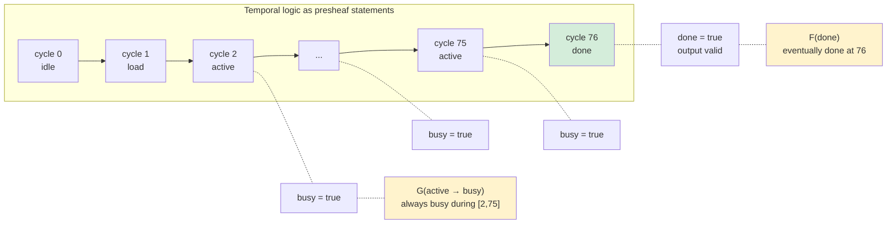

### 10.4 Modal Logic and Kripke Semantics

Modal logic is a generalization of temporal logic. In Kripke semantics:
- A set W of possible worlds
- An accessibility relation R ⊆ W × W
- □φ: φ holds in all R-accessible worlds
- ◇φ: φ holds in some R-accessible world

In temporal logic, W = ℕ (time), R = successor relation. In hardware, W = reachable states, R = FSM transitions.

A Kripke frame (W, R) is a model of a presheaf topos. The modal operators □, ◇ correspond to universal/existential quantification in the internal logic over presheaves.

### 10.5 Connection to Hoare Logic

A Hoare triple {P} C {Q} in Hoare logic means "if precondition P holds and program C is executed, then postcondition Q holds."

The correspondence in this repository:

```
{phase = idle ∧ start = true}   -- precondition P
  run totalCycles                -- program C (76 cycles)
{phase = done ∧ output = mlpFixed(input)}  -- postcondition Q
```

This is the combination of `rtl_correct` and `acceptedStart_eventually_done`. Hoare logic and temporal logic meet here: Hoare logic addresses the input-output relation, while temporal logic addresses the temporal properties of intermediate steps.

Dynamic logic unifies modal logic and Hoare logic: [C]φ = "after executing C, φ necessarily holds." This is a program-indexed version of the necessity operator □.

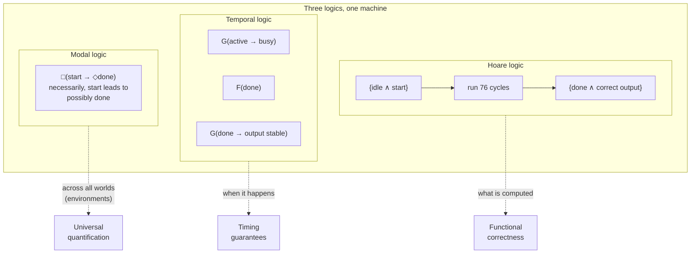

---

## 11. Arithmetic Theories and the Grothendieck Construction

### 11.1 Three Arithmetic Theories

| Theory | Language | Axioms | Decidability |
|--------|----------|--------|-------------|
| Presburger arithmetic | (ℕ, 0, S, +) | Axioms for addition + induction schema | **Decidable** |
| Robinson arithmetic Q | (ℕ, 0, S, +, ×) | Basic axioms for addition and multiplication (no induction) | Incomplete |
| Peano arithmetic PA | (ℕ, 0, S, +, ×) | Axioms for addition and multiplication + induction schema | Incomplete |

### 11.2 Their Place in Hardware Verification

**Presburger arithmetic**: index range checks, counter boundaries, linear inequalities. The SMT solver's `omega` decision procedure completely decides this domain. In this repository, index invariants like "inputIdx < 4" and "hiddenIdx ≤ 7" live in Presburger arithmetic.

**Robinson arithmetic**: the world changes the moment multiplication enters. `w1[i,j] * x[j]` is not free multiplication but multiplication by a fixed constant; however, in general, the inclusion of multiplication brings Gödel incompleteness.

**Peano arithmetic**: proofs where induction is essentially required. In this repository, `rtlTrace_preserves_indexInvariant` is proved by induction on the natural number n and lies in the domain of Peano arithmetic.

### 11.3 Categorical Reinterpretation

Each arithmetic theory can be viewed as a categorical object. For a theory T, one constructs the **syntactic category** **Syn**(T):
- Objects: formulas (contexts) of T
- Morphisms: provably functional relations in T

A model is a functor F_T : **Syn**(T) → **Set**. The model endows the syntactic structure with set-theoretic meaning.

**Connection to the Grothendieck construction**: consider the context category **Ctx**(T) and, for each context Γ, the set of formulas (types) definable in Γ:

```
F : Ctx(T)ᵒᵖ → Set
F(Γ) = { φ | φ is a formula in context Γ }
```

The Grothendieck construction ∫F of this functor is the totality of "context + formula" pairs, and the projection π : ∫F → **Ctx**(T) extracts the context from each pair. This is the **fibration of logic**.

### 11.4 Comparing Fibers Across Presburger, Robinson, and Peano

| Theory | Fiber F(Γ) characteristics | Automation potential |
|--------|---------------------------|---------------------|
| Presburger | Linear inequalities → decidable by QE | Fully automated (SMT `omega`) |
| Robinson | Includes multiplication → representable but incomplete | Partially automated (bit-blasting) |
| Peano | Requires induction → incomplete but powerful | Semi-automated (tactics + user guidance) |

The QF_BV (quantifier-free bitvector) proofs in this repository are essentially finite-width Presburger-like decision procedures. In bitvector arithmetic, multiplication by a fixed constant reduces to repeated addition and is therefore decidable.

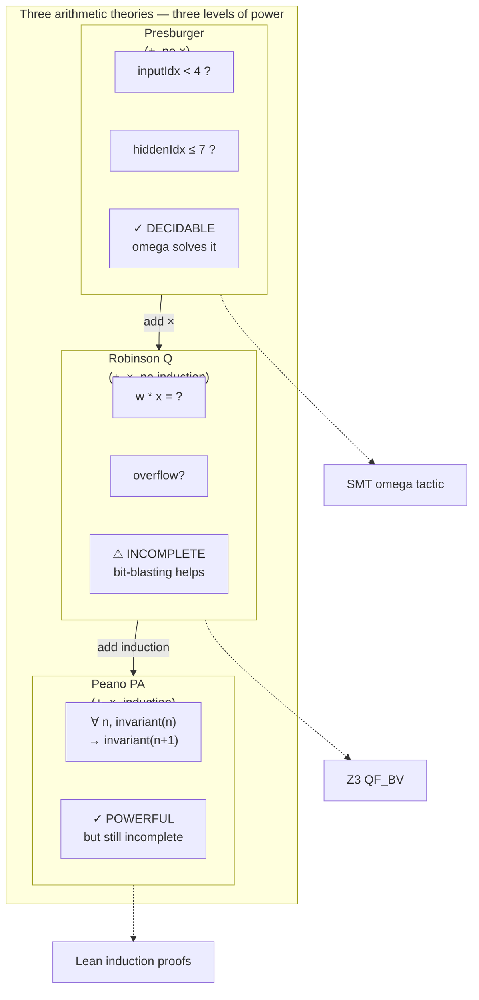

---

## 12. Quotient Ring Geometry and Fixed-Point Arithmetic

### 12.1 Correspondence Between Two Models

The MLP forward-pass computation is a term in integer linear arithmetic. This term is evaluated in two models:

| Model | Domain | Arithmetic | Lean counterpart |
|-------|--------|-----------|-----------------|
| ℤ (spec) | Unbounded integers | Standard | `mlpSpec` |
| ℤ/2ⁿℤ (fixed-point) | Finite bitvectors | Modular (wrapping at each step) | `mlpFixed` |

### 12.2 Injectivity of the Quotient Map

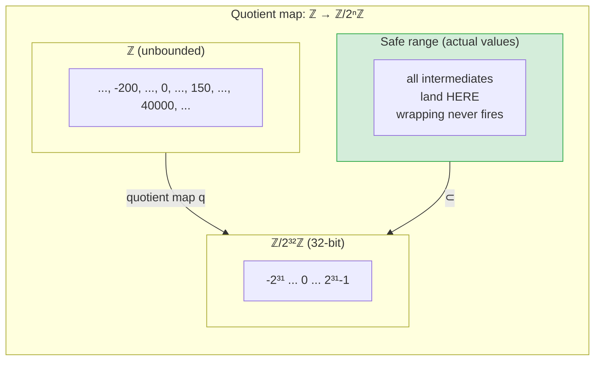

Key theorem: for the frozen weights, the quotient map ℤ → ℤ/2ⁿℤ is **injective** on the actual computation range.

```lean
theorem mlpFixed_eq_mlpSpec (input : Input8) :
    mlpFixed input = mlpSpec (toMathInput input)
```

This means wrapping never activates. Two's-complement wrapping is declared in the model but never an active part of the computation. See [`from-ann-to-proven-hardware.md` §5](from-ann-to-proven-hardware.md) for the proof layers and [`solver-backed-verification.md` §5](solver-backed-verification.md) for the QF_BV wide-sum checks that confirm this at the bitvector level.

### 12.3 Categorical Interpretation

The quotient map q : ℤ → ℤ/2ⁿℤ is a ring homomorphism. Categorically:

- ℤ and ℤ/2ⁿℤ are objects in the category **Ring**
- q : ℤ → ℤ/2ⁿℤ is a morphism in **Ring**
- The "injective range" is the complement of the kernel of q

In the layer-by-layer MLP computation, each layer operates at a different bit width:

```
16-bit: hidden products (int8 × int8)
32-bit: accumulator (hidden MAC sums)
24-bit: output products (int16 × int8)
32-bit: output score (output MAC sums)
1-bit:  final decision (score > 0)
```

This is a **tower of quotient maps**:

```
ℤ → ℤ/2¹⁶ℤ → ℤ/2³²ℤ → ℤ/2²⁴ℤ → ℤ/2³²ℤ → ℤ/2¹ℤ
```

Whether the two views (contract view and RTL view) produce the same result at each layer is verified by a compositional miter. The correct composition of this tower is ultimately confirmed by the `out_bit` equivalence.

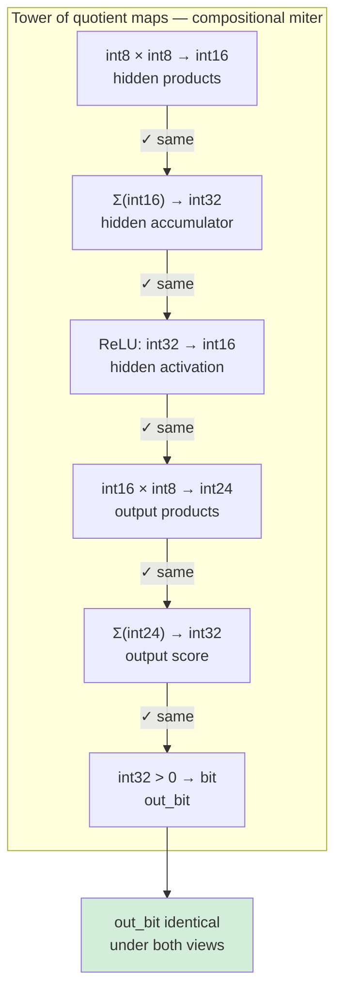

### 12.4 Fibered Interpretation

In Sparkle's `encodeState`, quotient arithmetic meets Grothendieck structure. The encoding must:

1. Place each intermediate value in the correct BitVec representable range (quotient geometry)
2. Simultaneously land in the correct phase fiber (Grothendieck construction)

If an encoded index drifts out of the target fiber at a guard-cycle boundary, the refinement proof fails at precisely that transition.

---

## 13. Reactive Synthesis and Game Semantics

### 13.1 Pnueli's Program

Starting from the temporal logic introduced by Pnueli (1977), Pnueli and Rosner (1989) posed the **reactive synthesis** problem: given a temporal specification, automatically construct a system that satisfies it against all environment behaviors.

This is a **game-theoretic view**:
- Environment: chooses inputs
- System: chooses outputs
- Winning condition: an infinite game satisfying the temporal specification φ

### 13.2 GR(1) Synthesis

GR(1) (Generalized Reactivity 1) is a practical subclass of reactive synthesis. It is solvable in polynomial time when the specification has the form:

```
(GF p₁ ∧ ... ∧ GF pₘ) → (GF q₁ ∧ ... ∧ GF qₙ)
```

where GF means "infinitely often."

The TLSF specification in this repository uses only the safety fragment of GR(1) — all constraints have the form `G(condition → X consequence)`. See [`generated-rtl.md` §1–§7](generated-rtl.md) for the full reactive synthesis pipeline, predicate abstraction, and dual validation strategy.

### 13.3 Categorical Connection

The game semantics of reactive synthesis and the Lean proofs in this repository are two approaches to the **same universally quantified statement**:

```
∀ (samples : ℕ → CtrlSample), acceptedStart ... → doneOf (rtlTrace samples totalCycles)
```

- **GR(1) synthesis**: **constructs** a winning strategy for the system (constructive)
- **Lean proof**: **verifies** that a specific system wins against all environments (analytic)

Type-theoretically, this universal quantification is a dependent product (Π-type):

```
Π(samples : ℕ → CtrlSample), acceptedStart ... → doneOf (rtlTrace samples totalCycles)
```

A constructive proof constructs an element of this Π-type, and game-theoretic synthesis constructs a function — the winning strategy.

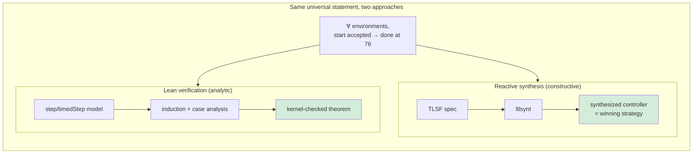

### 13.4 Predicate Abstraction and Fibration

The core technique in the reactive synthesis branch is **predicate abstraction**. It abstracts 4-bit counter buses into boolean predicates:

```
input_idx[3:0]  →  { hidden_mac_active, hidden_mac_guard,
                     output_mac_active, output_mac_guard, last_hidden }
```

This is categorically a **fibration**. The full state space (9 phases × 16 × 16 counter values) projects onto a boolean predicate base. Since control decisions depend only on the base, this is the same structure as the Cartesian fibration in §7 — only Lean's `controlOf` and TLSF's predicate abstraction express the same mathematical object in different languages.

---

## 14. The Sheaf Condition and the Local-to-Global Principle

### 14.1 What Is a Sheaf

Given a Grothendieck topology J on a category **C**, a presheaf F : **C**ᵒᵖ → **Set** is a **sheaf** if for every covering sieve S ∈ J(c), every S-compatible family extends uniquely.

Intuition: locally compatible data can be glued into a global whole.

### 14.2 The Local-to-Global Principle in Hardware Verification

The verification in this repository is a practical application of the local-to-global principle:

**Local proofs**:
- Index preservation at each phase transition (`step_preserves_indexInvariant`)
- Overflow safety at each neuron (`hiddenSpecAt_bounds`)
- No-work proof at each guard cycle (`hiddenGuard_no_mac_work`)

**Global conclusions**:
- Index safety across the entire trace (`rtlTrace_preserves_indexInvariant`)
- Correctness over 76 cycles (`rtl_correct`)
- Temporal correctness of the full transaction (`acceptedStart_eventually_done`)

This assembly process is precisely how the sheaf condition works: if local data (proofs at each transition) are compatible (each transition connects), they glue into a global proof.

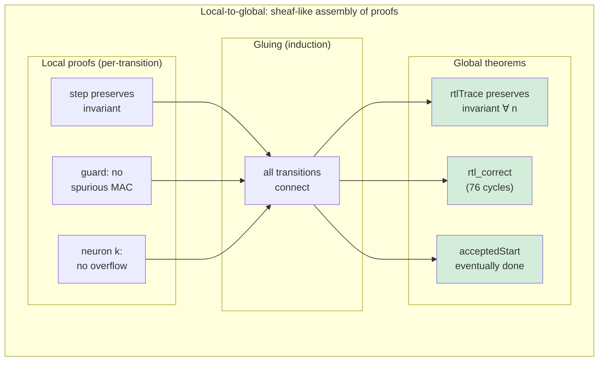

### 14.3 Relationship Between the Grothendieck Construction and Sheaves

The Grothendieck construction ∫F of a presheaf F : **C**ᵒᵖ → **Set** is the total category. The sheaf condition reads as a **gluing property** of this total category: sections defined locally along a cover glue uniquely into a global section.

In the context of this repository:
- Base category **C** = phase category (FSM transition graph)
- Fiber F(p) = legal index space for phase p
- Gluing condition = boundary conditions of adjacent phases are compatible (guard cycle proofs)

---

## 15. The Bridge Theorem and Partial Natural Isomorphism

### 15.1 Two Functors

One of the key structures in this repository is the existence of two state evolutions:

```
R : ℕ → State       R(n) = run n (initialState input)
T : ℕ → State       T(n) = rtlTrace samples n
```

R is the **operational** model — self-contained, ignoring the environment.
T is the **reactive** model — accepting environment input at every cycle.

### 15.2 Partial Natural Isomorphism

The bridge theorem says R and T agree on the interval [2, 76]:

```lean
theorem rtlTrace_matches_run_after_loadInput (samples : Nat → CtrlSample)
    (hstart : (samples 0).start = true) :
    ∀ n, n + 2 ≤ totalCycles →
      rtlTrace samples (n + 2) = run (n + 2) (initialState (capturedInput samples))
```

This is a **partial natural isomorphism**. R and T:
- Differ at n ∈ {0, 1} (different handling of start/loadInput)
- Agree at n ∈ [2, 76] (active computation window)
- Differ at n > 76 (hold/release vs. fixed point)

The enabling condition is the **active window lemma**: at n ∈ [2, 75], the phase is active (neither idle nor done), so `timedStep` degenerates to `step` and the natural transformation becomes the identity.

Categorically, this is a natural transformation η between two functors R, T : **ℕ** → **State** that is a natural isomorphism on a partial interval. This partial isomorphism is the bridge connecting functional correctness to temporal correctness.

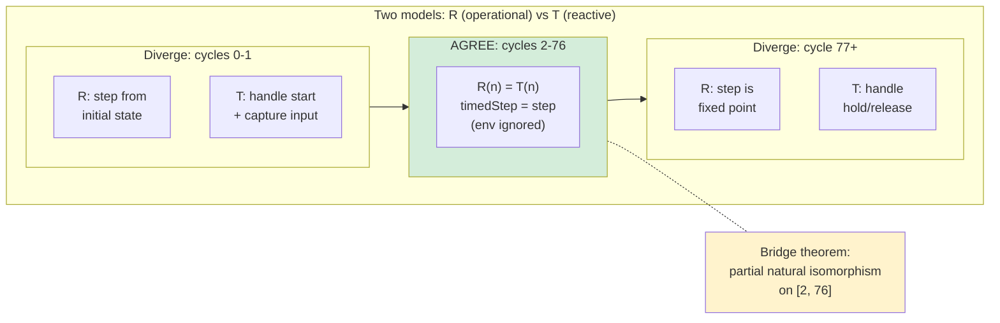

---

## 16. Lean's Calculus of Inductive Constructions and Category Theory

### 16.1 CIC and Topoi

The logical foundation of Lean 4 is the **Calculus of Inductive Constructions (CIC)**. CIC is a form of dependent type theory featuring:

- Dependent products Π(x : A), B(x) — universal quantification / function types
- Dependent sums Σ(x : A), B(x) — existential quantification / pair types
- Inductive types — definitions of natural numbers, lists, trees, etc.
- Universes — Type, Prop

The semantics of CIC is given in **locally Cartesian closed categories (LCCCs)**. Every Grothendieck topos is an LCCC, so it can provide a model of CIC.

### 16.2 The Grothendieck Construction in Lean

In Lean, the Grothendieck construction appears directly in the form of dependent types:

```lean
-- Functor F : Phase → Set
def IndexSpace : Phase → Type
  | .macHidden  => { p : Nat × Nat // p.1 < 8 ∧ p.2 ≤ 4 }
  | .biasHidden => { p : Nat × Nat // p.1 < 8 ∧ p.2 = 4 }
  -- ...

-- Grothendieck construction ∫F = Σ(p : Phase), IndexSpace p
def LegalControlConfig := Σ (p : Phase), IndexSpace p
```

`IndexInvariant` is the characteristic function of this dependent sum, and `step_preserves_indexInvariant` proves that `step` is an endomorphism of this dependent sum.

### 16.3 Comparison with Coq and Isabelle

| System | Logical foundation | Grothendieck construction representation | Automation |
|--------|-------------------|------------------------------------------|-----------|
| Lean 4 | CIC (Inductive Constructions) | Σ-types + match | `omega`, `native_decide`, `simp` |
| Coq | CIC (Calculus of Constructions) | Σ-types + dependent pattern matching | `omega`, `lia`, `auto` |
| Isabelle/HOL | HOL (Higher-Order Logic) | Records + locales | `auto`, `sledgehammer` |

One reason this repository chose Lean is that dependent types naturally express the phase-dependent invariants of the Grothendieck construction. In HOL, which lacks dependent types, these must be encoded as predicates.

---

## 17. SMT and Decidable Fragments

### 17.1 SAT and SMT

**SAT**: satisfiability of propositional logic formulas — NP-complete but practically solvable

**SMT (Satisfiability Modulo Theories)**: satisfiability of first-order formulas with background theories (linear arithmetic, bitvectors, arrays, etc.)

### 17.2 QF_BV and Presburger Arithmetic

The contract proofs in this repository use **QF_BV (quantifier-free bitvector)** logic. QF_BV is quantifier-free arithmetic over finite-width bitvectors.

Multiplication by a fixed constant `w * x` (w constant, x variable) reduces to repeated addition `x + x + ... + x`. Therefore, the MLP forward pass with frozen weights is essentially **finite-width Presburger arithmetic**. Z3's bit-blasting decision procedure is complete for this fragment.

### 17.3 Bounded Model Checking and Category Theory

Bounded model checking (BMC) unrolls the transition relation to depth k and checks all reachable states. Categorically:

```
BMC_k = ∀ (trace : Fin k → State),
          valid_trace(trace) → ∀ i, property(trace i)
```

Here `Fin k` is {0, 1, ..., k-1}. This is universal quantification over the finite category **Fin k**.

The SMT bounded model checking in this repository (depth 82) is universal quantification over **Fin 82**. Lean's temporal theorems are universal quantification over **ℕ** (infinite, by induction). Both are assertions about sections of presheaves, but over base categories of different size.

---

## 18. Fibrations, Stacks, and Descent

### 18.1 Fibrations

A functor π : **E** → **B** is a **fibration** if, for every morphism f : b → b' and every object e' over the codomain of f, a Cartesian lift exists.

The Grothendieck construction ∫F → **C** naturally yields a split fibration. Conversely, a split fibration determines a functor F : **C** → **Cat**, and this correspondence is the **Grothendieck correspondence**.

### 18.2 Fibration Interpretation in Hardware

Three fibrations in this repository:

**1. Control-data fibration** (§7)

```
State → ControlState
```

Base: FSM control state (phase, indices)
Fiber: datapath values (registers, accumulator, hidden activations)

**2. Index invariant fibration** (§6.4)

```
∫F → Phase
```

Base: FSM phase
Fiber: legal index space per phase

**3. Arithmetic fibration** (§12.4)

```
ℤ → ℤ/2ⁿℤ
```

Base: finite bitvector representation
Fiber: equivalence classes of integers with the same bit representation

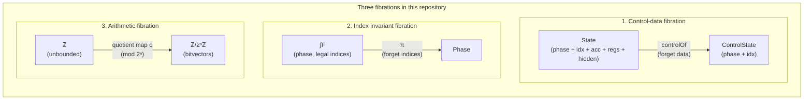

### 18.3 Relationship to Stacks

A stack is "fibration + descent condition." Descent is the categorified version of the sheaf condition: locally defined objects glue into a global object, uniquely up to isomorphism.

In this repository, the three RTL implementations (hand-written, reactive synthesis, Sparkle) meeting at the same `mlp_core` boundary is a practical example of descent: they have different internal structures but are compatible at the "cover" of the `mlp_core` port interface.

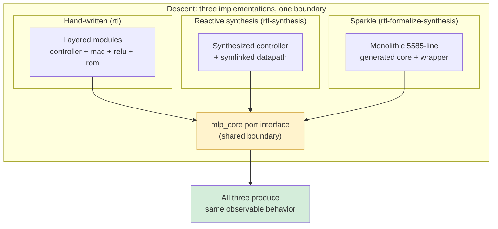

Internally different, externally the same — like three open sets that look different locally but agree on their overlaps. That agreement is descent. See [`generated-rtl.md` §16–§22](generated-rtl.md) for the structural comparison and trust analysis of the three implementations.

---

## 19. HDL Semantics and Category Theory

### 19.1 Two Levels of HDL

HDL (Hardware Description Language) is a language for describing hardware. The core distinction in SystemVerilog:

- `always_comb`: combinational logic — pure functions (§4)
- `always_ff @(posedge clk)`: sequential logic — state transitions (§5)

### 19.2 Categorical Semantics of the Sparkle Signal DSL

```mermaid
graph LR
    subgraph "HDL two-level structure"
        direction TB
        subgraph comb["always_comb — combinational"]
            COMB_IN["inputs"] --> COMB_F["pure function f"] --> COMB_OUT["outputs"]
        end
        subgraph seq["always_ff @(posedge clk) — sequential"]
            SEQ_STATE["state(t)"]
            SEQ_IN["input(t)"]
            SEQ_NEXT["state(t+1) = δ(state(t), input(t))"]
            SEQ_STATE --> SEQ_NEXT
            SEQ_IN --> SEQ_NEXT
        end
    end

    comb -.->|"no memory<br/>= morphism"| CAT1["CCC morphism"]
    seq -.->|"state over time<br/>= presheaf"| CAT2["Presheaf ℕ → State"]
```

Sparkle's `Signal dom α` is a time-indexed stream:

```lean
-- Signal.atTime t: extract value at cycle t
-- Signal.register init next: register — initial value + next-state function
-- Signal.loop: recursive signal definition (feedback loops)
-- hw_cond: multiplexer (synthesizable conditional)
```

Categorically:
- `Signal dom α` = functor **ℕ** → **Set** (presheaf)
- `Signal.register` = fixed point of the state monad
- `Signal.loop` = least fixed point of a recursive equation
- `hw_cond` = universal property of the coproduct

### 19.3 Synthesis and Place & Route

Yosys synthesis transforms HDL into a gate netlist. This is categorically a **functor** Synth : **HDL** → **Gate**, where:

- **HDL** = category of HDL descriptions (objects: modules, morphisms: instantiations)
- **Gate** = category of gate netlists (objects: netlists, morphisms: subcircuit inclusions)

Yosys's SMT formalization operates on the image of this functor:

```
HDL →^{Synth} Gate →^{SMT2} SMT-LIB →^{Z3} {sat, unsat}
```

The `yosys-smtbmc` in this repository performs bounded model checking on the result of Synth. See [`solver-backed-verification.md` §3](solver-backed-verification.md) for the full semantics of bounded model checking and the four RTL property families.

```mermaid
graph LR
    subgraph "BMC (bounded) vs Lean (unbounded)"
        direction TB
        subgraph bmc["SMT bounded model checking"]
            FIN["Fin 82<br/>(finite unrolling)"]
            FIN --> PROP1["∀ inputs at each cycle,<br/>property holds"]
            PROP1 --> CAVEAT["⚠ Cannot see<br/>beyond depth 82"]
        end
        subgraph lean["Lean induction proofs"]
            NAT["ℕ<br/>(infinite, by induction)"]
            NAT --> PROP2["∀ n : ℕ,<br/>property holds"]
            PROP2 --> CAVEAT2["⚠ Over model,<br/>not real Verilog"]
        end
    end

    bmc -.->|"real Verilog<br/>bounded depth"| IMPL["Implementation<br/>fidelity"]
    lean -.->|"model<br/>unbounded depth"| SEMANTIC["Semantic<br/>depth"]

    style IMPL fill:#cce5ff
    style SEMANTIC fill:#cce5ff
```

---

## 20. Synthesis: A Mathematical Map of Hardware Verification

### 20.1 The Full Picture

```mermaid
graph TB
    subgraph "Grothendieck Construction ∫F"
        direction TB
        PHASE["Base: Phase (FSM phases)"]
        FIBER["Fiber: F(p) (legal indices per phase)"]
        TOTAL["Total: ∫F = Σ(p : Phase), F(p)"]
        PHASE --> FIBER --> TOTAL
    end

    subgraph "Cartesian Fibration"
        direction TB
        STATE["Full state: State"]
        CTRL["Control state: ControlState"]
        PROJ["Projection π = controlOf"]
        STATE --> PROJ --> CTRL
    end

    subgraph "Presheaf / Temporal Semantics"
        direction TB
        TIME["Base: ℕ (cycles)"]
        TRACE["Presheaf: rtlTrace (state trace)"]
        TEMPORAL["Temporal theorems: G, F, U properties"]
        TIME --> TRACE --> TEMPORAL
    end

    subgraph "Quotient Geometry"
        direction TB
        UNBOUNDED["ℤ (unbounded integers)"]
        BOUNDED["ℤ/2ⁿℤ (bitvectors)"]
        QUOTIENT["Quotient map q : ℤ → ℤ/2ⁿℤ"]
        UNBOUNDED --> QUOTIENT --> BOUNDED
    end

    TOTAL -.-> STATE
    TRACE -.-> STATE
    BOUNDED -.-> FIBER
```

### 20.2 Correspondence Table

| Hardware concept | Categorical counterpart | Realization in this repository |
|-----------------|------------------------|-------------------------------|
| Combinational logic | Morphisms in a CCC | Weight ROM, combinational MAC parts |
| Sequential logic | Presheaf ℕ → State | `rtlTrace`, `Signal dom α` |
| FSM phase | Object of the base category | `Phase` inductive type |
| Phase transition | Morphism of the base category | `AllowedPhaseTransition` |
| Index invariant | Grothendieck construction ∫F | `IndexInvariant` |
| Guard cycle | Cross-fiber transition morphism | `hiddenGuard_no_mac_work` |
| Control projection | Cartesian fibration | `controlOf` / `controlStep` |
| Moore output | Function on the base | `busyOf`, `doneOf` |
| Mealy output | Function on the total space | `doMacHidden` |
| Synchronous clock | Successor morphism in ℕ | Application of `timedStep` |
| Asynchronous reset | Forced projection to the base | Reset bridging logic |
| Fixed-point arithmetic | Quotient ring ℤ/2ⁿℤ | `mlpFixed`, `wrap16`, `wrap32` |
| Overflow safety | Injectivity of the quotient map | `mlpFixed_eq_mlpSpec` |
| Temporal properties | Internal logic of the presheaf | `busy_during_active_window`, etc. |
| BMC (bounded model checking) | Universal quantification over Fin k | yosys-smtbmc depth 82 |
| Reactive synthesis | Construction of a winning strategy | ltlsynt / TLSF |
| Predicate abstraction | Base projection of a fibration | Boolean predicates in TLSF |
| Three RTL implementations | Descent over a shared boundary | `mlp_core` port interface |
| Lean CIC | Internal language of an LCCC | Dependent types + inductive types |
| QF_BV decision | Finite-width Presburger decision | Z3 bit-blasting |

### 20.3 How Everything Connects

```mermaid
graph TB
    subgraph "The big picture: one hardware design, many mathematical lenses"
        direction TB

        HW["Hardware Design<br/>(MLP inference accelerator)"]

        HW --> COMB["§4 Combinational Logic<br/>= CCC morphisms<br/>(ROM, MAC, ReLU)"]
        HW --> SEQ["§5 Sequential Logic<br/>= presheaf over ℕ<br/>(rtlTrace)"]
        HW --> FSM_BOX["§6 FSM<br/>= transition category<br/>(Moore + Mealy)"]

        FSM_BOX --> GROTH["§6.4 Grothendieck Construction<br/>∫F = phase-dependent invariant<br/>(IndexInvariant)"]
        FSM_BOX --> CART["§7 Cartesian Fibration<br/>controlOf projection<br/>(finite decidability)"]

        SEQ --> TEMP["§10 Temporal Logic<br/>= presheaf internal logic<br/>(G, F, U properties)"]
        SEQ --> BRIDGE["§15 Bridge Theorem<br/>= partial natural iso<br/>(run ↔ rtlTrace)"]

        GROTH --> DEP["§9 Dependent Types<br/>Σ-type = ∫F<br/>(Lean encoding)"]
        GROTH --> SHEAF["§14 Sheaf / Gluing<br/>local proofs → global<br/>(induction)"]
        GROTH --> GUARD["§6.5 Guard Cycles<br/>= cross-fiber transitions"]

        HW --> ARITH["§12 Quotient Geometry<br/>ℤ → ℤ/2ⁿℤ<br/>(mlpFixed = mlpSpec)"]
        ARITH --> SMT["§17 SMT / QF_BV<br/>= finite Presburger<br/>(bit-blasting)"]

        HW --> SYNTH["§13 Reactive Synthesis<br/>= game-theoretic<br/>(∀ env, system wins)"]

        SHEAF --> DESCENT["§18 Descent<br/>three RTL impls<br/>same boundary"]
    end

    style GROTH fill:#f5d6a8,stroke:#c9963a
    style CART fill:#f5d6a8,stroke:#c9963a
    style GUARD fill:#f5d6a8,stroke:#c9963a
    style DEP fill:#f5d6a8,stroke:#c9963a
```

### 20.3.1 Key Relationships in One Sentence Each

1. The **Grothendieck construction** assembles the phase-dependent index spaces of the FSM into a single category.
2. The **Cartesian fibration** ensures that control logic is independent of data, enabling decision on a finite space.
3. **Presheaves** are state traces over time and provide the natural semantics of temporal logic.
4. **Quotient ring geometry** describes the conditions under which finite-width arithmetic agrees with unbounded arithmetic.
5. The **sheaf condition** is the principle for assembling a global proof (full trace) from local proofs (individual transitions).
6. **Dependent types** are the type-theoretic realization of the Grothendieck construction and are expressed naturally in Lean.

---

## Appendix A. Symbol Reference

| Symbol | Name | Meaning |
|--------|------|---------|
| ∫F | Grothendieck construction | Total category of functor F |
| π : ∫F → **C** | Projection functor | Forgetful functor from total to base |
| F(c) | Fiber | Category/set over base point c |
| Σ(a : A), B(a) | Dependent sum | Type-theoretic counterpart of the Grothendieck construction |
| Π(a : A), B(a) | Dependent product | Universal quantification / function space |
| Ω | Subobject classifier | Internal truth-value object of a topos |
| **Set**^(**C**ᵒᵖ) | Presheaf topos | All presheaves on **C** |
| Sh(**C**, J) | Sheaf topos | Sheaves for Grothendieck topology J |
| ℤ/2ⁿℤ | Quotient ring | n-bit modular arithmetic |
| G φ | Globally | LTL: φ at all future times |
| F φ | Eventually | LTL: φ at some future time |
| X φ | Next | LTL: φ at the next time point |
| {P} C {Q} | Hoare triple | Precondition – program – postcondition |
| □ φ | Necessity | Modal logic: φ in all accessible worlds |
| ◇ φ | Possibility | Modal logic: φ in some accessible world |
| ⊢ | Provable | Derivable in a formal system |
| ⊨ | Satisfies | True in a model |

## Appendix B. Reference Context

| Area | Key figures/results | Role in this document |
|------|--------------------|-----------------------|
| Temporal logic | Pnueli (1977) | Specification language for reactive systems |
| Reactive synthesis | Pnueli–Rosner (1989) | Temporal spec → automatic implementation |
| GR(1) synthesis | Piterman–Pnueli–Sa'ar (2006) | Practical synthesis subclass |
| Grothendieck topos | Grothendieck (SGA 4, 1963–69) | Sheaf categories, internal logic |
| Grothendieck construction | Grothendieck | Totalization of indexed categories |
| Dependent types | Martin-Löf (1971) | Foundation of Lean's CIC |
| Curry–Howard correspondence | Curry (1934), Howard (1969) | Proofs = programs |
| Cartesian fibrations | Grothendieck (SGA 1) | Data-independent control reasoning |
| Presburger arithmetic | Presburger (1929) | Decidable linear arithmetic |
| Gödel incompleteness | Gödel (1931) | Limits of arithmetic with multiplication |
| BMC | Biere et al. (1999) | Bounded-depth model checking |
| Kripke semantics | Kripke (1959) | Models for modal/temporal logic |
