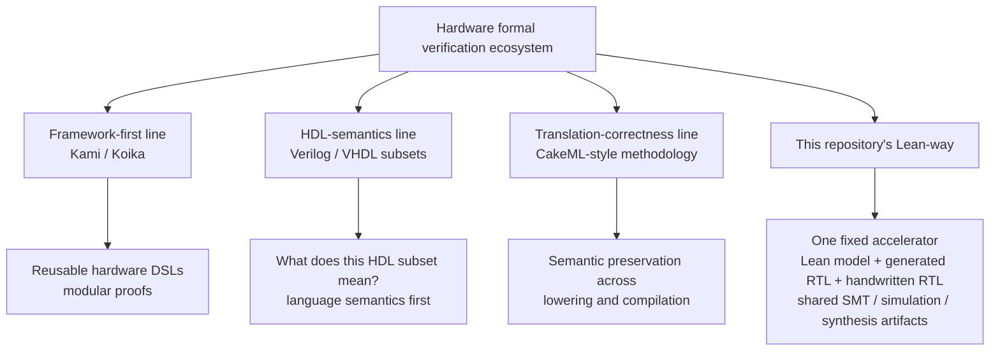

# Hardware Formal Verification Ecosystem

Date: 2026-03-17

## Scope

Why Coq and Isabelle dominate hardware formal verification today, where Lean 4 stands as a late entrant, and how this repository's "Lean-way" differs from the main established lines.

## Short Answer

Coq and Isabelle dominate hardware formal verification because they already accumulated the hard part: domain-specific hardware semantics, DSLs, libraries, and case studies. Lean 4 is not obviously weaker in principle, but it is much earlier in the hardware ecosystem build-out.

This repository's Lean-way is therefore not "Lean already replaces Kami, Koika, or HDL-semantics projects." It is a narrower bet:

- use Lean 4 to formalize the intended machine behavior of one small accelerator
- connect that model to generated RTL where possible
- cross-check handwritten RTL and generated RTL with shared simulation, SMT, and downstream artifacts
- make the full ANN -> contract -> Lean -> RTL -> experiments path inspectable and reproducible

That is a useful and credible research direction, but it is different from building a mature hardware-verification framework or a complete HDL semantics.

## What "Lean-Way" Means Here

In this repository, the Lean-centered path is not a full verified HDL toolchain.

It is a combination of:

- a Lean model and proof of the intended `mlp_core` behavior
- a Sparkle-based generated branch that narrows the model-to-RTL gap for one path
- handwritten baseline RTL that is still related to Lean by disciplined correspondence rather than by a theorem
- shared simulation, SMT, and synthesis-facing artifacts used as cross-checks across branches

So the repository's strongest claim is artifact-centric and boundary-centric, not framework-complete:

- one small accelerator is tracked end-to-end through multiple representations
- the main trust boundary is explicit
- generated and handwritten implementations are compared at a stable observable boundary

## Comparison Axes

The cleanest way to compare prior systems with this Lean-way is along four axes:

1. **Framework depth**: does the project provide a reusable hardware language or proof framework?
2. **HDL semantics**: does it formalize a real HDL or a disciplined hardware DSL?
3. **Translation correctness**: does it prove compiler or lowering correctness?
4. **Artifact-centric end-to-end flow**: does it tie one concrete design through training/specification/proof/RTL/checking/synthesis artifacts?

## Established Lines vs This Lean-Way

| Line | Proof Assistant | Main Strength | Relative to this repository's Lean-way |
| --- | --- | --- | --- |
| Kami | Coq | Modular hardware DSL with parameterized proofs and extraction to circuits | Much stronger on reusable framework design and modular processor-scale verification. We are narrower, smaller, and more artifact-driven. |
| Koika | Coq | Rule-based hardware language with precise semantics, ORAAT theorem, and verified compiler to circuits | Structurally the closest comparison. Koika is stronger on semantics and compilation correctness; this repository is stronger on cross-branch artifact comparison around one fixed accelerator. |
| Small-subset Verilog semantics line | Coq / other provers | Operational or executable semantics for a restricted HDL subset | Stronger on answering "what does this HDL mean?" We do not close that gap yet; our Lean-to-RTL bridge remains partial and explicit. |
| Isabelle Verilog-semantics line | Isabelle | Compositional semantics for a Verilog subset | Again stronger on HDL semantics itself. Our work is closer to machine-model correctness plus implementation cross-checking than to language semantics. |
| CakeML | HOL family | Verified compiler methodology and end-to-end semantic preservation for software toolchains | Not a hardware DSL project, but a stronger exemplar of proof-producing translation discipline than the current Lean/Sparkle path. |
| Early HOLCF/VHDL line | Isabelle/HOLCF | Foundational VHDL semantics work | Historically important semantics groundwork; much less aligned with our artifact pipeline, but directly relevant to the kind of HDL gap we still leave open. |

## More Precise Comparisons

### Kami

Kami is closer to a reusable verification platform than to a single case study. Its strengths are:

- modular proof structure
- parameterization over system families
- processor-scale verification examples
- a mature Coq-centered hardware DSL story

Compared to that, this repository is much smaller in proof scope and framework ambition. Its advantage is elsewhere:

- the object is tiny enough to inspect completely
- the ANN contract, Lean model, RTL branches, SMT checks, simulations, and synthesis inputs are all tied to the same frozen artifact

So Kami is deeper as a verification framework, while this repository is tighter as a single concrete research artifact.

### Koika

Koika is the closest conceptual relative.

Why it is close:

- hardware is written in a proof-assistant-hosted DSL
- the language has a precise execution semantics
- there is a verified compiler story
- the work is explicitly about making generated circuits inherit proved source-level meaning

Why it is still ahead of this repository:

- the semantics and compiler story are more mature
- ORAAT reasoning gives a crisp execution model for generated hardware
- the scale of reusable framework design is higher

Why this repository is still different:

- it keeps both handwritten RTL and generated RTL in play
- it emphasizes branch comparison at the `mlp_core` boundary
- it ties formal reasoning to a frozen ML contract and downstream QoR-style experiments

So if one prior system is "closest in spirit," it is Koika. But Koika is a language-and-compiler result, while this repository is an end-to-end artifact stack with a partially proved generation path.

### HDL-semantics projects

The Verilog- and VHDL-semantics lines answer a different first question:

- not "is this machine model correct?"
- but "what does this HDL subset mean in the first place?"

That is exactly where this repository is still incomplete. The current repository is explicit that:

- the handwritten RTL branch is not formally linked to Lean by a semantics theorem
- the Sparkle branch narrows the gap, but still leaves the backend and wrapper boundary trusted

So these semantics projects are stronger on language foundations than this Lean-way. In contrast, this repository is stronger on showing a full engineering workflow around one stable design boundary.

### CakeML

CakeML is not a hardware verification framework, so it should not be compared as if it were Kami or Koika.

Its relevance is methodological:

- define a precise source semantics
- compile through a sequence of justified transformations
- prove that target execution preserves source meaning

That is the gold-standard shape for the part of this repository that is still open. In that sense, CakeML is less a competitor than a model for what a stronger Lean-to-RTL story would eventually resemble.

## Why Coq and Isabelle Still Lead

### Historical accumulation

Coq and Isabelle have had decades to build libraries, train researchers, and iterate on kernels and tooling. In hardware, that time advantage compounds because the expensive part is not only proving theorems, but building the semantics and libraries that make hardware proofs feasible at all.

### Trusted computing base maturity

Hardware verification often sits close to tape-out, certification, or other high-trust settings.

- **Coq** has a long-studied CIC kernel and an established record in certified compilation and systems verification.
- **Isabelle** has the LCF-style small-kernel architecture and a long history of highly trusted theorem-proving workflows.
- **Lean 4** has a credible kernel and much better modern engineering ergonomics, but its hardware-facing trust story is still young.

### Existing hardware semantics and DSLs

The incumbent systems already have:

- hardware DSLs
- HDL subset semantics
- bitvector and arithmetic libraries used in practice
- large case studies that trained the research community

Lean 4 currently has pieces of this, but not yet the full stack.

## Where Lean 4 Still Has Real Advantages

Lean 4 is still a plausible place to build new hardware verification work.

1. **Metaprogramming**: Lean 4 is very good for DSL construction, elaboration, and reflective tooling.
2. **Performance**: compiled evaluation can be attractive for executable models and proof-side computation.
3. **Developer experience**: editor support and language tooling are materially better than many incumbent proof-assistant workflows.
4. **Mathlib**: broad mathematical infrastructure is already available.
5. **AI concentration**: recent LLM-oriented proof tooling is disproportionately focused on Lean.

These are not enough to erase the ecosystem gap, but they are enough to justify experiments like this repository.

## Bottom Line

Relative to the systems listed above, this repository is:

- **weaker on reusable framework depth** than Kami and Koika
- **weaker on HDL semantics** than Verilog/VHDL semantics projects
- **weaker on verified lowering discipline** than CakeML-style end-to-end compilation work
- **stronger on concrete artifact integration** than most of them for one tiny accelerator flowing through ML contract, Lean, RTL, SMT, simulation, and synthesis-facing outputs

So the right positioning is not "Lean now does what the Coq/Isabelle hardware ecosystem already does."

It is:

- Lean 4 is now good enough to support a serious small-scale hardware verification artifact
- this repository demonstrates that claim on a single inspectable accelerator
- the next step is to turn that artifact discipline into stronger semantics and translation results
