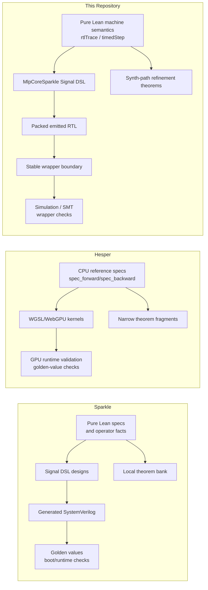

# Sparkle, Hesper, and Our Generated MLP Core

Date: 2026-03-19

## Scope

This note compares:

- the large public examples shipped by upstream Sparkle
- the large public examples shipped by upstream Hesper
- this repository's `rtl-formalize-synthesis/` branch

The point is not to rank projects in the abstract. The point is narrower:

- what kinds of large designs do these systems publicly carry?
- what kind of proof or validation surface do they attach to those designs?
- what does that imply for this repository's open question about the Lean-to-RTL semantic gap?

## Short Answer

Sparkle is the closest comparison to this repository's generated branch because it is also a Lean-hosted hardware DSL that emits Verilog. Its public large examples show that Signal-DSL scale is not the main bottleneck for us. The remaining issue is the proof boundary below the DSL.

Hesper is useful as a neighboring comparison, but not as a direct RTL comparison. It is a Lean-hosted GPU and WGSL framework, not a Verilog-emitting RTL DSL. Its large BitNet example is impressive as a typed and validated inference stack, but it does not directly answer this repository's question about emitted RTL semantics.

So the most honest positioning is:

- Sparkle shows that large Lean-hosted generated hardware is practical
- Hesper shows that a different path is possible, where verification pressure moves upward into a generator or shader DSL
- this repository remains smaller in hardware scale than the largest Sparkle examples, but sharper in focus on one fixed emitted MLP core and its explicit theorem boundary

## Comparison Axes

To keep the comparison honest, four axes matter more than raw source lines:

1. Execution target
2. Structural organization of the example
3. Public proof surface versus validation surface
4. Remaining gap to an end-to-end emitted-artifact theorem

## High-Level Map

## Sparkle: Large Generated-Hardware Examples

### BitNet b1.58 Accelerator

Upstream Sparkle presents BitNet as a complete Signal-DSL inference accelerator with two architecture modes:

- `HardwiredUnrolled`: larger area, minimum latency
- `TimeMultiplexed`: smaller area, serialized layer reuse

The public tree puts the top-level SoC organization in:

- <https://github.com/Verilean/sparkle/blob/main/Examples/BitNet/SoC/Top.lean>

and the arithmetic proof bank in:

- <https://github.com/Verilean/sparkle/tree/main/Examples/BitNet/Proof>

On a simple tree count of the public repository as checked on 2026-03-19, `Examples/BitNet` contains:

- 34 Lean files
- about 2023 lines total
- 8 proof files
- 67 `theorem` declarations in that subtree

The striking point is not only size. It is the proof style. The public proof files are concentrated around:

- fixed-point operator correctness
- arithmetic width sufficiency
- dot-product and softmax fragments
- local datapath facts suitable for `native_decide`

This is a real and important result: it shows that a Lean-hosted Signal DSL can support a nontrivial ML accelerator with a substantial theorem bank.

What it does **not** automatically show is a full emitted-SystemVerilog semantics theorem. The public Sparkle story is strongest at:

- Signal-DSL expressivity
- local arithmetic and operator proofs
- generation to Verilog
- validation against model data

It is weaker, at least publicly, on a theorem that closes the entire path from source DSL semantics to generated RTL semantics for the whole design.

### RV32IMA SoC

Sparkle also ships a larger SoC-scale example:

- <https://github.com/Verilean/sparkle/tree/main/Examples/RV32>

This example is structurally different from BitNet:

- it is not just a datapath proof bank
- it is a pipelined CPU plus privilege, MMU, memory, UART, and firmware boot story
- it emits Verilog and is exercised through a wrapper and Verilator flow

The public tree count for `Examples/RV32` as checked on 2026-03-19 is:

- 14 Lean files
- about 4734 lines total

The key architectural fact exposed in the public sources is that the SoC is organized around a single large state bundle and `Signal.loop` body, with `declare_signal_state` accessors and a separate Verilog-emission entrypoint:

- <https://github.com/Verilean/sparkle/blob/main/Examples/RV32/SoC.lean>
- <https://github.com/Verilean/sparkle/blob/main/Examples/RV32/SoCVerilog.lean>

That matters for comparison with this repository because it shows that Sparkle can carry not only arithmetic-heavy ML examples but also a state-heavy SoC example with a wrapper-facing generated-Verilog flow.

Again, however, the public strength is:

- large generated design
- explicit Signal-DSL structure
- boot evidence and runtime validation

not a clearly published end-to-end semantics theorem from the Signal DSL all the way down to emitted Verilog and wrapper behavior.

## Hesper: Large Lean-Hosted Verified Compute Examples

Hesper is different in kind:

- it targets WebGPU and WGSL rather than Verilog
- it uses Lean-hosted typed shader expressions and operator abstractions
- its public BitNet example is an inference stack, not an RTL generator

The public repository says this plainly:

- <https://github.com/Verilean/hesper/blob/main/README.md>

It also labels itself as alpha software.

### BitNet and the VerifiedOp Pattern

The most important Hesper structure for comparison is not a hardware netlist. It is the `VerifiedOp` and `VerifiedOpFusion` pattern:

- <https://github.com/Verilean/hesper/blob/main/Hesper/Core/VerifiedOp.lean>
- <https://github.com/Verilean/hesper/blob/main/Hesper/Core/VerifiedOpFusion.lean>

The architecture is:

- `spec_forward` and `spec_backward` as CPU-level reference behavior
- `impl_forward` / kernels as GPU or WGSL implementations
- consistency checking and fused-kernel composition as the main verification story

Its public BitNet-related files as checked on 2026-03-19 are roughly:

- `Hesper/Models/BitNet.lean`
- `Examples/BitNetComplete.lean`
- `Examples/BitNetInference.lean`
- `Examples/BitNet/InferenceDemo.lean`
- `Tests/BitNetValidation.lean`

Together these are about 2007 lines.

The important observation is that this BitNet path is much more validation-centric than theorem-centric. The visible public emphasis is:

- typed host-side structure
- GPU-oriented implementation
- golden-value comparison against `bitnet.cpp`

For example:

- <https://github.com/Verilean/hesper/blob/main/Tests/BitNetValidation.lean>

At the same time, some higher-level neural-network examples in the public tree still contain placeholders in GPU kernels or backwards paths, for example:

- <https://github.com/Verilean/hesper/blob/main/Hesper/NN/MLP.lean>
- <https://github.com/Verilean/hesper/blob/main/Hesper/NN/ResNet.lean>

Hesper does contain real theorem proving. A concrete visible example is:

- <https://github.com/Verilean/hesper/blob/main/Hesper/Proofs/ReductionEquiv.lean>

But that proof is narrow and algebraic: tree reduction equals linear sum over integers. It is not an end-to-end BitNet theorem.

So Hesper should be read as a neighboring but different case:

- stronger as a Lean-hosted verified GPU/shader framework
- not directly comparable as an emitted-RTL or emitted-Verilog semantics story

## Our `rtl-formalize-synthesis` Branch

Our generated branch is much smaller in hardware scale than Sparkle's largest public examples, but it is also more narrowly targeted.

The local `MlpCoreSparkle` subtree currently has:

- 9 Lean files
- about 4052 lines total
- about 1646 lines if one counts only the main implementation and emit files

Unlike the large Sparkle examples, the public claim here is tightly scoped to one fixed emitted design:

- one fixed 4-input / 8-hidden MLP core
- one fixed packed-output boundary
- one fixed emission entrypoint
- one explicit trust profile

The key files are:

- [MlpCoreSignal.lean](/Users/dididi/workspaces/ann-rtl-lean-poc/rtl-formalize-synthesis/src/MlpCoreSparkle/MlpCoreSignal.lean)
- [Refinement.lean](/Users/dididi/workspaces/ann-rtl-lean-poc/rtl-formalize-synthesis/src/MlpCoreSparkle/Refinement.lean)
- [BackendSemantics.lean](/Users/dididi/workspaces/ann-rtl-lean-poc/rtl-formalize-synthesis/src/MlpCoreSparkle/BackendSemantics.lean)
- [Emit.lean](/Users/dididi/workspaces/ann-rtl-lean-poc/rtl-formalize-synthesis/src/MlpCoreSparkle/Emit.lean)
- [ProofConfig.lean](/Users/dididi/workspaces/ann-rtl-lean-poc/rtl-formalize-synthesis/src/MlpCoreSparkle/ProofConfig.lean)

What is stronger here than in the large public upstream examples is not scale. It is the explicitness of the theorem boundary for one emitted design:

- there are public synth-path refinement theorems over the actual generated core path
- there is a public packed-payload theorem over the actual emit declaration
- the trust profile is recorded explicitly instead of being left implicit

What remains open here is also explicit:

- the branch still does not provide a general theorem for arbitrary MLP families
- the backend and wrapper story is still narrower than a full semantics-preservation theorem

## Comparative Summary

| System | Large public example | Main output target | Public proof style | Public validation style | Relation to our `Q6` |
| --- | --- | --- | --- | --- | --- |
| Sparkle | BitNet accelerator | Signal DSL to Verilog | Many local arithmetic and bit-width theorems | golden-value checks, generated RTL flows | Directly relevant; shows DSL scale is not the blocker |
| Sparkle | RV32IMA SoC | Signal DSL to Verilog | Structural Signal-DSL design with generated SoC flow | firmware tests, Verilator/Linux boot evidence | Directly relevant; shows large stateful generated systems are practical |
| Hesper | BitNet 2B inference engine | Lean to WGSL/WebGPU | narrow theorem fragments plus typed `VerifiedOp` framework | golden-value and GPU runtime validation | Indirectly relevant; closer to generator-native compute verification than RTL semantics |
| This repository | fixed `mlp_core` branch | Signal DSL to emitted Verilog wrapper path | actual synth-path and packed-payload refinement for one design, under explicit trust profile | shared simulation, SMT, wrapper checks | Smallest in scale, sharpest on one explicit theorem boundary |

## Proof-Boundary Sketch

```mermaid
flowchart TB
    subgraph SparkleLarge[Large Sparkle examples]
        SL1[Pure specs and local proofs]
        SL2[Signal DSL design]
        SL3[Generated Verilog]
        SL4[Golden-value checks or boot evidence]
        SL1 --> SL2
        SL2 -. public proof story is strongest here .-> SL3
        SL3 --> SL4
    end

    subgraph HesperLarge[Large Hesper examples]
        HL1[CPU reference behavior]
        HL2[WGSL/WebGPU implementation]
        HL3[Golden-value and GPU validation]
        HL4[Narrow theorem fragments]
        HL1 --> HL2 --> HL3
        HL1 --> HL4
    end

    subgraph OurBranch[Our generated MLP branch]
        OL1[Pure rtlTrace / timedStep semantics]
        OL2[Signal DSL synth path]
        OL3[Packed emitted RTL]
        OL4[Wrapper reconstruction]
        OL5[Simulation and SMT]
        OL1 -->|refinement theorems| OL2
        OL2 -. explicit trust profile<br/>and narrower backend claim .-> OL3
        OL3 --> OL4 --> OL5
    end
```

## What This Means for the Open Questions

### For `Q6`: the Lean-to-RTL semantic gap

The Sparkle comparisons strengthen `Q6` rather than weakening it.

They show that:

- this repository's problem is not that Lean-hosted Signal DSL is too small or too toy-like
- larger ML accelerators and SoCs already exist in the same general ecosystem

Therefore the remaining problem is more specific:

- what semantics do we assign to the exact generated subset and boundary used here?
- how do we relate the Sparkle DSL model, the emitted RTL, and the stable wrapper contract by theorem rather than by validation alone?

### For generalized theorems

Neither Sparkle's large public examples nor Hesper's large public examples automatically solve the repository's generalization problem.

They are still concrete artifact families:

- specific architectures
- specific operator libraries
- specific packing and execution conventions

So the repository's current limitation remains real:

- the theorem is universal over input traces
- it is not yet universal over architecture families

### For research positioning

The cleanest positioning is:

- Sparkle is the strongest nearby evidence that large Lean-hosted generated hardware is feasible
- Hesper is evidence that one can push correctness arguments upward into a generator or shader DSL rather than downward into emitted RTL
- this repository contributes a smaller but more artifact-specific refinement story around one emitted MLP core and its explicit trust boundary

## Bottom Line

The large upstream Sparkle examples should make us less modest about scale, but not less precise about proof boundaries.

The right lesson is not:

- "upstream has large examples, therefore our emitted RTL gap is solved"

It is:

- "upstream large examples remove the scale objection, so our remaining open problem is genuinely about semantics, translation, and trust boundaries rather than about whether Lean-hosted generated hardware is practical at all"
