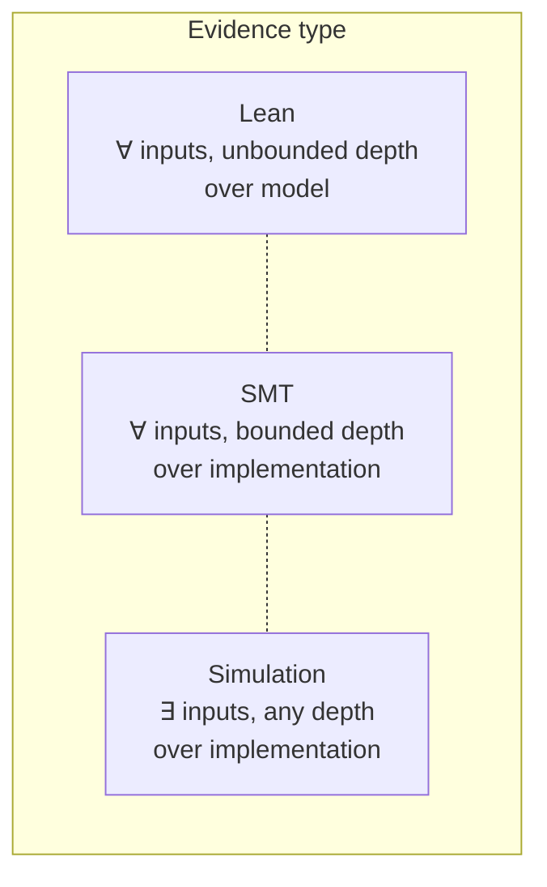
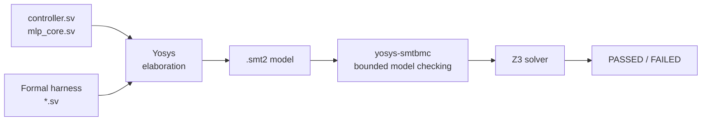
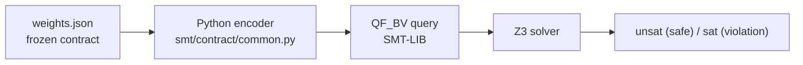
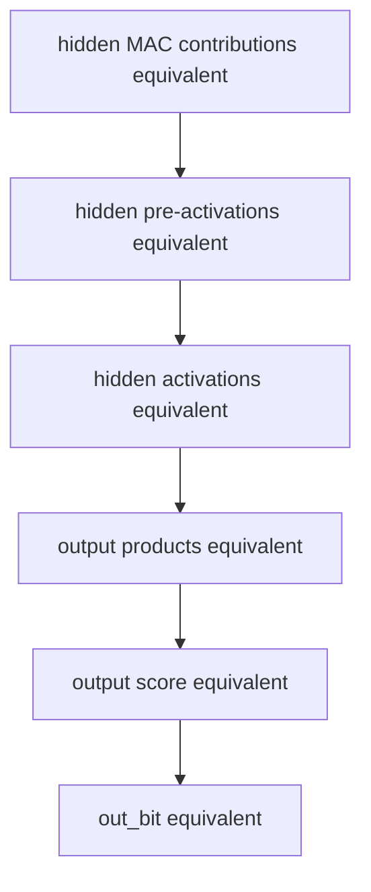

# Solver-Backed Verification

This document describes what the solver-backed verification layer in this repository means — what kind of evidence it provides, how that evidence differs across the three RTL branches, and where its trust boundaries lie. For execution details, see the Makefile targets under `smt` and the runner scripts in `smt/runners/`.

## 1. The Gap Solvers Address

Lean proves unbounded theorems over a hand-written model; simulation exercises the actual Verilog on finite test vectors (see [`from-ann-to-proven-hardware.md`](from-ann-to-proven-hardware.md) §5–§7 for details). Neither provides universal statements over the implementation.

Solver-backed verification occupies that position:



The SMT layer reasons about the actual Verilog — the same SystemVerilog that Yosys elaborates into gates — while covering all possible inputs within a bounded trace window. This is weaker than Lean's unbounded depth, but it operates on the real artifact rather than a transcription of it.

The combination matters because neither side alone is sufficient. Lean proves deep structural facts (phase ordering, index invariants, functional correctness) but trusts the model-to-implementation correspondence. SMT proves shallow-but-universal facts directly on the implementation but cannot see beyond its trace depth. Together, they provide both semantic depth and implementation fidelity.

## 2. Two Kinds of Solver Evidence

The solver work splits into two tracks that address different concerns and carry different trust assumptions.

### RTL Track: Structural Properties on Elaborated Verilog

The RTL track uses **Yosys** to elaborate the SystemVerilog into an SMT-LIB model, then **yosys-smtbmc** to run bounded model checking with **Z3** as the backend solver.



The harnesses are SystemVerilog modules that instantiate the real RTL design-under-test and add `assume` and `assert` statements. Yosys reads both the RTL sources and the harness, then generates an SMT-LIB encoding of the combined system.

The trust model here is straightforward: Yosys elaboration is the same elaboration that a synthesis tool would perform. The SMT model _is_ the Verilog, represented as a transition relation over bitvectors. A property proved by yosys-smtbmc holds for the actual RTL within the bounded trace depth.

### Contract Track: Arithmetic Properties on Frozen Weights

The contract track generates **QF_BV** (quantifier-free bitvector) SMT-LIB queries directly from Python and runs them through **Z3**.



The Python encoder reads the frozen weights and arithmetic rules from `contract/results/canonical/weights.json`, builds a complete bitvector model of the network's forward pass, and asserts the negation of each safety property. If Z3 returns `unsat`, no counterexample exists — the property holds for all valid inputs.

The trust model is different from the RTL track. The QF_BV encoding is not an elaboration of Verilog but a hand-written Python model of the arithmetic. Its correctness depends on the Python encoder faithfully representing the contract's arithmetic rules. The encoder enforces this by validating the contract's overflow and clipping policies at load time and refusing to proceed if they change.

## 3. What RTL Bounded Proofs Mean

### The Semantics of Bounded Model Checking

A bounded model check to depth _k_ proves: starting from any state satisfying the initial assumptions, no assertion violation is reachable within _k_ steps. This is a universal statement over all inputs at every cycle, but it is bounded in time. A bug that requires more than _k_ steps to manifest would not be found.

The mlp_core families are proved to depth 82. A single inference transaction takes 76 cycles from acceptance to DONE, plus one cycle for DONE-to-IDLE release. Depth 82 provides a full transaction with margin. The controller_interface family is proved to depth 12, sufficient to exercise every state transition in the controller FSM.

This is _not_ induction. An inductive proof would establish that if the property holds at step _k_, it holds at step _k+1_, thereby covering unbounded depth. The bounded check does not attempt this. It exhaustively unrolls the transition relation for 82 steps and checks every unrolled state. For this specific design, 82 steps cover every reachable control state in a single transaction — but the proof does not extend to arbitrary multi-transaction sequences.

### Why These Property Families Exist

The four mlp_core property families are not an arbitrary partition of "things to check." Each family exists because it addresses a specific class of bug that the other verification methods handle differently or not at all.

**boundary_behavior** — Guard cycles are the single most error-prone feature of sequential MAC-reuse architectures. A guard cycle is a clock edge where the FSM is nominally in a MAC state but the MAC enable is gated off because the index counter has reached its terminal value. The Lean formalization proves guard-cycle safety (`hiddenGuard_no_mac_work`, `outputGuard_no_mac_work`) over the Lean model. The boundary_behavior family proves the same structural properties directly on the elaborated Verilog — confirming that the actual RTL guard cycles match the Lean model's account of them. In the Grothendieck construction that the temporal verification layer uses (see [`temporal-verification-of-reactive-hardware.md`](temporal-verification-of-reactive-hardware.md) §7), guard cycles are fiber transitions: the index pair moves from one fiber (e.g., `F(macHidden)` where `inputIdx ≤ 4`) to another (e.g., `F(biasHidden)` where `inputIdx = 4`). The boundary_behavior family is the SMT analogue of those fiber transition proofs, applied to the actual Verilog rather than the Lean model.

| Property | What it says |
|----------|-------------|
| Hidden guard cycle | At `input_idx == 4`, the FSM takes one guard cycle with no MAC work, then enters BIAS_HIDDEN |
| Last hidden handoff | When the 8th hidden neuron completes, the FSM enters MAC_OUTPUT with `hidden_idx == 0` and `input_idx == 0` |
| Output guard cycle | At `input_idx == 8`, the FSM takes one guard cycle with no MAC work, then enters BIAS_OUTPUT |
| Completion | BIAS_OUTPUT applies the output bias and enters DONE with the correct final indices |

**range_safety** — An out-of-range ROM read or selector miss would produce garbage data that propagates silently through the accumulator. Simulation catches this only if the specific test vector triggers the boundary. The range_safety family proves, for all inputs, that MAC enables imply in-range indices and that guard cycles drive the multiplier input to zero. This is the implementation-level counterpart of the Lean `IndexInvariant` — the phase-dependent predicate that defines legal index ranges per FSM state. The Lean formalization treats this as a Grothendieck total space ∫F over the phase category; the range_safety family checks membership in the same total space, but against the actual Verilog wires rather than the Lean model.

| Property | What it says |
|----------|-------------|
| Hidden MAC range | `do_mac_hidden` implies `input_idx < 4` and the selector/ROM cases are real hits |
| Output MAC range | `do_mac_output` implies `input_idx < 8` and the selector/ROM cases are real hits |
| Hidden guard drives zero | The guard cycle at `input_idx == 4` misses all selector cases and drives `mac_a` to zero |
| Output guard drives zero | The guard cycle at `input_idx == 8` misses all selector cases and drives `mac_a` to zero |
| Output phase index | `hidden_idx == 0` throughout the entire output MAC phase |

**transaction_capture** — The RTL's handshake contract requires that inputs are captured on the LOAD_INPUT cycle and remain stable for the rest of the transaction. A capture bug — sampling at the wrong cycle, or failing to latch — would produce correct timing with wrong data. The Lean temporal theorem `acceptedStart_capturedInput_correct` proves this over the model. The transaction_capture family proves it over the real Verilog.

| Property | What it says |
|----------|-------------|
| LOAD_INPUT reached | After accepted start, the FSM enters LOAD_INPUT and asserts the load pulse |
| Input captured | LOAD_INPUT samples `in0..in3` into `input_regs` |
| Inputs stable | The captured `input_regs` remain unchanged for the rest of the transaction |
| Clean state | The load step clears the accumulator, resets indices, and clears `out_bit` |

**bounded_latency** — The 76-cycle latency is a contract, not an implementation detail. Downstream logic relies on it for scheduling. The Lean theorem `acceptedStart_eventually_done` proves this over the model with unbounded environment quantification. The bounded_latency family proves it against the actual RTL for all inputs within the trace window.

| Property | What it says |
|----------|-------------|
| Not done early | The transaction is not done before cycle 76 after acceptance |
| Busy throughout | `busy` stays high during the active window |
| Done at 76 | `done` becomes visible exactly 76 cycles after acceptance |
| Release | The design returns to IDLE one cycle after DONE when `start` is low |

The **controller_interface** family, which runs only against the hand-written `rtl` branch, proves that the controller's observable outputs (`done`, `busy`, `load_input`, `clear_acc`, `do_mac_hidden`, `do_mac_output`, `bias`, `advance`) each match their documented state encoding. These are the signals that the datapath and external logic rely on. A mismatch between the documented encoding and the actual Verilog would be a silent protocol violation.

### Assumption Discipline

Every formal job records its assumptions explicitly. The bounded-latency proof, for example, requires:

1. Reset is asserted for the initial step, then released permanently
2. `start` is sampled high only on the accept cycle immediately after reset release
3. `start` stays low afterward so DONE can release
4. No reset occurs during the bounded transaction window

These assumptions are written into the harness as `assume` statements and recorded in the JSON summary. A property that passes under hidden assumptions would be misleading. The `export_assumptions.py` script exports all frozen assumptions as a standalone JSON document, making them inspectable without running any solver.

## 4. How Trust Differs Across Branches

The shared RTL runner applies the same property families to three different RTL source sets. But the _meaning_ of a passing result differs across branches because the trust gap between Lean and RTL has a different shape in each case.

### The Hand-Written Baseline (`rtl`)

The `rtl` branch contains hand-written SystemVerilog. The Lean model is a manual transcription of this Verilog. The trust gap is the _model-to-implementation correspondence_: the Lean `step` function and `controller.sv` are separate artifacts written in separate languages, maintained by design discipline rather than a formal equivalence proof.

Solver evidence on this branch provides an independent check on the implementation side of the gap. When the SMT bounded_latency family proves "done at cycle 76" against the actual Verilog, and the Lean theorem `acceptedStart_eventually_done` proves the same fact about the model, the two results corroborate each other without either depending on the other. A transcription error would likely cause one side to fail while the other passes.

This branch runs all five families: `controller_interface` plus the four shared `mlp_core` families.

### The Mixed-Path Branch (`rtl-synthesis`)

The `rtl-synthesis` branch replaces the hand-written controller with a synthesized one (generated from a TLSF specification via ltlsynt), while keeping the hand-written datapath. The trust gap has two parts:

- **Controller**: the gap is the _synthesis toolchain_ (TLSF → ltlsynt → AIGER → Verilog). The controller is correct-by-construction if the TLSF spec is complete and the toolchain is sound. The `controller_interface` harness does not apply here because the synthesized controller's state encoding differs from the hand-written one. Controller-specific equivalence is owned by the `rtl-synthesis` flow itself.

- **Datapath**: the gap is the same transcription trust as the `rtl` branch — the MAC unit, ReLU, and weight ROM are the same hand-written modules.

Solver evidence on this branch proves that the _mixed assembly_ — synthesized controller driving hand-written datapath — exhibits the same mlp_core-level behavior (boundary transitions, range safety, transaction capture, exact latency) as the baseline. This is the key claim: different controller implementation, same observable behavior at the `mlp_core` boundary.

This branch runs the four shared `mlp_core` families only. For the full synthesis pipeline, predicate abstraction, and dual validation strategy, see [`docs/generated-rtl.md`](generated-rtl.md).

### The Sparkle Full-Core Branch (`rtl-formalize-synthesis`)

The `rtl-formalize-synthesis` branch generates the entire `mlp_core` — controller and datapath — from a Lean-hosted Signal DSL via Sparkle. The Lean refinement theorems (`sparkleMlpCoreState_refines_rtlTrace`, `sparkleMlpCoreView_refines_rtlTrace`) connect the pure Lean machine semantics to the Sparkle Signal DSL, but the proof boundary stops at DSL semantics. The emitted Verilog and the wrapper that reconstructs the stable `mlp_core` interface from Sparkle's packed output bus are below the proof boundary.

The trust gap here is:

- **Sparkle lowering/backend**: the DSL-to-Verilog code generator. Treated as verified for the declared emitted subset exercised by the checked-in sources.
- **Wrapper bus mapping**: the bit-slicing logic that unpacks Sparkle's raw output into the `mlp_core` port interface. This is a direct validation surface, not a proved artifact.

Solver evidence on this branch serves a role that neither Lean nor simulation alone can fill. The `sparkle_wrapper_equivalence` check — unique to this branch — proves that the stable wrapper exposes the same observable behavior as the raw packed Sparkle module. The four shared `mlp_core` families then prove that the wrapper-backed assembly satisfies the same boundary, range-safety, capture, and latency properties as the hand-written baseline.

This is particularly important because the Lean theorem for this branch stops at Signal DSL semantics. The SMT checks are the only universal-over-inputs evidence that operates on the emitted Verilog itself.

```mermaid
graph TB
    subgraph "Where solver evidence sits in each branch's trust chain"
        direction TB

        subgraph rtl["rtl (hand-written)"]
            L1["Lean model"] -.->|"transcription trust"| V1["Verilog"]
            V1 -->|"SMT: 5 families"| E1["bounded universal evidence"]
        end

        subgraph syn["rtl-synthesis (mixed-path)"]
            TLSF["TLSF spec"] -->|"synthesis trust"| CTRL["generated controller"]
            L2["Lean model"] -.->|"transcription trust"| DP["hand-written datapath"]
            CTRL --> MIX["mixed mlp_core"]
            DP --> MIX
            MIX -->|"SMT: 4 families"| E2["same boundary behavior as baseline"]
        end

        subgraph spark["rtl-formalize-synthesis (Sparkle)"]
            L3["Lean DSL semantics"] -->|"Sparkle lowering trust"| RAW["raw Sparkle output"]
            RAW -->|"wrapper trust"| WRAP["mlp_core wrapper"]
            WRAP -->|"SMT: 4 families + wrapper equiv"| E3["same boundary behavior + wrapper fidelity"]
        end
    end
```



## 5. What Contract Proofs Mean

The contract track addresses a different concern from the RTL track. It does not reason about Verilog state machines. It reasons about the arithmetic itself: whether the frozen weights produce intermediate values that stay within their declared widths, and whether two different bitvector interpretations of the same computation agree.

### Overflow Safety and the Wraparound Model

The frozen contract declares `"overflow": "two_complement_wraparound"` — meaning that the arithmetic is specified in terms of modular two's-complement operations. This is the model that the Lean fixed-point layer (`FixedPoint.lean`) uses: every intermediate value passes through `wrap16` or `wrap32`.

The Lean bridge theorem `mlpFixed_eq_mlpSpec` proves that for the frozen weights, wrapping does not change the result — the fixed-point computation agrees with unbounded integer arithmetic. But this proof operates on the Lean model's arithmetic, not on the bitvector encoding that a hardware implementation would use.

The 8 overflow checks in the contract track prove the bitvector-level analogue:

| Check | What it proves |
|-------|---------------|
| `hidden_products_fit_int16` | Every `int8 × int8` hidden product stays within signed int16 |
| `hidden_pre_activations_fit_int32` | Every hidden accumulator (products + bias) stays within signed int32 |
| `hidden_activations_fit_int16` | Every post-ReLU hidden activation stays within signed int16 |
| `output_products_fit_int24` | Every `int16 × int8` output product stays within signed int24 |
| `output_accumulator_fits_int32` | The final output score stays within signed int32 |
| `hidden_product_sign_extension_matches_rtl` | Contract-view and RTL-view hidden products agree after sign extension |
| `hidden_accumulators_match_wide_sum` | 32-bit hidden accumulators match exact 64-bit wide sums (no wraparound) |
| `output_accumulator_matches_wide_sum` | 32-bit output score matches exact 64-bit wide sum (no wraparound) |

The wide-sum checks deserve particular attention. They construct a 64-bit "wide" accumulator alongside the 32-bit contract accumulator and prove that the two agree for all `int8` inputs. If they agree, the 32-bit modular arithmetic never actually wraps — the two's-complement model is _declared but inactive_. This is the QF_BV counterpart of the Lean bridge theorem: both establish that wrapping is a no-op for these specific weights, but they establish it at different levels (Lean model vs. bitvector encoding).

**Arithmetic decidability.** The MLP forward pass with frozen weights is a _linear_ function of the inputs: each intermediate value is a fixed affine combination of the `int8` input vector. The weights are constants, so `w × x` is not free multiplication but a fixed linear map. This means the overflow question — does every intermediate value stay within its declared width? — reduces to bounding a fixed affine map on a bounded domain `[-128, 127]⁴`. This is decidable. The QF_BV encoding exploits this: quantifier-free bitvector arithmetic is the hardware-width analogue of Presburger arithmetic (the first-order theory of integers with addition), extended with bounded multiplication by constants. Z3's bit-blasting decision procedure is complete for this fragment. The solver does not search heuristically — it decides the question.

**Quotient geometry.** The same two-model framework from [`from-ann-to-proven-hardware.md` §5](from-ann-to-proven-hardware.md) applies here at the bitvector level. The wide-sum checks confirm that for all inputs in `[-128, 127]⁴`, the canonical representative in ℤ/2³²ℤ lies within `[-2³¹, 2³¹-1]`, so the quotient map is injective on the actual range — wraparound is declared but never active. The frozen weights are the specific instance for which this holds; change the weights, and the injectivity argument must be re-established. For the categorical treatment of quotient ring geometry and the Grothendieck construction that organizes phase-dependent invariants, see [`docs/hardware-mathematics.md`](hardware-mathematics.md).

### Arithmetic Equivalence and the Two-View Miter

The contract's quantization spec and the RTL's datapath use different width conventions for the same computation:

- The **contract view** models hidden products as `int8 × int8 → int16` and applies signed-saturating ReLU (values above 32767 are clamped)
- The **RTL-style view** sign-extends inputs to 16 bits before multiplication, produces 24-bit products, and applies non-negative-truncation ReLU (negative → 0, non-negative → low 16 bits)

These two views exist because they reflect different design concerns. The contract view follows the quantization spec literally. The RTL view follows the hardware's actual wire widths. The question is whether they compute the same function for the frozen weights.

The 6 equivalence checks prove that they do, layer by layer in a compositional miter:



Each layer assumes the previous layer's equivalence, then proves the current layer matches. This compositional structure means a failure at any layer pinpoints exactly where the two views diverge. It also means the trust is compositional: the out_bit equivalence depends on every layer below it.

The miter has a fibered reading. Each layer operates at a different bit width — 16-bit products, 32-bit accumulators, 24-bit output products — and the equivalence at each layer is an agreement between two different quotient maps ℤ → ℤ/2ⁿℤ for different _n_. The compositional structure ensures that the quotient maps compose correctly: if the 16-bit hidden products agree, and the 32-bit accumulation of those products agrees, then the quotient geometry is preserved through the entire forward pass. The tower collapses to a single fact at the top: `out_bit` (1-bit) is the same under both views.

The hidden-activation equivalence (layer C) is the most interesting. Signed-saturating ReLU and non-negative-truncation ReLU are different functions in general. For a 32-bit input _x_:

- Signed-saturating: if _x_ < 0 then 0, else min(_x_, 32767)
- Non-negative-truncation: if _x_ < 0 then 0, else _x_ mod 2¹⁶

These agree when 0 ≤ _x_ < 32768 — that is, when the post-ReLU value fits in 15 bits. The overflow safety checks establish that every hidden pre-activation, for all `int8` inputs, falls within the range where the two ReLU models coincide. The equivalence proof depends on the overflow safety result.

### How Assumptions Flow from the Contract

The frozen contract records the arithmetic rules that govern all SMT encodings:

```json
{
  "overflow": "two_complement_wraparound",
  "sign_extension": "required_between_product_and_accumulator_stages",
  "input_bits": 8,
  "hidden_product_bits": 16,
  "output_product_bits": 24,
  "accumulator_bits": 32
}
```

The Python encoder (`smt/contract/common.py`) validates these rules at load time and refuses to proceed if the contract changes its overflow or clipping policy. This ensures the SMT encoding stays synchronized with the contract. The validation is not a convenience check — it is a trust boundary. If the contract declared a different overflow model (say, saturation instead of wraparound), the existing QF_BV encoding would be wrong. The load-time guard makes that class of error impossible.

## 6. Trust Boundaries and Limitations

### What Bounded Depth Cannot See

The RTL bounded proofs cover a single transaction: 76 cycles from acceptance to DONE, plus release. Depth 82 is sufficient for this because the FSM schedule is deterministic and data-independent — every transaction follows the same 76-cycle path regardless of input values. But the proofs do not cover:

- **Multi-transaction sequences**: back-to-back transactions, re-entrancy, or long idle intervals between transactions. The idle cleanup theorem in Lean (`idle_wait_cleans_controller_indices`) proves that idle cycles reset controller indices, but the SMT layer does not check this.
- **Unbounded liveness**: the Lean theorem `acceptedStart_eventually_done` is universally quantified over all environment behaviors and holds for unbounded time. The SMT bounded_latency check is a finite unrolling that covers the same 76-cycle fact but does not generalize.

An inductive strengthening — proving that an invariant holds at step _k+1_ given that it holds at step _k_ — would extend the bounded proof to unbounded depth. The current SMT layer does not attempt this. The Lean formalization provides unbounded coverage instead, at the cost of operating on a model rather than the implementation.

### What the SMT Layer Proves vs. What Lean Proves

The two layers prove overlapping facts about different objects:

| Concern | Lean (over model) | SMT (over implementation) |
|---------|-------------------|---------------------------|
| Width safety | Per-neuron bounds theorems in `Defs/SpecCore.lean` | All 8 overflow checks via Z3 QF_BV |
| No-wraparound | `mlpFixed_eq_mlpSpec` bridge theorem | Wide-sum checks confirm no actual wraparound |
| Controller transitions | `phase_ordering_ok`, temporal theorems | `controller_interface` family against real Verilog |
| Guard-cycle safety | `hiddenGuard_no_mac_work`, boundary theorems | `boundary_behavior` and `range_safety` against real Verilog |
| Exact latency | `acceptedStart_eventually_done` (76 cycles, unbounded) | `bounded_latency` (76 cycles, bounded depth) |
| Transaction capture | `acceptedStart_capturedInput_correct` | `transaction_capture` against real Verilog |

When both layers prove the same fact — say, "done at cycle 76" — the results are _independent_. The Lean proof does not depend on the SMT result, and the SMT check does not depend on the Lean model. If one fails while the other passes, the discrepancy reveals either a transcription error in the Lean model or a Verilog bug that the model does not reproduce. This independence is the source of the combination's strength.

The layers do not prove the same thing in the same sense. Lean's `acceptedStart_eventually_done` is quantified over all environment strategies (`∀ samples : ℕ → CtrlSample`). The SMT bounded_latency check is quantified over all inputs at each cycle but only within an 82-step unrolling under specific assumptions (single transaction, no mid-transaction reset). The Lean result is strictly stronger in scope but operates on a different object.

**Two models of one theory.** The arithmetic overlap between Lean and SMT has a precise structure. Both layers prove that wrapping does not change the result, but they prove it in different models of integer arithmetic. Lean works in ℤ (the bridge theorem `mlpFixed_eq_mlpSpec` shows fixed-point equals unbounded). SMT works in ℤ/2ⁿℤ (the wide-sum checks show 32-bit matches 64-bit). They meet at the same mathematical fact — the quotient map ℤ → ℤ/2ⁿℤ is injective on the computation range — approached from opposite sides. Lean descends from unbounded to bounded; SMT ascends from narrow-width to wide-width. The frozen contract weights are the specific instance that makes both directions converge.

### The formalize-smt Distinction

The repository also contains `formalize-smt/`, a separate optional Lean-side package that serves as an SMT-backed parallel proof lane inside Lean. This is not part of the `smt/` domain described in this document.

The architectural distinction:

| | `smt/` (this domain) | `formalize-smt/` (Lean proof lane) |
|---|---|---|
| Where it runs | Outside Lean — Python, Yosys, Z3 | Inside Lean — as tactics in `.lean` files |
| What it reasons about | Real Verilog RTL, QF_BV contract encodings | Lean proof obligations |
| Trust boundary | Solver result (PASSED / unsat) | Lean kernel (if witness-checked) or solver oracle (if sorry-backed) |
| Independence from Lean | Fully independent | Coupled to the Lean proof build |

The trust question is the key concern. If the solver only accelerates proof search while the Lean kernel still checks the final proof term, `formalize-smt` stays inside the Lean leg of the repository's verification story. If solver answers are accepted as oracles (via `sorry` or unverified axioms), the Lean proofs become only as trustworthy as the solver — weakening the Lean leg rather than creating a new independent verification direction.

The current `formalize-smt` package has a weaker trust story than the vanilla `formalize/` baseline: its upstream `lean-smt` dependency emits a `sorry` warning during build. That is why it remains explicitly optional and separate from both `formalize/` and `smt/`. The checked-in implementation exposes the full mirrored theorem surface under `MlpCoreSmt` across six proof modules — `SpecArithmetic`, `FixedPoint`, `Invariants`, `Simulation`, `Temporal`, and `Correctness` — but it still inherits that weaker trust boundary.

The actual `smt` tactic usage within `formalize-smt` is narrow: 8 call sites in two private interval-bound helpers (`int8_mul_int8_interval_bounds_smt` and `int16_mul_int8_interval_bounds_smt`) inside `SpecArithmetic.lean`. These helpers prove monotonicity steps for bounded multiplication that `omega` alone cannot close. The remaining ~2000 lines of proof across all six modules use standard Lean tactics (`omega`, `simp`, `native_decide`, `by_cases`, `rfl`). The upper machine, invariant, simulation, temporal, and correctness layers remain readable Lean proofs — SMT is applied only where it reduces real proof burden in the arithmetic base.

Lane swapping between vanilla and SMT-backed proofs is mediated by the `ArithmeticProofProvider` typeclass defined in `formalize/`. Each proof module in `formalize-smt/` binds `local instance : ArithmeticProofProvider := smtArithmeticProofProvider`, keeping the solver choice explicit and scoped. Consumers swap lanes by changing imports, not by rewriting theorem statements.

### What No Single Method Covers

No single verification method in this repository provides universal, unbounded, implementation-level proof. The residual gaps:

- **Lean** proves unbounded facts but trusts the model-to-implementation correspondence
- **SMT** proves implementation-level facts but trusts the bounded depth
- **Simulation** exercises the implementation at arbitrary depth but trusts the finite test suite
- **Generated RTL** (Sparkle) narrows the Lean-to-RTL gap structurally but introduces the code generator as a new trust boundary

The solver layer's specific contribution is _bounded universality over the implementation_. It is the only method that can say "for all inputs, the actual Verilog satisfies this property" — within its depth bound. That is a weaker statement than Lean's unbounded universality, but it is made about a stronger object: the real artifact rather than a model of it.
