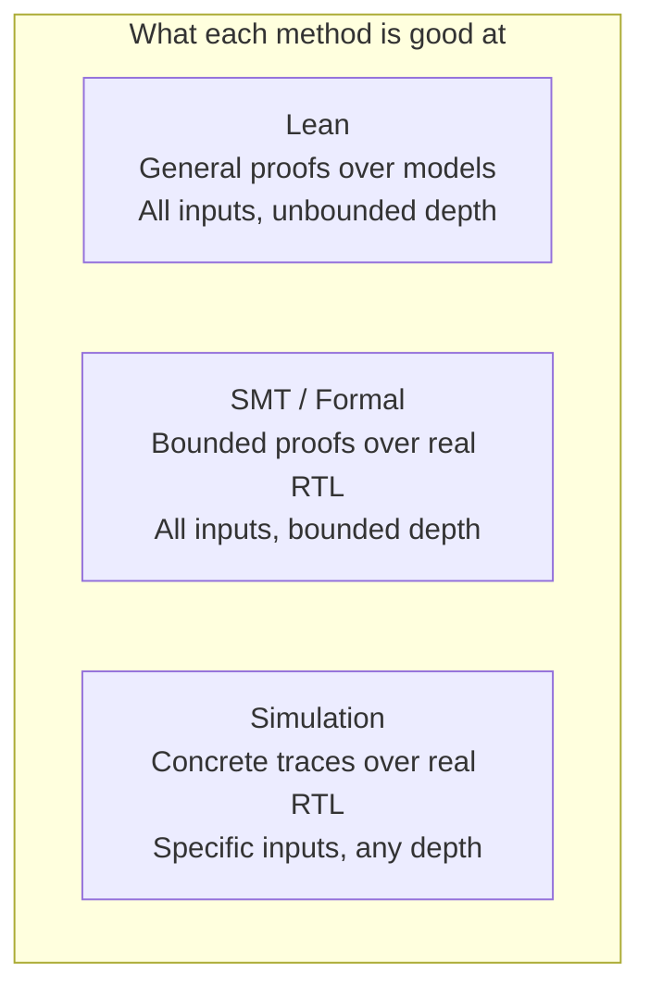
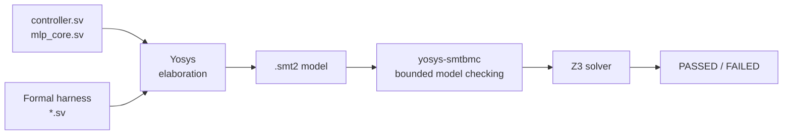
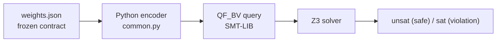
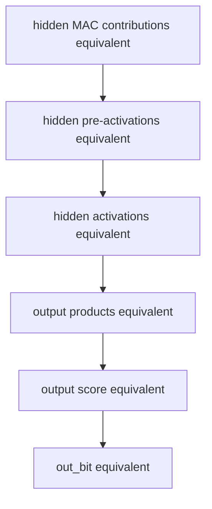

# Solver-Backed Verification

This document describes the solver-backed verification layer in this repository: what it proves, how it works, and why it complements the Lean formalization and simulation rather than replacing either.

## 1. What Solvers Add

The repository already has two verification methods:

- **Lean formalization**: unbounded proofs over the mathematical model, the fixed-point model, and the FSM model. General, compositional, machine-checked. But it reasons about a Lean model of the hardware, not the Verilog source.

- **Simulation**: concrete trace checking against the actual RTL. Catches bugs on the tested inputs, but cannot cover all 2^32 input combinations.

Solver-backed verification fills the gap between these two:



The key property of SMT-based verification is that it reasons about the actual Verilog — not a hand-written model of it — while still covering all possible inputs within a bounded trace window. This makes it good at:

- catching RTL bugs that Lean's model might not reproduce
- proving width and overflow properties that simulation can only spot by chance
- automated checking of repetitive control properties across all states

## 2. Two Verification Tracks

The solver work splits into two tracks that use different tools for different strengths.

### RTL Property Checking

For RTL control and timing properties, the flow uses **Yosys** to elaborate the SystemVerilog into an SMT-LIB model, then **yosys-smtbmc** to run bounded model checking with **Z3** as the backend solver.



The harnesses are SystemVerilog modules that instantiate the real RTL design-under-test and add assumptions and assertions using `assume` and `assert` statements. Yosys reads both the RTL sources and the harness, then generates an SMT-LIB encoding of the combined system.

This track proves properties about the actual RTL state machine — the same Verilog that gets synthesized into gates.

### Contract Arithmetic Checking

For width, overflow, and arithmetic equivalence properties over the frozen contract, the flow generates **QF_BV** (quantifier-free bitvector) SMT-LIB queries directly from Python and runs them through **Z3**.



The Python encoder reads the frozen weights and arithmetic rules from `contract/results/canonical/weights.json`, builds a complete bitvector model of the network's forward pass, and asserts the negation of each safety property. If Z3 returns `unsat`, no counterexample exists — the property holds for all valid inputs.

## 3. What the RTL Track Proves

The RTL track proves baseline property families over the hand-written `rtl/results/canonical/sv/controller.sv` and `rtl/results/canonical/sv/mlp_core.sv`.

### Controller Properties

The `controller_interface` family proves against `rtl/results/canonical/sv/controller.sv` alone:

| Property | What it says |
|----------|-------------|
| Accepted start leaves IDLE | When `start` is high in IDLE, the next state is LOAD_INPUT |
| `done` matches state | `done = 1` if and only if `state == DONE` |
| `busy` matches state | `busy = 1` if and only if `state != IDLE && state != DONE` |
| Control outputs match encoding | `load_input`, `clear_acc`, `do_mac_hidden`, `do_mac_output`, `bias`, `advance` each match their documented state |
| DONE hold/release | DONE self-holds while `start` is high; releases to IDLE when `start` drops |

These are proved to depth 12 — enough to exercise every state transition.

### mlp_core Properties

The remaining four families prove against the full `rtl/results/canonical/sv/mlp_core.sv` (which instantiates controller, MAC unit, ReLU, and weight ROM):

**boundary_behavior** — Guard cycles and phase transitions:

| Property | What it says |
|----------|-------------|
| Hidden guard cycle | At `input_idx == 4`, the FSM takes one guard cycle with no MAC work, then enters BIAS_HIDDEN |
| Last hidden handoff | When the 8th hidden neuron completes, the FSM enters MAC_OUTPUT with `hidden_idx == 0` and `input_idx == 0` |
| Output guard cycle | At `input_idx == 8`, the FSM takes one guard cycle with no MAC work, then enters BIAS_OUTPUT |
| Completion | BIAS_OUTPUT applies the output bias and enters DONE with the correct final indices |

**range_safety** — No out-of-range reads at boundaries:

| Property | What it says |
|----------|-------------|
| Hidden MAC range | `do_mac_hidden` implies `input_idx < 4` and the selector/ROM cases are real hits |
| Output MAC range | `do_mac_output` implies `input_idx < 8` and the selector/ROM cases are real hits |
| Hidden guard drives zero | The guard cycle at `input_idx == 4` misses all selector cases and drives `mac_a` to zero |
| Output guard drives zero | The guard cycle at `input_idx == 8` misses all selector cases and drives `mac_a` to zero |
| Output phase index | `hidden_idx == 0` throughout the entire output MAC phase |

**transaction_capture** — Input sampling integrity:

| Property | What it says |
|----------|-------------|
| LOAD_INPUT reached | After accepted start, the FSM enters LOAD_INPUT and asserts the load pulse |
| Input captured | LOAD_INPUT samples `in0..in3` into `input_regs` |
| Inputs stable | The captured `input_regs` remain unchanged for the rest of the transaction |
| Clean state | The load step clears the accumulator, resets indices, and clears `out_bit` |

**bounded_latency** — Exact timing:

| Property | What it says |
|----------|-------------|
| Not done early | The transaction is not done before cycle 76 |
| Busy throughout | `busy` stays high during the active window |
| Done at 76 | `done` becomes visible exactly 76 cycles after acceptance |
| Release | The design returns to IDLE one cycle after DONE when `start` is low |

All mlp_core families are proved to depth 82, covering one complete transaction from reset through DONE and release.

### Assumption Discipline

Every formal job records its assumptions explicitly. The bounded-latency proof, for example, requires:

1. Reset is asserted for the initial step, then released permanently
2. `start` is sampled high only on the accept cycle immediately after reset release
3. `start` stays low afterward so DONE can release
4. No reset occurs during the bounded transaction window

These assumptions are written into the harness as `assume` statements and recorded in the JSON summary. A property that passes under hidden assumptions would be misleading — the assumption discipline prevents that.

### Sparkle Full-Core Branch

The Sparkle full-core branch is not part of the SMT domain's dedicated runner set. Its maintained validation path is the shared `mlp_core` simulation/QoR flow under `experiments/`, not a separate wrapper-equivalence harness.

## 4. What the Contract Track Proves

The contract track proves properties over the frozen quantized arithmetic, using the committed weights from `contract/results/canonical/weights.json`.

### Overflow and Width Safety (8 checks)

These prove that no intermediate value escapes its intended width for any `int8` input:

| Check | What it proves |
|-------|---------------|
| `hidden_products_fit_int16` | Every `int8 * int8` hidden product stays within signed int16 |
| `hidden_pre_activations_fit_int32` | Every hidden accumulator (products + bias) stays within signed int32 |
| `hidden_activations_fit_int16` | Every post-ReLU hidden activation stays within signed int16 |
| `output_products_fit_int24` | Every `int16 * int8` output product stays within signed int24 |
| `output_accumulator_fits_int32` | The final output score stays within signed int32 |
| `hidden_product_sign_extension_matches_rtl` | Contract-view and RTL-view hidden products agree after sign extension |
| `hidden_accumulators_match_wide_sum` | 32-bit hidden accumulators match exact 64-bit wide sums (no wraparound) |
| `output_accumulator_matches_wide_sum` | 32-bit output score matches exact 64-bit wide sum (no wraparound) |

The wide-sum checks are particularly important: they confirm that the two's-complement wraparound model declared in the contract is explicit but inactive — no actual wraparound occurs for the frozen weights.

### Arithmetic Equivalence (6 checks)

These prove that two different bitvector encodings of the same network produce identical results:

- The **contract view** models the hidden layer as `int8 * int8 -> int16` with signed-saturating ReLU
- The **RTL-style view** sign-extends inputs to 16 bits, multiplies in 24 bits, and uses non-negative-truncation ReLU

The equivalence is proved layer by layer in a compositional miter:



Each layer assumes the previous layer's equivalence, then proves the current layer matches. This structure means a failure at any layer pinpoints exactly where the two views diverge.

The two ReLU models exist because the contract's quantization spec uses signed-saturating clipping (values above 32767 are clamped to 32767), while the RTL `relu_unit` simply truncates to the low 16 bits of a non-negative value. The equivalence proof shows these produce the same result for all values that actually arise from the frozen weights.

### How Assumptions Flow from the Contract

The frozen contract records the arithmetic rules that govern all SMT encodings:

```json
{
  "overflow": "two_complement_wraparound",
  "sign_extension": "required_between_product_and_accumulator_stages",
  "input_bits": 8,
  "hidden_product_bits": 16,
  "output_product_bits": 24,
  "accumulator_bits": 32
}
```

The Python encoder (`smt/contract/common.py`) validates these rules at load time and refuses to proceed if the contract changes its overflow or clipping policy. This ensures the SMT encoding stays synchronized with the contract — you cannot accidentally check properties under stale arithmetic rules.

The `export_assumptions.py` script exports the frozen assumptions as a standalone JSON document, making them inspectable without running any solver.

## 5. How This Relates to Lean

The SMT and Lean layers prove overlapping but differently-shaped facts:

| Concern | Lean proves | SMT proves |
|---------|-----------|-----------|
| Width safety | Per-neuron bounds theorems in `Defs/SpecCore.lean` | All 8 overflow checks via Z3 QF_BV |
| No-wraparound | `mlpFixed_eq_mlpSpec` bridge theorem | Wide-sum checks confirm no actual wraparound |
| Controller transitions | `phase_ordering_ok`, temporal theorems | `controller_interface` family against real Verilog |
| Guard-cycle safety | `hiddenGuard_no_mac_work`, boundary theorems | `boundary_behavior` and `range_safety` against real Verilog |
| Exact latency | `acceptedStart_eventually_done` (76 cycles) | `bounded_latency` (76 cycles against real Verilog) |
| Transaction capture | `acceptedStart_capturedInput_correct` | `transaction_capture` against real Verilog |

The critical difference: Lean proves facts about a Lean model of the hardware, while SMT proves facts about the actual SystemVerilog. Neither alone is sufficient:

- If the Lean model has a transcription error from the Verilog, Lean would not catch it
- If the SMT bounded trace is too short, a deeper bug could hide beyond the proof depth

Together, they provide both semantic depth (Lean) and implementation fidelity (SMT).

### The formalize-smt Bridge

There is also a separate optional Lean-side path, `formalize-smt/`, specified in `specs/formalize-smt/`. It uses SMT solvers as proof-automation tactics inside Lean rather than as standalone external checkers. The current implementation is narrow: it reproves the arithmetic `ArithmeticProofProvider` theorem family for the shared fixed-point layer.

This is not part of the `smt/` domain described in this document. The distinction:

| | `smt/` (this domain) | `formalize-smt/` (separate Lean overlay) |
|---|---|---|
| Where it runs | Outside Lean — Python scripts, Yosys, Z3 CLI | Inside Lean — as tactics within `.lean` files |
| What it reasons about | Real Verilog RTL, QF_BV contract encodings | Lean proof obligations |
| Trust boundary | Solver result (PASSED / unsat) | Depends on mode (see below) |
| Independence from Lean | Fully independent | Coupled to the Lean proof build |

The trust question is the key architectural concern:

- **Kernel-checked reconstruction / witness checking**: the solver accelerates proof search, but the Lean kernel remains the trust root. This stays inside the Lean leg of the repository's four-way story.

- **Oracle / axiom trust**: the Lean proofs become only as trustworthy as the solver. This weakens the Lean leg rather than creating a new independent verification direction.

The current package still has a weaker trust story than the vanilla baseline because the pinned upstream `lean-smt` dependency emits a `sorry` warning during build. That is why `formalize-smt/` remains explicitly optional and separate from both `formalize/` and `smt/`.

Possible expansion targets beyond the current arithmetic provider slice:

| Current Lean technique | Potential additional `formalize-smt` target |
|---|---|
| `native_decide` case-splits in `w1Int8At_toInt` (56 cases) | `querySMT` over QF_BV with proof reconstruction |
| Manual `Int.mul_le_mul_*` proofs in `int8_mul_int8_bounds` | Solver-backed arithmetic decision procedure |
| `omega` for linear arithmetic in bound proofs | `lean-smt` for mixed linear/bitvector goals |

Whether to expand this path further is an explicit architectural decision recorded in `specs/formalize-smt/`, not an implicit consequence of having SMT tools available.

## 6. Running the Checks

All solver checks run through `make smt`:

```bash
make smt
```

This runs four steps in sequence:

1. **Assumption export** — writes `build/smt/contract_assumptions.json`
2. **RTL control checks** — 5 formal jobs via Yosys + yosys-smtbmc + Z3
3. **Contract overflow checks** — 8 QF_BV queries via Z3
4. **Contract equivalence checks** — 6 QF_BV queries via Z3

In practice, the top-level command expects `python3`, `yosys`, `yosys-smtbmc`, and `z3`.

Individual steps can be run separately:

```bash
# RTL control only
python3 smt/rtl/check_control.py --summary build/smt/rtl_control_summary.json

# Contract overflow only
python3 smt/contract/overflow/check_bounds.py --summary build/smt/contract_overflow_summary.json

# Contract equivalence only
python3 smt/contract/equivalence/check_equivalence.py --summary build/smt/contract_equivalence_summary.json
```

Every check produces a JSON summary recording the tool versions, assumptions, properties, and pass/fail result. A non-zero exit code on any failure makes `make smt` fail the same way a test failure would.
