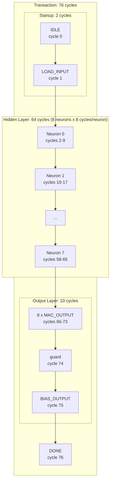
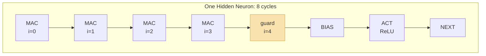
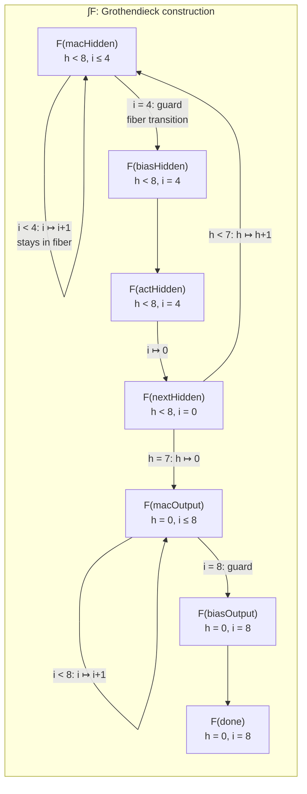

# Temporal Verification of Reactive Hardware

This document describes how the Lean formalization in this repository goes beyond functional correctness to prove cycle-accurate temporal properties of a reactive hardware system. The approach connects mathematical proof, temporal logic, and reactive system semantics in a single kernel-checked artifact.

## 1. The Problem: Functional Correctness Is Not Enough

Most hardware verification projects stop at functional correctness: given an input, the circuit computes the right output. For combinational logic, this is sufficient. For sequential, reactive hardware it is not.

A sequential inference accelerator is a reactive system. It does not simply compute a function. It:

- waits for an external start signal
- captures inputs at a specific cycle
- occupies shared resources (accumulator, ROM port) over a multi-cycle schedule
- signals completion via a level protocol
- holds results stable for downstream sampling
- returns to idle under specific release conditions

Proving that the final output register contains the correct value does not establish that the surrounding system can safely use it. The downstream consumer needs to know _when_ the result is valid, _how long_ it remains valid, and _what happens_ when it issues a new request. These are temporal properties.

## 2. The Cycle Schedule

A single inference transaction occupies exactly 76 clock cycles. The schedule has a nested loop structure:



Each hidden neuron occupies 8 cycles with the following internal structure:



The guard cycle (highlighted) is where `inputIdx` has reached the terminal value (`inputCount = 4`). The MAC enable is gated off (`inputIdx < 4` is false), so no computation occurs. The FSM advances to BIAS_HIDDEN. This guard exists identically in the output layer at `inputIdx = hiddenCount = 8`.

The full cycle breakdown:

| Phase | Cycles per neuron | Neurons | Subtotal |
|-------|-------------------|---------|----------|
| IDLE | 1 | - | 1 |
| LOAD_INPUT | 1 | - | 1 |
| MAC_HIDDEN (4 MAC + 1 guard) | 5 | 8 | 40 |
| BIAS_HIDDEN | 1 | 8 | 8 |
| ACT_HIDDEN | 1 | 8 | 8 |
| NEXT_HIDDEN | 1 | 8 | 8 |
| MAC_OUTPUT (8 MAC + 1 guard) | 9 | 1 | 9 |
| BIAS_OUTPUT | 1 | 1 | 1 |
| **Total** | | | **76** |

This schedule is deterministic: it depends only on the topology constants (`inputCount`, `hiddenCount`), not on the input data or weight values. The FSM is data-independent. This property is what enables the control projection technique described in section 8.

## 3. Two Models of the Same Machine

The formalization splits the FSM into two complementary models.

### The Operational Model: `step` / `run`

The operational model (`Machine.lean`) defines a pure state-transition function:

```lean
def step (s : State) : State :=
  match s.phase with
  | .macHidden =>
      if s.inputIdx < inputCount then
        { s with accumulator := acc32 s.accumulator (hiddenMacTermAt ...),
                 inputIdx := s.inputIdx + 1 }
      else
        { s with phase := .biasHidden }
  | .biasOutput =>
      let finalAcc := acc32 s.accumulator bias2Term
      { s with accumulator := finalAcc,
               output := finalAcc.toInt > 0,
               phase := .done }
  -- ...
```

`run n s` applies `step` n times from state `s`. This model is self-contained: it does not reference external signals. It answers the question "what does the machine compute if it starts from this state and runs for n cycles?"

The correctness theorem is stated over this model:

```lean
theorem rtl_correct (input : Input8) :
    (run totalCycles (initialState input)).output = mlpFixed input
```

This proves that 76 applications of `step` from the initial state produce the mathematically correct output. But it says nothing about how the machine interacts with the outside world.

The target function `mlpFixed` itself is connected to an unbounded mathematical specification by a separate bridge theorem:

```lean
theorem mlpFixed_eq_mlpSpec (input : Input8) :
    mlpFixed input = mlpSpec (toMathInput input)
```

**Model-theoretic reading.** The bridge theorem says: for the frozen weights, the MLP computation evaluates identically in unbounded ℤ and in the quotient ring ℤ/2ⁿℤ — the quotient map is injective on the actual computation range, so wrapping is a no-op. This exactness is instance-specific: it holds only for these frozen weights. For the full two-model analysis, the quotient geometry, and the QF_BV wide-sum checks that confirm this at the bitvector level, see [`from-ann-to-proven-hardware.md` §5](from-ann-to-proven-hardware.md) and [`solver-backed-verification.md` §5](solver-backed-verification.md).

### The Reactive Model: `timedStep` / `rtlTrace`

The reactive model (`Temporal.lean`) wraps `step` with external signal semantics:

```lean
structure CtrlSample where
  start : Bool
  inputs : Input8

def timedStep (sample : CtrlSample) (s : State) : State :=
  match s.phase with
  | .idle =>
      if sample.start then { s with phase := .loadInput }
      else { s with hiddenIdx := 0, inputIdx := 0 }
  | .loadInput =>
      { s with regs := sample.inputs, hidden := Hidden16.zero,
               accumulator := Acc32.zero, hiddenIdx := 0,
               inputIdx := 0, output := false, phase := .macHidden }
  | .done =>
      if sample.start then s
      else { s with phase := .idle }
  | _ => step s
```

`timedStep` takes an external sample at each cycle. The environment provides `start` and `inputs`; the machine responds according to its current phase. In active computation phases (MAC, bias, activation, next), `timedStep` delegates to `step`. In the three interface phases (idle, loadInput, done), it implements the handshake protocol.

`rtlTrace` builds a complete execution trace from a sample stream:

```lean
def rtlTrace (samples : Nat → CtrlSample) : Nat → State
  | 0 => idleState
  | n + 1 => timedStep (samples n) (rtlTrace samples n)
```

This models the RTL as it appears to the outside world: a machine that starts in idle and evolves cycle by cycle in response to external stimuli.

## 4. Bridging the Two Models

The central technical challenge is connecting `run` (which proves correctness) to `rtlTrace` (which models the reactive interface). The bridge theorem establishes that once a transaction is accepted, the reactive trace agrees with the operational model:

```lean
theorem rtlTrace_matches_run_after_loadInput (samples : Nat → CtrlSample)
    (hstart : (samples 0).start = true) :
    ∀ n, n + 2 ≤ totalCycles →
      rtlTrace samples (n + 2) = run (n + 2) (initialState (capturedInput samples))
```

The proof proceeds by induction on `n`. The base case shows that two cycles of `rtlTrace` (idle → loadInput → macHidden) produce the same state as `run 2`. The inductive step uses the fact that during the active computation window (cycles 2 through 75), the machine is in an active phase (not idle, not loadInput, not done), so `timedStep` reduces to `step` regardless of the external sample. The environment is irrelevant during computation.

This is the key structural insight: a reactive system that ignores its environment during active processing can be analyzed as a closed system during that window.

**Categorical reading.** Define two functors from the natural numbers (viewed as a category with successor morphisms) to the state space:

```
R : ℕ → State         R(n) = run n (initialState input)
T : ℕ → State         T(n) = rtlTrace samples n
```

The bridge theorem establishes that `R` and `T` agree on the interval `[2, 76]` — a _partial natural isomorphism_. They diverge outside this window precisely at the reactive interface: at `n ∈ {0, 1}`, `timedStep` handles `start` and `loadInput` differently from `step`; at `n > 76`, it handles the hold/release protocol while `step` is a fixed point. The active window lemma provides the enabling condition: for `n ∈ [2, 75]`, the phase is active, so `timedStep` degenerates to `step`, and the natural transformation becomes an identity.

### The Active Window Lemma

The active window claim is established by projecting the full machine state onto a control-only view:

```lean
structure ControlState where
  phase : Phase
  hiddenIdx : Nat
  inputIdx : Nat

def controlStep (cs : ControlState) : ControlState := ...
def controlRun : Nat → ControlState → ControlState := ...
```

The control projection discards datapath fields (registers, accumulator, hidden activations) and retains only the FSM state and index counters. Since control transitions do not depend on datapath values (the FSM is data-independent), this projection commutes with stepping:

```lean
theorem control_step_agrees (s : State) :
    controlOf (step s) = controlStep (controlOf s)

theorem control_run_agrees (n : Nat) (s : State) :
    controlRun n (controlOf s) = controlOf (run n s)
```

The active window property is then proved by exhaustive evaluation of the finite control model:

```lean
private theorem controlRun_active_window (k : Fin totalCycles) (hpos : 0 < k.1) :
    let ph := (controlRun k.1 initialControl).phase
    ph ≠ .idle ∧ ph ≠ .done := by
  native_decide +revert
```

`native_decide` evaluates `controlRun k initialControl` for all 75 values of `k` in {1, ..., 75} and confirms that none of them are idle or done. This is a checked computation, not a tactic shortcut: the Lean kernel verifies the decision procedure.

## 5. The Temporal Theorem Surface

The reactive model supports seven categories of temporal theorems. Each corresponds to a property that a downstream hardware consumer or system integrator needs to rely on.

### 5.1 Liveness: Accepted Start Reaches Done

```lean
theorem acceptedStart_eventually_done (samples : Nat → CtrlSample)
    (haccept : acceptedStart (samples 0) idleState) :
    doneOf (rtlTrace samples totalCycles)
```

If the machine is idle and `start` is asserted, then after exactly `totalCycles` (76) steps of `rtlTrace`, the machine is in the done phase. This holds for _any_ sample stream — the environment can do anything it wants with `start` and `inputs` during the computation window. The machine will still reach done.

### 5.2 Safety: Busy During Active Window

```lean
theorem busy_during_active_window (samples : Nat → CtrlSample)
    (haccept : acceptedStart (samples 0) idleState)
    (k : Fin totalCycles) (hpos : 0 < k.1) :
    busyOf (rtlTrace samples k.1)
```

For every cycle strictly between acceptance and completion, the machine reports busy. This is a safety property: the downstream consumer must not sample the output while busy is asserted.

`busyOf` is defined as `phase ≠ .idle ∧ phase ≠ .done`. The proof lifts the control-projection active window lemma to the full trace via the control/data commutation theorem.

### 5.3 Functional Correctness Under Reactive Semantics

```lean
theorem acceptedStart_capturedInput_correct (samples : Nat → CtrlSample)
    (haccept : acceptedStart (samples 0) idleState) :
    (rtlTrace samples totalCycles).output = mlpFixed (capturedInput samples)
```

The output at cycle 76 equals `mlpFixed` applied to the input captured during the loadInput cycle (cycle 1). This connects the reactive trace to the mathematical specification. The proof chains `rtlTrace_matches_run_after_loadInput` with `rtl_correct`.

Note the precision: the theorem says `capturedInput samples`, which is `(samples 1).inputs` — the input bus value presented during the loadInput cycle, not the value at the start cycle. If the environment changes inputs between cycle 0 and cycle 1, the machine uses the cycle-1 value. This matches the RTL's register-capture semantics.

### 5.4 Output Stability

```lean
theorem output_stable_while_done (samples : Nat → CtrlSample) (t : Nat) :
    stableOutputOn t (rtlTrace samples)
```

where `stableOutputOn` is:

```lean
def stableOutputOn (t : Nat) (trace : Nat → State) : Prop :=
  ∀ n, (∀ m, t ≤ m → m ≤ t + n → doneOf (trace m)) →
    (trace (t + n)).output = (trace t).output
```

If the machine remains in done for a contiguous window starting at cycle `t`, the output bit does not change throughout that window. The proof is by induction on the window length, using `timedStep_done_preserves_output` at each step.

This is a critical property for physical hardware. The downstream consumer may sample the output at any point while done is asserted. Without output stability, the consumer would need to sample at a specific cycle — a timing dependency that is fragile and hard to close in physical layout.

### 5.5 Done Hold and Release

```lean
theorem done_hold_while_start_high (sample : CtrlSample) (s : State)
    (hdone : doneOf s) (hstart : sample.start = true) :
    timedStep sample s = s

theorem done_to_idle_when_start_low (sample : CtrlSample) (s : State)
    (hdone : doneOf s) (hstart : sample.start = false) :
    timedStep sample s = { s with phase := .idle }
```

In done with start high, the entire state is preserved (not just the output — all fields). In done with start low, the machine transitions to idle. The hold theorem says `timedStep sample s = s`, which is state identity: no field changes at all. This is stronger than output stability; it guarantees that the accumulator, hidden registers, and indices are also frozen.

### 5.6 Idle Cleanup

```lean
theorem idle_wait_cleans_controller_indices (sample : CtrlSample) (s : State)
    (hidle : s.phase = .idle) (hstart : sample.start = false) :
    timedStep sample s = { s with hiddenIdx := 0, inputIdx := 0 }
```

While idle with start low, the machine resets its index counters to zero on every cycle. This ensures that a subsequent transaction starts with clean counter state regardless of how many idle cycles elapsed.

### 5.7 Phase Ordering

```lean
def AllowedPhaseTransition : Phase → Phase → Prop
  | .idle, .idle => True
  | .idle, .loadInput => True
  | .loadInput, .macHidden => True
  | .macHidden, .macHidden => True
  | .macHidden, .biasHidden => True
  -- ... (14 legal transitions total)
  | _, _ => False

theorem phase_ordering_ok (sample : CtrlSample) (s : State) :
    AllowedPhaseTransition s.phase (timedStep sample s).phase
```

Every single-step transition follows the declared phase graph. The proof is by exhaustive case analysis on the current phase, start signal, and index predicates. This is the reactive-system analogue of a progress property: the machine never enters an undeclared state transition.

## 6. Guard Cycle Verification

Guard cycles are the single most error-prone feature of sequential MAC-reuse architectures. They are cycles where the FSM is nominally in a MAC state but the MAC enable is gated off because the index counter has reached its terminal value.

The formalization proves three properties for each guard cycle:

### No Computation

```lean
theorem hiddenGuard_no_mac_work (sample : CtrlSample) (s : State)
    (hphase : s.phase = .macHidden) (hidx : s.inputIdx = inputCount) :
    SameDataFields s (timedStep sample s)
```

`SameDataFields` asserts that all datapath fields (registers, hidden activations, accumulator, indices, output) are unchanged. Only the phase advances. This rules out spurious MAC operations that would corrupt the accumulator.

### No Out-of-Range Access

```lean
theorem hiddenGuard_no_out_of_range_reads (sample : CtrlSample) (s : State)
    (hphase : s.phase = .macHidden) (hidx : s.inputIdx = inputCount) :
    SameDataFields s (timedStep sample s) ∧
      (timedStep sample s).phase = .biasHidden
```

The combined assertion says: no data changes _and_ the next phase is exactly biasHidden. Since the step preserves all data fields, no weight ROM read or register file access occurred. An off-by-one error that allowed `inputIdx = inputCount` to trigger a MAC would show up as a changed accumulator.

### Boundary Completeness

```lean
theorem hiddenBoundary_no_duplicate_or_skip_work
    (sample₀ sample₁ : CtrlSample) (s : State)
    (hphase : s.phase = .macHidden) (hidx : s.inputIdx + 1 = inputCount) :
    timedStep sample₀ s = { s with
        accumulator := acc32 s.accumulator (hiddenMacTermAt s.regs s.hiddenIdx s.inputIdx),
        inputIdx := inputCount } ∧
    SameDataFields (timedStep sample₀ s) (timedStep sample₁ (timedStep sample₀ s)) ∧
    (timedStep sample₁ (timedStep sample₀ s)).phase = .biasHidden
```

This is a two-step boundary theorem. Starting from the last valid MAC index (`inputIdx + 1 = inputCount`):

1. The first step performs exactly one MAC and advances `inputIdx` to the terminal value.
2. The second step (the guard cycle) changes no data and transitions to biasHidden.

The conjunction proves that the boundary sequence is _complete_ (the last MAC happens), _non-duplicating_ (the guard cycle does no extra MAC), and _correctly ordered_ (biasHidden follows immediately).

## 7. Index Safety as a Phase-Dependent Invariant

The `IndexInvariant` defines legal index ranges per phase:

```lean
def IndexInvariant (s : State) : Prop :=
  match s.phase with
  | .macHidden  => s.hiddenIdx < hiddenCount ∧ s.inputIdx ≤ inputCount
  | .biasHidden => s.hiddenIdx < hiddenCount ∧ s.inputIdx = inputCount
  | .actHidden  => s.hiddenIdx < hiddenCount ∧ s.inputIdx = inputCount
  | .nextHidden => s.hiddenIdx < hiddenCount ∧ s.inputIdx = 0
  | .macOutput  => s.hiddenIdx = 0 ∧ s.inputIdx ≤ hiddenCount
  | .biasOutput => s.hiddenIdx = 0 ∧ s.inputIdx = hiddenCount
  | .done       => s.hiddenIdx = 0 ∧ s.inputIdx = hiddenCount
  | _           => s.hiddenIdx ≤ hiddenCount ∧ s.inputIdx ≤ hiddenCount
```

This is not a global invariant but a _phase-dependent_ one. The legal range for `inputIdx` changes as the machine moves through phases. In macHidden, `inputIdx ≤ 4` (counting up to the guard). In macOutput, `inputIdx ≤ 8` (counting through hidden neurons). In biasHidden, `inputIdx = 4` exactly (the guard value is frozen).

**Grothendieck construction.** This phase-dependent predicate is a dependent type indexed by phase — or equivalently, a Grothendieck construction. Define a functor `F : Phase → Set` assigning each phase its legal index space:

```
F(macHidden)  = { (h, i) ∈ ℕ² | h < 8 ∧ i ≤ 4 }
F(biasHidden) = { (h, i) ∈ ℕ² | h < 8 ∧ i = 4 }
F(nextHidden) = { (h, i) ∈ ℕ² | h < 8 ∧ i = 0 }
F(macOutput)  = { (h, i) ∈ ℕ² | h = 0 ∧ i ≤ 8 }
F(done)       = { (h, i) ∈ ℕ² | h = 0 ∧ i = 8 }
...
```

The total space ∫F = { (p, h, i) | p ∈ Phase, (h, i) ∈ F(p) } is the set of legal control configurations. The `IndexInvariant` is the characteristic function of ∫F. The full machine state is a pair of a point in ∫F and a datapath record.

The preservation theorem says `step` is an endomorphism of ∫F × Datapath. The guard cycle proofs verify that transition maps respect the fiber boundaries: when the phase moves from macHidden to biasHidden, the index pair moves from `F(macHidden)` to `F(biasHidden)`, and the guard proof confirms the image lands in the correct fiber.



Self-loops are index increments within a fiber. Cross-fiber arrows are phase transitions where the invariant constraint changes. Each arrow is validated by a specific preservation lemma.

The invariant is proved preserved by all three stepping functions:

```lean
theorem step_preserves_indexInvariant :
    IndexInvariant s → IndexInvariant (step s)

theorem timedStep_preserves_indexInvariant :
    IndexInvariant s → IndexInvariant (timedStep sample s)

theorem rtlTrace_preserves_indexInvariant (samples : Nat → CtrlSample) (n : Nat) :
    IndexInvariant (rtlTrace samples n)
```

The third theorem is the strongest: the invariant holds at every cycle of every possible reactive trace, starting from idle. This guarantees that ROM reads and register file accesses never use out-of-range indices, regardless of the environment's behavior.

## 8. The Control Projection Technique

A recurring proof strategy in this formalization is the _control projection_: reduce a question about the full machine state to a question about the finite control state, then answer the finite question by exhaustive evaluation.

The technique has three steps:

1. Define a control-only projection that discards datapath fields.
2. Prove that the projection commutes with stepping (the control evolution is data-independent).
3. Use `native_decide` to evaluate the finite control model exhaustively.

For example, the active window property requires showing that for all `k ∈ {1, ..., 75}`, the phase is neither idle nor done. The full state space is infinite (the accumulator and hidden registers can hold arbitrary values). But the control projection has only `9 × 9 × 9 = 729` reachable states (9 phases × bounded indices). `native_decide` evaluates `controlRun k initialControl` for each `k` and confirms the property.

This is not a proof by exhaustion of the _hardware_ state space (which is far too large). It is a proof by exhaustion of the _control schedule_, which is finite because the indices are bounded and the phase transitions are deterministic given the control state.

**Cartesian fibration.** The soundness of this reduction has a precise categorical characterization. The projection `controlOf : State → ControlState` defines a fibered structure where the fiber over each control state `cs` is the set of all compatible datapath configurations `π⁻¹(cs) = { (regs, hidden, acc, out) | arbitrary }`. The commutation theorem says the diagram commutes:

```
         step
State ─────────→ State
  │                 │
  │ π               │ π
  ↓                 ↓
ControlState ──→ ControlState
       controlStep
```

This is a Cartesian fibration: the control evolution is independent of the fiber coordinate. The dynamics on the base space (control) are deterministic and data-independent; the dynamics on the fiber (datapath) are determined by the base point. In type-theoretic terms, `State` is a dependent pair `Σ (cs : ControlState), Fiber cs`, and `step` acts on the base and fiber components while preserving the dependency structure.

Any property that depends only on the phase and indices can therefore be decided by evaluating `controlRun` on the (finite) base space, without reasoning about the (infinite) fiber.

## 9. Relationship to Temporal Logic

The theorems in this formalization correspond to standard temporal logic properties, expressed in a proof-assistant style rather than in LTL/CTL notation.

| Temporal Logic Concept | This Formalization |
|------------------------|--------------------|
| **Liveness** (F done) | `acceptedStart_eventually_done`: accepted start _eventually_ reaches done |
| **Safety** (G (active → busy)) | `busy_during_active_window`: busy is _always_ asserted during active cycles |
| **Stability** (done → G (done → output = output₀)) | `output_stable_while_done`: output is _globally_ constant while done persists |
| **Response** (start → F done) | `acceptedStart_eventually_done` with quantified cycle bound |
| **Until** (busy U done) | `busy_during_active_window` + `acceptedStart_eventually_done` compose to: busy holds _until_ done |
| **Invariant** (G IndexInvariant) | `rtlTrace_preserves_indexInvariant`: index bounds hold at _every_ cycle |
| **Phase ordering** (G AllowedTransition) | `phase_ordering_ok`: every transition follows the declared graph |

The key difference from model checking is that these properties are proved over _all possible_ environment behaviors (the `samples` stream is universally quantified), not just checked over a bounded trace. The liveness bound (76 cycles) is a _proved_ constant, not a search depth.

## 10. Relationship to Reactive Synthesis

This repository also contains a reactive-synthesis experiment (`rtl-synthesis`) and a separate Sparkle RTL-generation experiment (`rtl-formalize-synthesis`). The connection to this temporal verification layer is direct but distinct:

**Reactive synthesis** asks: "Given a temporal specification, _construct_ a controller that satisfies it." In this repository, the committed TLSF specification in `rtl-synthesis/controller/controller.tlsf` is the `exact_schedule_v1` controller abstraction used for a secondary controller-scoped proof artifact under strong environment assumptions. The `rtl-synthesis` branch therefore has controller generation scope, mixed-path `mlp_core` integration scope, and mixed-path `mlp_core` validation scope for its primary claim. That primary claim is a bounded 82-cycle closed-loop `mlp_core` equivalence check between baseline and synthesized-controller mixed-path assemblies. Within that setup, ltlsynt produces a controller satisfying the TLSF guarantees under the declared assumptions.

**Temporal verification** asks: "Given a specific controller, _prove_ that it satisfies temporal properties." The Lean formalization proves these properties about the hand-written `step`/`timedStep` model.

The two approaches are complementary:

- Synthesis produces a correct-by-construction controller but requires the temporal specification to be complete and the abstraction to be sound.
- Verification proves properties of an existing controller but requires the Lean model to faithfully represent the RTL.

Both leave a trust gap. Synthesis trusts the spec-to-implementation chain (TLSF → AIGER → Verilog). Verification trusts the model-to-implementation correspondence (Lean `step` → SystemVerilog `controller.sv`). The SMT formal checks and simulation regression help close both gaps empirically, but neither is formally bridged in this repository. For the full reactive synthesis pipeline — predicate abstraction, adapter design, and dual validation strategy — see [`docs/generated-rtl.md`](generated-rtl.md).

**Type-theoretic connection.** The temporal theorems are universally quantified over the sample stream `samples : ℕ → CtrlSample`. Each theorem is an element of a dependent product:

```
acceptedStart_eventually_done :
    Π (samples : ℕ → CtrlSample),
      acceptedStart (samples 0) idleState →
      doneOf (rtlTrace samples totalCycles)
```

The function type `ℕ → CtrlSample` is the type of _environment strategies_. The universal quantification says: for every possible environment behavior, the machine reaches done. This is the type-theoretic counterpart of the game-theoretic formulation in GR(1) synthesis, where the system must satisfy a guarantee for all environment strategies satisfying certain assumptions. Here, the assumption is `acceptedStart` and the guarantee is `doneOf` in bounded time.

The difference is that GR(1) synthesis _constructs_ a winning strategy (correct-by-construction), while the Lean proof _verifies_ that a specific system wins against all environments (correct-by-verification). Both prove the same universally quantified statement; the constructive and analytic approaches are dual.

## 11. What This Approach Does Not Cover

**RTL-level temporal verification.** The temporal theorems are proved over the Lean model (`timedStep`), not over the SystemVerilog source. The Lean model is a manual transcription of the RTL behavior. A bug in the transcription (e.g., a missing edge case in `timedStep` that exists in `controller.sv`) would not be caught by the Lean proofs. The SMT bounded model checking in `smt/rtl/` partially addresses this by proving control properties directly over the elaborated Verilog, but the SMT properties and the Lean temporal theorems are not formally linked.

**Multi-transaction reasoning.** The current temporal theorems cover a single transaction: from accepted start to done, plus hold/release behavior. They do not prove properties about sequences of transactions (e.g., that back-to-back transactions produce independent correct results, or that the machine is reentrant).

**Timing closure.** The 76-cycle latency is proved at the RTL abstraction level. Post-synthesis timing (setup/hold violations, clock skew, routing delays) is not addressed. A gate-level simulation or static timing analysis would be needed to close this gap.

**Parameterized verification.** The proofs are specific to the 4→8→1 topology. Changing `inputCount` or `hiddenCount` would require reproving most theorems. A parameterized version would need inductive arguments over the neuron counts rather than the current fixed-size symbolic simulation.

## 12. Summary

The temporal verification layer in this repository demonstrates that cycle-accurate reactive properties of hardware state machines can be machine-checked in a general-purpose proof assistant. The approach does not require temporal logic model checking infrastructure; it uses standard induction, case analysis, and finite evaluation within Lean 4.

The core technical elements are:

1. **Two-model separation**: an operational model for correctness, a reactive model for timing.
2. **Bridge theorem**: the reactive trace equals the operational run during the active window.
3. **Control projection**: data-independent control questions answered by finite evaluation.
4. **Phase-dependent invariants**: index safety bounds that vary with the FSM phase.
5. **Guard cycle proofs**: completeness, non-duplication, and no-access theorems at MAC boundaries.

These elements compose into a theorem surface that covers liveness, safety, stability, phase ordering, and index safety — the properties that determine whether a reactive hardware module can be safely integrated into a larger system.

### Mathematical Correspondences

| Proof Structure | Mathematical Concept | Role in Verification |
|----------------|---------------------|---------------------|
| `IndexInvariant` | Grothendieck construction ∫F | Legal state space as a fibered set over Phase |
| `controlOf` projection | Cartesian fibration | Data-independent control reasoning |
| `mlpFixed_eq_mlpSpec` | Model-theoretic lifting (ℤ ↔ ℤ/2ⁿℤ) | Bounded arithmetic matches unbounded |
| `run` vs `rtlTrace` bridge | Partial natural isomorphism | Closed-system proof ↔ reactive trace |
| Guard cycle boundary proofs | Fiber transition maps | Correct cross-fiber index evolution |
| `∀ samples, ...` quantification | Dependent product / game quantifier | Property holds against all environments |
| `AllowedPhaseTransition` | Graph morphism / transition system | Phase dynamics as a directed graph |

For a self-contained treatment of the category theory behind these correspondences — Grothendieck construction, Cartesian fibrations, presheaf semantics, quotient ring geometry, topos-theoretic internal logic, and their connection to combinational/sequential logic, Moore/Mealy machines, and HDL — see [`docs/hardware-mathematics.md`](hardware-mathematics.md).
